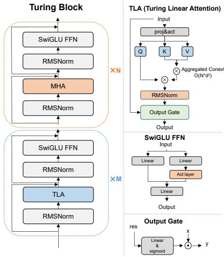
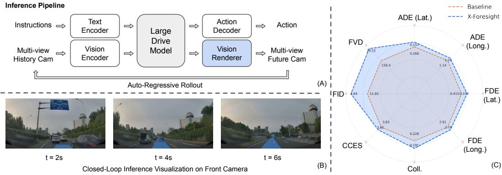
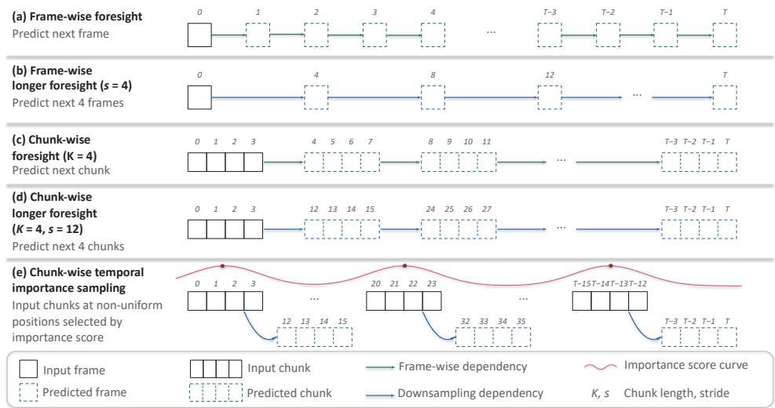
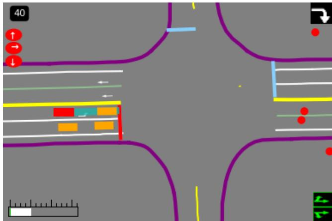
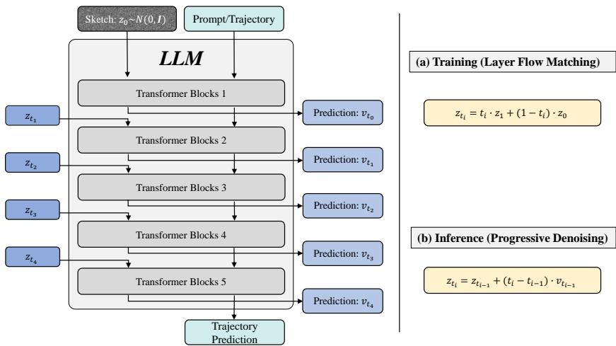
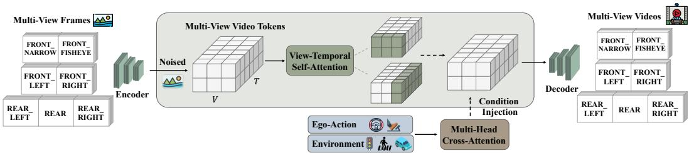
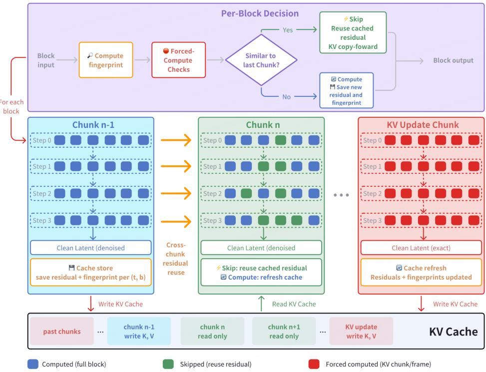

# 小鹏 VLA 与世界模型技术体系总结

> **受众：** 关注自动驾驶大模型、世界模型与 VLA 架构的研究者和工程师。
> **最后更新：** 2026-08-23
> **基于论文：** TuringViT、X-Foresight、X-Mind、X-World、X-Cache（XPeng，2026）

## 0. 摘要

从这几篇论文可以看出，小鹏在自动驾驶大模型上的技术路线已经不再局限于传统意义上的"端到端 VLA"，而是在尝试建立一套围绕 **Physical Intelligence（物理智能）** 的完整技术栈。

其核心问题可以概括成一句话：

> **自动驾驶模型不能只学会"看到现在之后该怎么开"，还必须学会"如果这么开，未来世界会发生什么"。**

传统 VLA 的基本范式是：

$$O_{\le t} \rightarrow VLA \rightarrow A_t$$

即根据当前及历史视觉观测直接生成驾驶动作。

小鹏在 X-Foresight 和 X-Mind 中试图进一步将其变成：

$$O_{\le t} \rightarrow \text{Predict Future} \rightarrow \hat{W}_{t:t+H} \rightarrow \text{Planning} \rightarrow A_t$$

模型在采取动作之前，先显式或隐式地预测未来世界状态，让未来预测本身成为推理过程的一部分。X-Foresight 明确指出，现有 VLA 虽然能够统一感知、推理与控制，但仍然主要属于 **reactive policy**：模型只能根据历史信息做反应，而无法在行动前模拟未来，因此在碰撞预测、复杂交互和长期因果关系上存在天然限制。

综合五篇工作，可以把小鹏目前公开的技术体系归纳为：

```text
                 海量图像 / 视频 / 驾驶数据
                          │
                          ▼
              ┌────────────────────────┐
              │   TuringViT            │
              │   视觉基础模型          │
              └───────────┬────────────┘
                          ▼
              ┌────────────────────────┐
              │  Large Drive Model     │
              │  / VLA                 │
              └───────────┬────────────┘
                          │
            ┌─────────────┴─────────────┐
            ▼                           ▼
  ┌──────────────────┐        ┌──────────────────┐
  │ X-Foresight      │        │ X-Mind           │
  │ 视频级世界预测    │        │ Visual CoT       │
  └────────┬─────────┘        └────────┬─────────┘
           └─────────────┬─────────────┘
                         ▼
                 Trajectory / Action
                         │
                         ▼
              ┌────────────────────────┐
              │ X-World                │◄──── X-Cache（推理加速）
              │ 生成式世界模拟器        │
              └───────────┬────────────┘
                          ▼
          闭环评估 / Online RL / 数据合成
                          │
                          └──────► 回流数据
```

因此，小鹏的"世界模型"实际上出现了**两种完全不同但互补的形态**：

| 世界模型形态 | 代表工作 | 作用 |
| --- | --- | --- |
| **Internal World Model** | X-Foresight、X-Mind | 让 VLA 在做动作之前"想象未来" |
| **External World Model** | X-World | 在模型之外构建可以交互的虚拟世界 |
| **World Model Infra** | X-Cache | 让外部世界模型达到实时闭环所需的推理速度 |

再加上 TuringViT 提供视觉编码基础，小鹏实际上正在形成一套从 **Perception → Prediction → Planning → Simulation → RL** 的完整闭环。

---

## 1. 从 VLA 到"具备未来预测能力的 VLA"

### 1.1 传统 VLA 的核心问题：Reactive，而不是 Predictive

传统端到端自动驾驶模型可以抽象成：

$$a_t = \pi(o_{\le t})$$

即：

```text
摄像头
   ↓
Visual Encoder
   ↓
VLA / Transformer
   ↓
Trajectory / Action
```

这种架构即使拥有非常大的参数规模，本质上依然可能在学习：

> **当前场景长什么样 → 人类驾驶员通常怎么操作**

但驾驶是一个强因果、强时间性的任务。例如：

```text
前方行人靠近路边
        ↓
当前没有进入车道
        ↓
直接反应式模型：
继续行驶
```

真正优秀的驾驶策略应该考虑：

```text
行人当前位置
      ↓
行人运动趋势
      ↓
2 秒后是否进入道路？
      ↓
如果继续加速会发生什么？
      ↓
是否应该提前减速？
```

这就是世界模型引入 VLA 的根本原因。

X-Foresight 将视频视作承载物理世界知识的重要媒介，因为视频同时包含物体外观、空间关系、运动模式和自车运动等时空信息，因此通过"预测未来视频"可以迫使模型学习物理世界中的动态和长期因果关系。([arXiv][2])

---

## 2. 整体技术地图

五篇论文各自解决的是整个体系中的不同瓶颈：

| 工作 | 主要问题 | 核心技术 | 在体系中的角色 |
| --- | --- | --- | --- |
| **TuringViT** | 高分辨率视觉编码成本高 | Turing Linear Attention、VISTA-Curation、Native Dynamic Resolution | 视觉基础模型 |
| **X-Foresight** | VLA 不具备真正的未来预测能力 | Chunk-wise AR World Modeling + LDM + Vision Renderer | VLA 内生世界模型 |
| **X-Mind** | 视频世界模型太重，无法高频车端推理 | Abstract Sketch + DC-AE + Recurrent Block Diffusion | Visual CoT |
| **X-World** | 真实道路无法低成本闭环训练和测试 | Action-conditioned Multi-camera Video World Model | 外部世界模拟器 |
| **X-Cache** | 世界模型生成速度不足 | Cross-Chunk Block Caching | 世界模型推理基础设施 |

这五项工作并不是彼此独立的论文点子。从工程视角，更适合理解成：

```text
                    ┌──────────────────┐
                    │    TuringViT     │
                    │ Visual Foundation│
                    └────────┬─────────┘
                             │
                             ▼
                   ┌─────────────────────┐
                   │       VLA / LDM     │
                   └─────────┬───────────┘
                             │
             ┌───────────────┴───────────────┐
             ▼                               ▼
       X-Foresight                        X-Mind
  Future Video Prediction             Visual Thinking
        世界预测                         世界推理
             │                               │
             └───────────────┬───────────────┘
                             ▼
                        Trajectory
                             │
                             ▼
                     ┌──────────────┐
                     │   X-World    │
                     │  World Sim   │
                     └──────┬───────┘
                            │
                       X-Cache 加速
                            │
                            ▼
                  Evaluation / Online RL
```

---

## 3. TuringViT：先解决 VLA 的"眼睛"

世界模型和 VLA 的第一层基础仍然是视觉表征。([arXiv][1])

现代 VLM/VLA 往往直接使用 SigLIP、CLIP 等现成 ViT 作为视觉编码器，但自动驾驶具有几个非常明显的特殊要求：

- 高分辨率；
- 多摄像头；
- 多帧视频；
- 动态输入尺寸；
- 低延迟；
- 长视觉 Token 序列。

传统 Softmax Attention 的复杂度：

$$O(N^2)$$

当输入从单张低分辨率图片扩展到多摄、多帧、高分辨率输入时，视觉 Token 数量迅速增长。

因此 TuringViT 的核心不是单纯追求更高视觉 benchmark，而是：

> **重新设计一个更适合 VLM/VLA 和车端部署的视觉基础模型。**

TuringViT 将设计归纳为三个部分：Turing Linear Attention、VISTA-Curation 和原生动态分辨率训练。论文报告其在只使用约领先开源 ViT 基线 10% 数据规模的情况下取得更好的视觉和下游多模态表现。

### 3.1 Turing Linear Attention

其核心 TLA 为：

$$G(X)=\sigma(XW_g)$$

$$\operatorname{TLA}(X)=G(X)\odot\frac{\phi(Q)\left(\phi(K)^T\phi(V)\right)}{N\sqrt d}$$

相比传统 Attention：

$$\operatorname{Softmax}\left(\frac{QK^T}{\sqrt d}\right)V$$

它把主要计算路径变成近线性的全局聚合。

但小鹏并没有完全抛弃 Softmax Attention。TuringViT 使用：

$$[\mathrm{TLA},\mathrm{TLA},\mathrm{TLA},\mathrm{TLA},\mathrm{TLA},\mathrm{MHA}]$$

也就是：

> **5 层 Linear Attention + 1 层标准 MHA**

周期性重复。这样 TLA 负责低成本全局信息聚合，而少量 MHA 保留显式 token-to-token 交互。18 层版本包含 15 层 TLA + 3 层 MHA，24 层版本包含 20 层 TLA + 4 层 MHA。



> 图：TuringViT 的 Turing Block 与 18L/24L 配置。

### 3.2 VISTA-Curation：不是简单增加数据，而是提高监督密度

TuringViT 另一个值得关注的点是：

> **数据规模并不是唯一决定因素。**

VISTA-Curation 针对图像和视频重新生成、过滤和排序描述，使训练信号更加"视觉相关、语义丰富、可区分"。

对于视频，还会聚合：

```text
局部帧信息
    +
运动变化
    +
全局视频语义
```

让视觉编码器不仅学习 object appearance，也学习：

```text
viewpoint change
object state change
motion
scene transformation
```

这对于后面的世界模型尤其重要，因为世界模型关心的恰恰不是静态识别，而是：

> **视觉状态如何随时间发生变化。**

### 3.3 四阶段预训练

TuringViT 采取渐进式四阶段训练路线：

| Stage | 数据 | 主要目的 |
| --- | --- | --- |
| Stage 1 | 55M 无标注图片 | MIM 视觉初始化 |
| Stage 2 | 850M Image-Text | 动态分辨率视觉语言对齐 |
| Stage 3 | 850M Image-Text | Native Resolution |
| Stage 4 | 2M Image/Video-Text | 视频与时序能力适配 |

其本质是逐渐从：

```text
视觉结构
↓
图文语义
↓
高分辨率
↓
视频时序
```

把视觉模型推进到适合 VLA 的输入分布。

---

## 4. X-Foresight：让 VLA 真正学习"未来世界"

如果 TuringViT 是"眼睛"，那么 X-Foresight 解决的是：

> **VLA 是否真正理解物理世界的演化规律。**

X-Foresight 并没有简单把一个独立 World Model 接在 VLA 前后，而是：

> **直接把未来世界预测任务融入 Large Drive Model。**

LDM 同时预测：

```text
Future Action
+
Future BEV
+
Future Camera Latent Tokens
```

随后再由一个 diffusion-based Vision Renderer 将抽象视觉 Token 渲染成高清多摄像头未来视频。

整体可以写成：

$$(O_t,A_t,L_t)\rightarrow \mathrm{LDM}\rightarrow\begin{cases}A_{t+1}\\ BEV_{t+1}\\ Z^{camera}_{t+1}\end{cases}$$

再由：

$$Z^{camera}_{t+1}\rightarrow \mathrm{VisionRenderer}\rightarrow X_{t+1}$$

形成下一轮输入。



> 图：X-Foresight 推理架构以及 2s、4s、6s 的未来预测示例。

---

## 5. 为什么不能简单做 Next Frame Prediction？

这是 X-Foresight 很重要的一个理论判断。

文本语言模型：

```text
The
 ↓
car
 ↓
is
 ↓
turning
```

相邻 token 通常有很高的信息增量。

但是视频：

```text
Frame 100
Frame 101
Frame 102
Frame 103
```

可能 95% 的像素和语义结构都没有明显变化。所以：

$$H(Video_{t+1}|Video_t)$$

很低。如果简单训练：

$$Frame_t \rightarrow Frame_{t+1}$$

模型很容易学成：

> **复制上一帧 + 微小外推**

而不是真正学习：

```text
车辆为什么会移动
行人会不会穿越道路
红灯什么时候转绿
当前动作会产生什么后果
```

X-Foresight 因此使用 **Chunk-wise Autoregressive Prediction**。

### 5.1 Chunk-wise Foresight

不是逐帧预测：

```text
Frame
 ↓
Frame
 ↓
Frame
 ↓
Frame
```

而是：

```text
Chunk t
   ↓
Chunk t+1
   ↓
Chunk t+2
```

每个 Chunk 内部保留连续密集帧：

```text
Chunk
├── frame 1
├── frame 2
├── frame 3
└── frame 4
```

于是同时保留两种时间尺度：

**Chunk 内**学习：速度、加速度、转向、局部交互——即 **Instantaneous Dynamics**。

**Chunk 之间**学习：交通灯变化、路口行为、长期路线意图、多车交互演化——即 **Long-term Causality**。



> 图：Frame-wise、Chunk-wise、Longer Foresight 与 Temporal Importance Sampling 的区别。

这是小鹏几篇世界模型论文中反复出现的一个重要思想：

> **Chunk 是自动驾驶世界模型非常自然的时间建模单位。**

后面的 X-World 和 X-Cache 同样沿用了 Chunk 这一抽象。

---

## 6. Curriculum Learning：逐渐让模型看得更远

直接让模型预测非常遥远的未来会导致训练困难。X-Foresight 使用：

```text
短时间预测
     ↓
1 秒 Chunk 间隔
     ↓
逐渐扩大时间距离
     ↓
3 秒 Chunk stride
     ↓
Long Horizon Prediction
```

也就是：

$$H_{short}\rightarrow H_{long}$$

一个关键点是：

> **扩大 Chunk 之间的 temporal stride，并不需要等比例增加 Token 数。**

因此在基本不增加序列计算成本的情况下，可以迫使模型学习更远的因果关系。

---

## 7. Temporal Importance Sampling：不是所有时间片都一样重要

大量自动驾驶数据实际上非常"无聊"：

```text
直行
直行
直行
直行
直行
```

真正决定模型安全能力的是：

```text
急刹车
Cut-in
突然变道
路口博弈
行人横穿
交通灯变化
```

因此 X-Foresight 不是均匀训练所有未来片段，而是根据 longitudinal acceleration、lateral acceleration、ego motion、driving behavior 识别重要未来 Chunk。最终：

$$P(chunk)\propto Importance(chunk)$$

让安全关键状态得到更多世界模型监督。

X-Foresight 的 Stage I 还同时采用了短到长 Curriculum、Temporal Importance Sampling 和定制的 Block Sparse Attention，以降低长时间序列训练成本。

---

## 8. 一个非常关键的设计：世界知识和高清像素生成分离

X-Foresight 并不要求 LDM 自己生成高清图像。这是一个非常值得注意的架构选择。

LDM 主要负责：

```text
World Semantics
+
Geometry
+
Dynamics
+
Action
+
Causality
```

而高清纹理（texture、lighting、appearance、pixel details）交给 Diffusion Renderer。

原因在于：

> **用于 Planning 的世界表示不需要保存每一片树叶、道路纹理和天空细节。**

所以：

```text
          LDM
           │
           ▼
Camera Latent Token
           │
     ┌─────┴─────┐
     ▼           ▼
Planning      Renderer
需要语义       需要高清像素
```

Renderer 基于 X-World 中的 DiT 和 3D Causal VAE，并通过跨视角/时间 Attention 保持多摄像头几何和时序一致性；在 X-Foresight 最终配置中，Renderer 只接收 LDM 预测的 Camera Token 作为核心控制信号。

X-Foresight 训练进一步采用三阶段路线：

```text
Stage I
训练 LDM
Action + BEV + Camera Tokens

        ↓

Stage II
单独训练 Vision Renderer
GT Action → Future Video

        ↓

Stage III
冻结 LDM
Renderer 改为消费
LDM predicted Camera Tokens
```

这样解决"Teacher Forcing 时的输入分布和真正闭环推理时输入分布不同"的问题。

推理时则形成：

```text
History Frames
      ↓
     LDM
      ↓
Action + Camera Tokens
      ↓
Vision Renderer
      ↓
Future Frames
      ↓
重新进入 LDM
      ↓
下一轮预测
```

从而可以递归形成长时间闭环 rollout。

---

## 9. X-Mind：从"生成未来视频"进一步走向"Visual Chain-of-Thought"

X-Foresight 证明：预测未来可以提升驾驶决策。但新的问题随之出现：

**真的有必要在车上生成高清未来视频吗？**

对于驾驶模型而言，树叶颜色、建筑纹理、天空云层、车辆漆面——很多信息对于 Planning 实际上并不重要。真正重要的是：

```text
道路拓扑
其他车辆位置
车辆运动
行人
交通灯
导航路线
限速
自车状态
```

因此 X-Mind 做了一个明显更加激进的抽象：

> **World Model 不再预测 Photorealistic Video，而是预测 Abstract Sketch。**

X-Mind 将 Predictive World Model 直接定义为一种 **Visual Chain-of-Thought**：模型必须先展开未来世界，再生成驾驶动作，而不是把未来重建作为网络末端的辅助任务。([arXiv][3])

---

## 10. Abstract Sketch：给模型一块"视觉思维画布"

Abstract Sketch 本质上是：

$$Sketch = BEV + DrivingPrior$$

其中包含：

**Physical Scene**：Ego Vehicle、Surrounding Agents、Road Topology、Lane Boundary。

**Driving Prior**：Traffic Light、Navigation Intent、Route、Speed Limit、Ego Speed。



> 图：X-Mind 使用的 Abstract Sketch，它不仅表示物理场景，还把交通灯、导航意图和速度约束编码进同一个 BEV Canvas。

可以把它理解为：

> **模型不需要在脑子里想象"高清电影"，只需要画一张未来交通草图。**

---

## 11. 12 帧未来只需要 96 Tokens

即便是 BEV Sketch，如果直接作为高分辨率图像 Token 进入 Transformer，也依然非常昂贵。因此 X-Mind 使用 **Deep Compression Autoencoder（DC-AE）** 进一步把未来 Sketch 压缩。最终：

$$12\ \text{Frames}\rightarrow 96\ \text{Tokens}$$

这意味着平均：

$$8\ \text{Tokens / Frame}$$

就能表示一段用于驾驶推理的未来世界。论文将这一点作为让 Visual CoT 能够真正进入资源受限车端的重要条件。

---

## 12. Recurrent Block Diffusion：把 Diffusion 塞进一次 Transformer Forward

传统 Diffusion：

```text
Noise
 ↓
Denoise 1
 ↓
Denoise 2
 ↓
Denoise 3
 ↓
...
 ↓
Future
```

意味着需要执行多次模型 Forward，这对车端推理明显不现实。

X-Mind 提出 **Recurrent Block Diffusion（RBD）**。核心思想是：

> 不再沿"时间上的多次 Forward"执行 Denoising，而是把不同 Denoising Stage 展开到 LLM 的不同深度。

例如：

```text
LLM Block 1
Denoise Step 1
      ↓
LLM Block 2
Denoise Step 2
      ↓
LLM Block 3
Denoise Step 3
      ↓
LLM Block 4
Denoise Step 4
      ↓
Future Sketch
```

于是：

$$N\times \text{Forward}$$

变成：

$$1\times \text{Forward}$$



> 图：Recurrent Block Diffusion，将逐步去噪展开到大型驾驶模型内部不同 Transformer Block 中。

最终架构变成：

```text
Camera
  ↓
Visual Encoder
  ↓
Large Drive Model
  │
  ├── Internal Visual CoT
  │      ↓
  │   Future Sketch
  │
  ▼
Inverse Dynamics Planner
  ↓
Trajectory
```

相比 X-Foresight：

```text
World Model
→ Video Latent
→ Diffusion Renderer
→ Future Video
```

X-Mind 更加接近：

```text
World Model
→ Abstract Future State
→ Planner
```

这说明小鹏对"世界模型"的理解已经从"生成未来世界"进一步转向"用未来世界作为模型内部推理空间"。

---

## 13. X-Mind 的一个重要实验结论：预测未来比重建现在更重要

X-Mind 对比了 Current Frame Reconstruction、Future 1 Frame、Future 12 Frames，结果如下：

| Prediction Target | FID ↓ | Lateral ADE ↓ | Longitudinal ADE ↓ |
| --- | ---: | ---: | ---: |
| Current Frame | 8.97 | 0.1866 | 1.2132 |
| Future 1 Frame | 9.05 | 0.1840 | 1.2124 |
| Future 12 Frames | 9.59 | **0.1765** | **1.1849** |

一个非常有意思的现象是：

> Current Reconstruction 的 FID 最好，但是驾驶 ADE 反而最差。

而预测 12 帧未来：图像生成指标更难，但驾驶规划结果最好。它实际上说明：

$$Visual\ Fidelity \neq Planning\ Intelligence$$

对于具身智能而言，好的内部世界表征未必需要"看起来最真实"。更关键的是它是否编码：

$$Dynamics + Causality + Future\ Occupancy + Interaction$$

---

## 14. X-World：另一个方向——把 World Model 变成"虚拟现实世界"

X-Foresight / X-Mind 解决的是"车上的 VLA 怎么预测未来"，X-World 解决的则是：

> **我们能不能在真实道路之外构造一个世界，让 VLA 在里面跑？**

其基本模型：

$$\hat X_{t+1:t+H}^{1:V}\sim p\left(X_{t+1:t+H}^{1:V}\mid X_{t-L:t}^{1:V},A_{t:t+H},C\right)$$

其中 $X$ 是七摄像头视频，$A$ 是未来自车动作，$C$ 是可选世界条件。([arXiv][4])

因此 X-World 可以做：

```text
同一个初始世界
       │
       ├── Action A
       │      ↓
       │   Future A
       │
       ├── Action B
       │      ↓
       │   Future B
       │
       └── Action C
              ↓
           Future C
```

本质上就是 **Counterfactual Simulation**。

---

## 15. X-World 的架构：3D Causal VAE + Multi-view DiT

X-World 基于 WAN 2.2 构建。

首先使用高压缩 3D Causal VAE：

$$Video\rightarrow Latent$$

压缩比例达到 $16\times$ Spatial 以及 $4\times$ Temporal，从而显著缩短 DiT 需要处理的时空序列。随后使用定制 Multi-view DiT。



> 图：X-World 整体结构。

### 15.1 View-Temporal Self-Attention

普通 Video Diffusion 主要关注 Time。但自动驾驶有七个摄像头：

```text
Front
Front Narrow
Front Left
Front Right
Rear Left
Rear Right
Rear
```

因此还必须保证：

$$Camera_i\leftrightarrow Camera_j$$

之间空间一致。X-World 交替执行：

```text
Temporal Attention
        +
Cross-view Attention
```

让模型学习时间一致性 + 跨摄几何一致性，避免出现这类世界状态不一致问题：

```text
左摄像头：
一辆白车

前摄像头：
同一位置没有车
```

---

## 16. 世界不仅受 Action 控制，还能被"编辑"

X-World 的 Condition 包括：Ego Action、Dynamic Agents、Static Elements、Camera Parameters、Text Prompt。不同条件采用不同注入方式：

| Condition | Injection |
| --- | --- |
| Action | adaLN-Zero |
| Flow timestep | adaLN |
| Camera Parameters | Additive Embedding |
| Dynamic Agent | Cross Attention |
| Static Element | Cross Attention |
| Text | Cross Attention |

而且 Dynamic、Static、Text 分别使用独立 Cross-Attention Branch。原因是：

> **不同 Condition 如果全部塞进同一 Attention，容易产生条件干扰。**

于是可以人为构造：

```text
增加一个突然横穿的骑行者
改变道路结构
修改其他车辆运动
改变天气
改变时间
改变国家道路外观
```

再观察 VLA 会做什么。

---

## 17. X-World 为什么必须从 Bidirectional Diffusion 改成 Causal World Model？

Stage I 的 X-World 类似传统高质量 Video Diffusion。一次：

```text
Noise
 ↓
约 50 次 refinement
 ↓
完整 Video Clip
```

画质很好，但这不是真正的实时 Simulator。闭环驾驶要求：

```text
World Model
   ↓
生成 1 秒未来
   ↓
VLA 看见结果
   ↓
输出 Action
   ↓
World Model 根据 Action
   ↓
继续生成下一秒
```

所以必须 **Streaming + Causal + Autoregressive**。X-World Stage II 将 Stage I 的双向、多步模型转化为 **Chunk-wise Causal Few-Step Model**。Chunk 内部依旧允许双向交互保证局部生成质量，但不同 Chunk 之间严格保持时间因果关系。

---

## 18. Self-Forcing：专门解决 Autoregressive Drift

训练时如果永远：

```text
GT Frame
   ↓
Predict
   ↓
GT Frame
   ↓
Predict
```

但推理时却：

```text
Pred Frame
   ↓
Predict
   ↓
Pred Frame
   ↓
Predict
```

就会产生 **Exposure Bias**，误差随后持续累积。

因此 X-World Stage II 直接使用模型自己生成的历史训练：

```text
Generated Chunk
       ↓
Next Chunk
       ↓
Generated Chunk
       ↓
Next Chunk
```

并通过 DMD 让 4-step Causal Student 逼近 Stage I 的高质量 Bidirectional Teacher：

$$p_{student}\rightarrow p_{teacher}$$

所以最终可以做到：

```text
50-step Offline Model
        ↓
Distillation
        ↓
4-step Streaming Model
```

---

## 19. Rolling KV Cache：把 World Model 变成无限流式系统

如果生成 Chunk 1 到 Chunk 100，每一次都重新 Attention 所有历史：

$$O(N^2)$$

计算和显存会不断增长。因此 X-World 使用固定长度的 **Rolling KV Cache**：

```text
KV Cache

[Chunk 20]
[Chunk 21]
[Chunk 22]
[Chunk 23]
[Chunk 24]

新的 Chunk 25 进入
      ↓
删除最老 Chunk 20
```

即 FIFO。这样：

$$Memory\approx Constant$$

而不是随 rollout 长度持续增长。论文展示了 24 秒多摄像头长时间生成，在延长 rollout 时仍保持较稳定的时序与跨摄像头一致性。

---

## 20. X-World 真正重要的地方：它把世界模型变成了 RL Environment

X-World 的最终目的其实并不是"生成自动驾驶视频"。更重要的是：

$$\text{WorldModel}=\text{Environment}$$

于是：

```text
             ┌───────────────┐
             │      VLA      │
             └───────┬───────┘
                     │ Action
                     ▼
             ┌───────────────┐
             │    X-World    │
             └───────┬───────┘
                     │ Observation
                     ▼
             ┌───────────────┐
             │      VLA      │
             └───────────────┘
```

这就是 Online RL 的基础。

真实世界里不能让模型故意尝试撞车、故意抢行、故意逼近行人、故意进行极限变道——但 World Model 中可以。

论文明确将 X-World 用于：Closed-loop Evaluation、Hard-case Specialization、Online RL、Corner Case Generation、Data Augmentation、海外驾驶场景的外观迁移。于是数据闭环就变成：

```text
真实车队数据
    │
    ▼
 VLA 训练
    │
    ▼
 VLA 策略 ──Action──► X-World ──Observation──► 闭环评估
    ▲                    │                        │
    │                    │                        ▼
    │                    │                   Hard Case 挖掘
    │                    │                        │
    │                    │◄───────────────────────┘
    │                    ▼
    │               Online RL ──────► 改进 VLA
    │                    │
    └──── 合成数据 ◄─────┘
```

这比单纯扩大真实驾驶数据规模更接近一个 **Self-Improving Autonomous Driving System**。

---

## 21. X-Cache：世界模型开始遇到真正的"系统工程问题"

当 X-World 从 Offline Video Generator 变成 Interactive Simulator，最大的瓶颈之一就变成 **Latency**。([arXiv][5])

即便已经从几十步 Diffusion 压缩到 4-step，DiT 仍然很重。传统 Diffusion Cache 通常复用相邻 Denoise Step 之间的相似性（Cross-Step Cache），但 Few-Step Diffusion 中每一步变化都很大，已经不存在足够强的冗余。

X-Cache 发现了另一种冗余：**Cross-Chunk Redundancy**。

---

## 22. Cross-Chunk Cache：物理世界本身是连续的

自动驾驶中的 Chunk $t$ 和 Chunk $t+1$ 通常变化并不剧烈。道路不会突然消失，建筑不会瞬移，大部分车辆只发生小范围位移。

因此相同（denoise step, transformer block）上的 feature 很相似。于是可以缓存上一 Chunk 中：

$$r_{t,b}=f_b(x_{t,b-1})$$

下一 Chunk 如果足够相似：

$$\tilde x_{t,b}=x_{t,b-1}+\hat r_{t,b}$$

直接复用 Residual。

```text
Chunk N
Block 17
      │
      ├── Compute
      │
      └── Cache Residual
                │
                ▼
Chunk N+1
Block 17
      │
Similarity Check
      │
      ├── Similar → Reuse
      │
      └── Different → Recompute
```



X-Cache 最终报告约 $71\%$ 的 Block Skip Rate，以及约 $2.6\times$ 的 DiT wall-clock 加速，同时维持较小质量退化。

---

## 23. 为什么 X-Cache 不能只看 Feature Similarity？

因为"画面差不多"并不意味着"驾驶动作也差不多"。例如：

```text
当前图像基本没变化

上一秒：
直行

下一秒：
急打方向
```

所以 X-Cache 的 Fingerprint 不只是视觉 latent，而是：

$$\text{Fingerprint}=\text{SpatialFeature}+\text{GlobalMean}+\text{ActionCondition}$$

并且不是直接在 flatten token 上随机采样，而是在 $(F,H,W)$ 三维时空网格中采样。因此 Cache Gate 同时感知 Scene Structure、Scene Drift 与 Control Action。

---

## 24. KV Cache Protection：这是 X-Cache 最重要的工程细节之一

Autoregressive World Model 有一类非常危险的 Forward：**KV Update**。因为当前输出会写入 KV Cache，并成为未来所有 Chunk 的历史。如果这里使用错误近似：

```text
当前误差
 ↓
写入 KV Cache
 ↓
Chunk +1
 ↓
继续传播
 ↓
Chunk +2
 ↓
继续传播
```

会形成永久污染。因此 X-Cache 规定：

> **所有写 KV 的关键步骤强制完整计算。**

这个设计并非可有可无。消融实验中，如果允许 KV-update Chunk 跳过计算，PSNR 从约 $53.4\ \mathrm{dB}$ 下降到 $21.5\ \mathrm{dB}$，同时 LPIPS 出现数量级恶化，而额外得到的 Skip Rate 收益很有限。

这说明对于 Autoregressive World Model：

> **Cache 的核心不是"能跳多少计算"，而是"哪些状态绝对不能被近似污染"。**

---

## 25. 五篇论文背后反复出现的统一设计思想

把这些论文放在一起看，会发现小鹏并不是在堆孤立技巧，而是在反复解决几个相同问题。

### 25.1 第一原则：Prediction 比 Reconstruction 更重要

传统视觉模型：

$$Understand(Current)$$

世界模型：

$$Predict(Future)$$

两者最大的区别不是生成能力，而是：

$$Prediction\Rightarrow Causality$$

模型只有预测未来，才必须理解"如果车辆这样移动，其他交通参与者会怎样响应，世界状态会怎样改变"。X-Mind 的 Future-12-frame 实验尤其直接地支持了这一点。

---

## 26. 第二原则：Planning World Representation 不等于 Photorealistic Representation

五篇论文共同体现出一个逐渐明确的分层：

```text
用于理解世界
        ≠
用于渲染世界
```

X-Foresight：

```text
Camera Tokens
→ Dynamics / Causality

Diffusion
→ Photorealism
```

X-Mind 则进一步：

```text
Abstract Sketch
→ Planning

完全不需要 Photorealistic Future
```

而 X-World 因为要作为外部 Simulator，VLA 必须重新"看到"这个世界，所以才真正需要 **Photorealistic Multi-Camera Video**。

因此三者不是互相冲突，而是针对不同任务选择不同 World Representation：

| Task | 合适的世界表示 |
| --- | --- |
| 内部 Planning | Semantic Latent |
| Visual CoT | Abstract Sketch |
| Simulator | Photorealistic Video |

---

## 27. 第三原则：Chunk 正在成为视频世界模型的"Token"

LLM 的基本单位是 Token。而从这些论文看，小鹏世界模型越来越倾向于把 Temporal Chunk 视作世界演化的基本单位：

- X-Foresight：Chunk-wise Prediction
- X-World：Chunk-wise Causal Generation
- X-Cache：Cross-Chunk Caching

这是一个非常值得关注的统一性。可以类比：

$$\text{LLM:}\ Token_t\rightarrow Token_{t+1}$$

而 Driving World Model：

$$WorldChunk_t\rightarrow WorldChunk_{t+1}$$

但一个 Chunk 内部仍保持密集时空信息。

---

## 28. 第四原则：训练分布与真实 Rollout 分布必须对齐

几个项目都遇到了同一个问题：

$$TeacherForcing\neq AutoregressiveInference$$

对应解决方式：

| 模型 | 方法 |
| --- | --- |
| X-Foresight | Renderer Stage III Alignment |
| X-World | Self-Forcing |
| X-Cache | KV Update Protection |

也就是说：

> **真正困难的已经不只是单步预测准确率，而是模型在自己生成的数据上运行几十、几百步之后还能否稳定。**

这实际上是世界模型进入工程阶段之后最重要的问题之一。

---

## 29. 第五原则：Compute 本身就是世界模型架构的一部分

小鹏这几篇论文中，几乎每一篇都在直接处理算力问题：

```text
TuringViT
Linear Attention
        ↓
降低视觉编码复杂度

X-Foresight
Block Sparse Attention
        ↓
降低 Long Horizon Training Cost

X-Mind
96 Tokens + RBD
        ↓
降低 Visual CoT Cost

X-World
4-step Distillation + Rolling KV
        ↓
降低 Streaming Simulation Cost

X-Cache
Cross-Chunk Cache
        ↓
进一步降低 DiT Inference Cost
```

例如 X-Foresight 的定制 Block Sparse Attention 将论文报告的单步训练时间从 $24.50\ \mathrm{s}$ 降到 $15.40\ \mathrm{s}$，约为 $1.59\times$ 加速。

这说明一个很明显的趋势：

> **世界模型研究正在从"能不能生成"进入"能不能实时运行"。**

---

## 30. 小鹏世界模型体系可以归纳为"两种想象能力"

综合来看，可以用一个非常简单的框架理解小鹏的路线。

**第一种：车自己想象未来。** 代表 X-Foresight、X-Mind，目的是 $Better\ Policy$。模型问："如果继续这样发展，未来会发生什么？"然后再做动作。

**第二种：云端替车辆创造未来。** 代表 X-World + X-Cache，目的是 $Better\ Training + Better\ Evaluation$。系统问："如果车辆采取这个动作，我能不能创造一个合理的未来世界给它体验？"

最终两者可以形成：

```text
                     REAL WORLD
                         │
                         ▼
                    Fleet Data
                         │
                         ▼
                 ┌──────────────┐
                 │     VLA      │
                 │ X-Foresight  │
                 │   X-Mind     │
                 └──────┬───────┘
                        │
                     Action
                        │
                        ▼
                 ┌──────────────┐
                 │   X-World    │
                 │ + X-Cache    │
                 └──────┬───────┘
                        │
                  Future World
                        │
                        ▼
                 VLA observes it
                        │
                        ▼
                Evaluation / RL
                        │
                        └──────────────┐
                                       │
                                       ▼
                                  Better VLA
```

这才是这五篇论文放在一起之后最值得关注的部分。

---

## 31. X-Foresight、X-Mind 与 X-World 的本质区别

| 维度 | X-Foresight | X-Mind | X-World |
| --- | --- | --- | --- |
| World Model 所在位置 | VLA 内部 | VLA 深层内部 | VLA 外部 |
| 核心目的 | 学习世界因果 | Visual Reasoning | Simulator |
| 预测对象 | Camera Latent + BEV + Action | Abstract Sketch | Multi-camera Video |
| 是否需要高清图像 | Renderer 需要 | 不需要 | 必须 |
| World Representation | Visual Latent | Compressed Sketch | Video Latent |
| 推理方式 | Chunk AR | Single Forward RBD | Chunk AR Diffusion |
| Planning | 直接联合 | Inverse Dynamics | 不负责 |
| Closed-loop RL | 间接 | 间接 | 核心用途 |
| 对实时性的要求 | 很高 | 极高 | 很高 |

因此更准确地说：

> **X-Foresight 和 X-Mind 是"Policy World Model"，X-World 是"Environment World Model"。**

这是理解小鹏这条技术路线非常重要的区分。

---

## 32. 从 X-Foresight 到 X-Mind：世界模型正在变成"隐式思维过程"

如果从技术思想上观察 X-Foresight → X-Mind，可以看到明显变化：

X-Foresight：

```text
我预测未来世界
↓
因此我更懂世界
↓
因此我开得更好
```

X-Mind：

```text
我必须先预测未来
↓
预测未来就是我的推理过程
↓
然后才能决定怎么开
```

于是 World Model 不再只是一个 Auxiliary Task，而变成：

$$\text{WorldModel}=\text{ReasoningProcess}$$

也就是 **Visual Chain-of-Thought**。这可能是这几篇论文中，对 VLA 架构演进最重要的信号。

---

## 33. 对未来 VLA 架构的启示

如果沿着这条路线继续发展，一个更加成熟的 Physical Intelligence Model 可能会形成：

```text
Observation
      │
      ▼
Visual Foundation Model
      │
      ▼
Semantic World State
      │
      ▼
Future World Rollout
      │
      ├── Future 1
      ├── Future 2
      └── Future 3
      │
      ▼
Evaluate Consequences
      │
      ▼
Action
```

也就是从 $ReactivePolicy$ 逐渐转向 $ModelBasedPolicy$。但与传统 Model-Based RL 不同，未来的 World State 未必是人工定义的 `x,y,v,a`，而可能是：

```text
Visual Latent
Semantic Token
BEV Sketch
Multimodal Latent
```

这样的高维表示。

---

## 34. 目前仍然存在的核心问题

### 34.1 Long-Horizon Error Accumulation

即使单步预测很好，也不意味着 100 步 rollout 仍然正确。误差会形成：

$$\epsilon_1\rightarrow\epsilon_2\rightarrow\cdots\rightarrow\epsilon_T$$

X-Foresight 的 Renderer Alignment、X-World 的 Self-Forcing、Rolling KV 以及 X-Cache 的 KV 保护，本质上都在不同层面处理这种闭环误差问题。

### 34.2 多模态未来

真实世界未来并不是唯一的。例如前车减速，未来可能是保持车道、变道、停车、再次加速。因此真正的：

$$P(World_{t+H}|World_t,Action)$$

是多峰分布。X-Foresight 中 L2 Camera Token 更接近多个可能未来的低熵语义汇总，再由生成式 Renderer 从条件分布中实例化具体视觉未来，这已经显露出"语义预测"和"随机生成"分工的必要性。

### 34.3 Simulator 与真实世界之间仍存在 Sim2Real Gap

如果未来 Online RL 大量依赖 X-World：

$$Policy\rightarrow WorldModel\rightarrow Reward$$

那么 World Model 中的系统性错误可能被 Policy 利用，即：

$$ModelBias\rightarrow PolicyExploitation$$

因此世界模型未来不仅需要 FID、FVD，而需要更严格的 Causal Accuracy、Action Consistency、Physical Consistency、Behavioral Fidelity、Long-tail Fidelity 评价体系。

---

## 35. 总结：小鹏正在构建的并不是一个 World Model，而是一套 World-Model-Centric Driving Stack

综合 TuringViT、X-Foresight、X-Mind、X-World 和 X-Cache，可以把小鹏目前的技术路线总结为五层：

```text
Layer 1
Visual Foundation
TuringViT
        ↓

Layer 2
Vision-Language-Action
Large Drive Model
        ↓

Layer 3
Internal World Reasoning
X-Foresight / X-Mind
        ↓

Layer 4
External World Simulation
X-World
        ↓

Layer 5
World Model Infrastructure
X-Cache
```

它所推动的核心范式变化可以概括为：从 $Perception\rightarrow Action$ 逐渐转变成 $Perception\rightarrow Prediction\rightarrow Reasoning\rightarrow Action$，同时在训练侧形成 $Action\rightarrow WorldSimulation\rightarrow Observation\rightarrow PolicyImprovement$，最终形成完整闭环：

$$\boxed{Data\rightarrow Perception\rightarrow WorldModel\rightarrow Planning\rightarrow Simulation\rightarrow RL\rightarrow Data}$$

从这个角度看，小鹏这些工作的真正重点已经不只是"把自动驾驶模型做得更大"。更准确地说，它们正在尝试解决三个更基础的问题：

> **第一，模型如何理解物理世界？** 通过预测未来，而不仅仅是识别当前。

> **第二，模型如何进行物理推理？** 让 World Model 成为内部 Visual Chain-of-Thought。

> **第三，模型如何规模化获得闭环经验？** 用生成式 World Simulator 代替大量昂贵、危险且不可重复的真实世界探索。

因此，小鹏公开研究中逐渐显现出的技术主线可以概括为：

$$\boxed{VLA + Predictive\ World\ Model + Generative\ Simulator + Online\ RL}$$

而 X-Foresight、X-Mind、X-World 与 X-Cache，实际上分别对应这套体系中**"会预测" → "会思考" → "会模拟" → "能够实时运行"**的四个关键阶段。

## 参考文献

1. [TuringViT: Making SOTA Vision Transformers Accessible to All][1]
2. [X-Foresight: A Joint Vision-Action Causal Forecasting Network via Predictive World Modeling][2]
3. [X-Mind: Efficient Visual Chain-of-Thought via Predictive World Model for End-to-End Driving][3]
4. [X-World: Controllable Ego-Centric Multi-Camera World Models for Scalable End-to-End Driving][4]
5. [X-Cache: Cross-Chunk Block Caching for Few-Step Autoregressive World Models Inference][5]

[1]: https://arxiv.org/abs/2606.24253 "TuringViT: Making SOTA Vision Transformers Accessible to All"
[2]: https://arxiv.org/abs/2605.24892 "X-Foresight: A Joint Vision-Action Causal Forecasting Network via Predictive World Modeling"
[3]: https://arxiv.org/abs/2606.28758 "X-Mind: Efficient Visual Chain-of-Thought via Predictive World Model for End-to-End Driving"
[4]: https://arxiv.org/abs/2603.19979 "X-World: Controllable Ego-Centric Multi-Camera World Models for Scalable End-to-End Driving"
[5]: https://arxiv.org/abs/2604.20289 "X-Cache: Cross-Chunk Block Caching for Few-Step Autoregressive World Models Inference"
