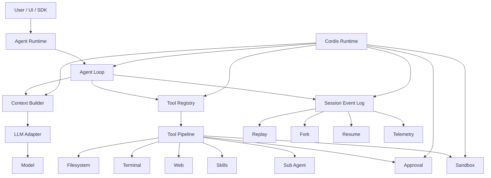
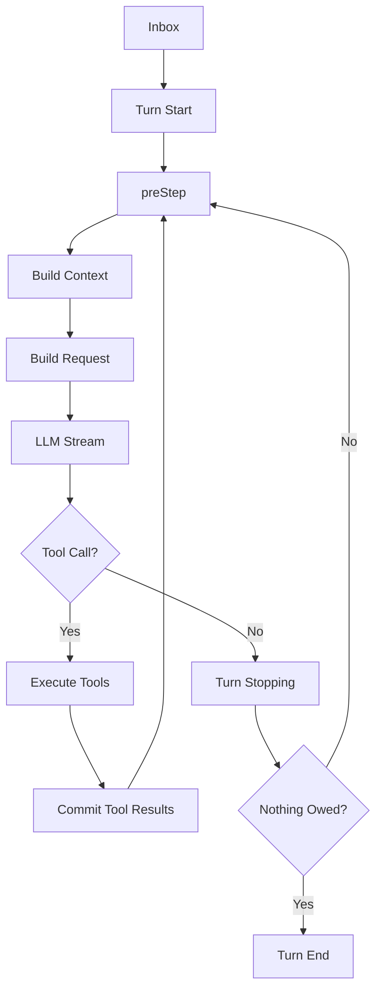
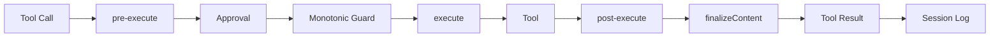

# DeepSeek Harness 技术报告

> **从 Model 到 Agent Runtime：DeepSeek 对 Agent Harness、可组合运行时与上下文工程的系统化实现**

---

## 0. 摘要

大模型本身并不能构成一个完整的 Agent。

模型主要负责：

* 理解任务；
* 推理与规划；
* 生成文本或工具调用意图。

而一个真正能够在真实环境中持续执行任务的 Agent，还需要解决：

* 如何获取环境状态；
* 如何调用文件、终端、搜索等工具；
* 如何组织多轮执行；
* 如何维护长期会话状态；
* 如何处理中断、重试与恢复；
* 如何控制上下文长度；
* 如何管理工具权限；
* 如何记录完整执行轨迹；
* 如何调度子 Agent；
* 如何保证执行过程可复现、可评测。

DeepSeek 将模型之外的这一整层统一称为 **Harness**，并将 Agent 表述为：

```text
Agent = Model + Harness
```

在这一架构中，Harness 不再被视作围绕 LLM 的简单胶水层，而是决定模型能力能否真正兑现为任务完成能力的 **Agent Runtime**。原报告将其职责概括为工作区访问、工具执行、沙箱与审批、append-only 会话日志以及 Agent Loop 等核心部分。

DeepSeek Harness 的核心设计可以进一步概括为六点：

1. **Everything is a Plugin**
2. **Agent Loop 可替换**
3. **Session Log 即系统状态**
4. **PTC 将工具调用转化为程序执行**
5. **确定性 Context 构建提升 Prefix Cache 命中**
6. **安全约束从 Prompt Guidance 下沉到 Runtime Enforcement**

其最大的技术意义，不是提供另一款类似 Claude Code 的编程助手，而是试图建立一个：

> **模型、Loop、工具、上下文、Session、Sandbox、Multi-Agent 都可以独立替换和实验的 Agent Runtime。**

---

## 1. 为什么需要 Harness

### 1.1 Model 并不等于 Agent

典型 LLM API 的工作模式非常简单：

```text
Prompt
  ↓
LLM
  ↓
Response
```

但真实 Agent 系统通常是：

```text
User Task
    ↓
Context Construction
    ↓
LLM Reasoning
    ↓
Tool Selection
    ↓
Tool Execution
    ↓
Environment Changes
    ↓
Observation
    ↓
LLM Reasoning
    ↓
...
    ↓
Task Completion
```

因此 Agent 的最终能力不仅由模型参数决定，还取决于整个执行系统。

例如，同一个模型：

```text
Model A
   │
   ├── Harness A
   │      └── 任务成功
   │
   └── Harness B
          └── 任务失败
```

原因可能并非模型不会，而是：

* Harness 给错了上下文；
* 工具太多导致模型选错；
* 工具结果顺序不稳定；
* Tool Schema 设计不合理；
* Compaction 丢失关键信息；
* Agent Loop 提前终止；
* Retry 策略错误；
* Sandbox 阻止了正确操作。

因此对于 Agent Benchmark：

```text
Agent Performance
        =
Model Capability
        ×
Harness Quality
```

Harness 实际上是模型能力的“显影层”。

---

## 2. DeepSeek Harness 总体架构

DeepSeek Harness 最重要的设计理念是：

> **Everything is a Plugin**

官方架构思想甚至进一步表述为：

```text
There is no privileged core to patch.
```

即模型适配器、工具注册表、Session、Agent Loop 等能力都尽量通过插件组织，而不是形成一个不可替换的大型核心。

整体可以抽象为：



从实现层来看，可以划分为四层。

| 层级                 | 主要职责                                         |
| ------------------ | -------------------------------------------- |
| Cordis Runtime     | 插件生命周期、依赖、事件与组合                              |
| Core Agent Runtime | Session、System Prompt、Tools、Agent、Agent Loop |
| Capability Layer   | LLM、Filesystem、Sandbox、Terminal、LSP 等        |
| Agent Extensions   | Skill、Workflow、SubAgent、Compaction、SDK 等     |

原报告对源码结构的归纳同样显示：Cordis 位于组合内核层，`core/session`、`core/tools`、`core/agent`、`core/agent-loop` 等构成产品 API 主干，而 sandbox、fs、terminal、subagent 等能力继续通过 seam/plugin 接入。

---

## 3. Cordis：插件化 Agent Runtime 的底座

### 3.1 为什么不是普通 Plugin System

传统插件系统一般只是：

```text
Core
 ├─ Plugin A
 ├─ Plugin B
 └─ Plugin C
```

Core 拥有绝大部分逻辑，Plugin 只能调用预留 API。

DeepSeek Harness 的结构更接近：

```text
              Cordis
                │
       ┌────────┼────────┐
       ↓        ↓        ↓
     LLM      Tools    Session
       │        │        │
       └──── Agent Loop ─┘
                │
             Extensions
```

Cordis 自身尽可能只提供：

* Context；
* Dependency Injection；
* Plugin Lifecycle；
* Event Bus；
* Effect Management。

真正的 Agent 语义位于其上的插件中。

---

### 3.2 Effect：解决插件卸载问题

插件加载时通常会产生大量副作用：

```text
register tool
register event listener
register service
start timer
mount filesystem
```

普通系统最大的隐患是：

```text
Plugin 卸载
    ↓
Listener 没删
Timer 没停
Service 没撤销
    ↓
Ghost State
```

Cordis 将这些副作用注册为 **Effect**：

```text
Plugin Mount
   ↓
Effect A
Effect B
Effect C
   ↓
Plugin Unmount
   ↓
Dispose C
Dispose B
Dispose A
```

因此插件生命周期天然具有可逆性。

这构成所谓：

```text
Temporal Composability
时间组合性
```

---

### 3.3 Coeffect：解决动态依赖

另一个问题是插件之间的依赖。

传统代码：

```ts
import LLM from "deepseek-provider"
```

消费者已经绑定具体实现。

Cordis 则更接近：

```text
Plugin
  ↓
inject: ["llm"]
  ↓
Runtime
  ↓
寻找 llm provider
```

如果 provider 不存在：

```text
Plugin → PENDING
```

provider 出现：

```text
PENDING → ACTIVE
```

provider 被替换：

```text
旧依赖解除
     ↓
重新绑定
     ↓
Plugin Reload
```

于是实现：

```text
DeepSeek Provider
      ↓
   ctx.llm
      ↑
OpenAI Provider
      ↑
Local Provider
```

消费方无需知道具体模型是谁。

---

## 4. Agent Loop：Harness 的核心执行引擎

DeepSeek Harness 默认 Agent Loop 为：

```text
ReactLoopAgent
```

但关键在于：

> `ReactLoopAgent` 是 Agent 接口的一种实现，而不是不可替换的系统核心。

这使得 Loop 本身也成为实验变量。原报告指出，扩展插件依赖的是 `Agent` 接口而不是具体 `agent-loop` 实现，因此可以替换整个驱动循环。

---

### 4.1 Turn 与 Step

dsh 对执行过程划分为：

#### Step

```text
一次 LLM Request
        +
该 Request 产生的 Tool Calls
```

#### Turn

```text
一个用户任务触发
        ↓
Step 1
        ↓
Step 2
        ↓
Step 3
        ↓
直到 nothing is owed
```

原报告对这一终止条件的总结是：

```text
没有待处理 inbox
+
没有等待回填给模型的 tool result
```

此时 Turn 才真正结束。

---

### 4.2 核心控制流

简化后的 Loop：



每个 Step 前：

```text
preStep
   ↓
claim inputs
   ↓
derive messages
   ↓
construct system prompt
   ↓
inject runtime context
   ↓
agent/pre-step hooks
```

然后生成模型请求。

---

### 4.3 请求冻结

一个非常重要的设计是：

```text
Request Constructed
        ↓
agent/request hooks
        ↓
Deep Freeze
        ↓
LLM Call
```

冻结以后，当前请求不可再变化。

因此：

```text
request/header
+
session events
+
plugin config
```

能够重建：

> 模型在当时到底看到了什么。

这对 Agent Debug、Benchmark 和后训练数据都非常重要。

---

## 5. Tool Runtime

### 5.1 工具不是直接执行

模型输出：

```text
tool_call
```

并不会立即调用真实工具，而是经过完整执行管线：



其中三个主要 waterfall 为：

```text
tools/pre-execute
tools/execute
tools/post-execute
```

审批、Guard、结果收尾等机制再围绕这些执行阶段叠加。

---

### 5.2 并行执行，但确定性提交

假设模型同时调用：

```text
Tool A
Tool B
Tool C
```

执行可以：

```text
A ──────────────┐
B ───────┐      │
C ──────────┐   │
             ↓
```

并行完成。

但写入 Session Log 时必须：

```text
Result A
Result B
Result C
```

严格遵循模型原始调用顺序。

即：

> **Scheduling can overlap, committing must remain ordered.**

这样做的原因不是单纯“方便日志查看”，而是为了保证：

```text
同一 Event Log
      ↓
deriveMessages()
      ↓
永远得到同一 Context
```

否则工具完成时间的随机性会污染 Agent 的可复现性。

原材料也明确将这一原则概括为“调度可以重叠，提交必须有序”。

---

## 6. PTC：Programmatic Tool Calling

PTC 是 DeepSeek Harness 最值得关注的创新之一。

传统 Function Calling：

```text
LLM
 ↓
search()
 ↓
LLM
 ↓
read()
 ↓
LLM
 ↓
parse()
 ↓
LLM
 ↓
write()
```

假设任务需要五次工具调用，就可能需要五轮 Model ↔ Tool 往返。

---

### 6.1 PTC 的核心思想

PTC 将几十个工具统一包装为：

```text
run_code()
```

模型看到：

```ts
declare const tools: {
  search: ...
  readFile: ...
  writeFile: ...
  ...
}
```

然后生成程序：

```ts
const files = await tools.search(...)

const results = []

for (const file of files) {
    const content = await tools.readFile(...)
    if (condition(content)) {
        results.push(content)
    }
}

return results
```

于是：

```text
LLM
 ↓
run_code
 ↓
Tool A
 ↓
Tool B
 ↓
Tool C
 ↓
Tool D
 ↓
Result
 ↓
LLM
```

由多轮自然语言控制变成一次程序执行。

原报告指出，Code/PTC 模式下模型侧主要只暴露 `run_code` 加动态生成的 TypeScript SDK 声明，程序内部的子调用仍然经过标准 Tool Pipeline。

---

### 6.2 为什么 PTC 能降低 Context 消耗

传统模式：

```text
Tool A Result
       ↓
Context

Tool B Result
       ↓
Context

Tool C Result
       ↓
Context
```

大量中间数据都会进入模型。

PTC：

```text
Tool A ┐
Tool B ├── Local Program
Tool C ┘
          ↓
      filter
      map
      reduce
          ↓
     Final Result
          ↓
        Context
```

只有真正需要的结果回到模型。

因此它优化的不只是：

```text
Tool Call 数量
```

更重要的是：

```text
Intermediate Observation Token
```

---

### 6.3 PTC 的适用边界

PTC 并非所有场景都更优。

当任务只有：

```text
1～2 个简单工具调用
```

时，引入 TypeScript SDK 本身也会消耗 Prompt Token。

因此其收益更倾向于：

```text
工具很多
+
调用链较长
+
中间结果很大
+
存在循环 / filter / aggregation
```

的任务。

---

## 7. Session Event Sourcing

DeepSeek Harness 最具架构价值的设计之一，是：

> **Session 不保存“当前状态”，Session Event Log 本身就是状态。**

传统 Agent：

```text
messages = [...]
current_task = ...
tool_state = ...
memory = ...
```

不同状态分别维护。

很容易发生：

```text
Messages != Runtime State
```

---

### 7.1 Append-only Event Log

dsh 使用：

```text
SessionEvent[]
```

事件只允许：

```text
append
```

不允许修改历史事件。

模型真正看到的消息通过：

```text
deriveMessages(events)
```

投影得到。

原报告将这一原则总结为：

```text
the log IS the state
```

而不是“日志记录状态”。

---

### 7.2 Surface Event

并非所有 Event 都进入模型。

真正影响模型历史的核心 Surface Event 主要包括：

```text
user/message
assistant/message
tool/result
```

而：

```text
turn/start
turn/end
step/start
step/end
assistant/chunk
request/header
compaction/*
```

可以保留在 Event Log 中，但不直接成为 Message History。

这就实现：

```text
         Session Event Log
               │
      ┌────────┴────────┐
      ↓                 ↓
Model Projection    Observability
      ↓                 ↓
Messages          Trajectory
```

原材料明确指出模型可见事件与结构/回放事件、log-only 事件被分层存储，从而同时获得完整可观测性和稳定模型上下文。

---

### 7.3 “Model-visible means logged”

这是 dsh 一个非常关键的不变量：

> 任何模型能够看到的信息，都必须存在于 Event Log 中。

即：

```text
Model Visible
      ⇕
Recorded
```

因此任意一次失败任务，都可以回答：

```text
模型看到什么？
System Prompt 是什么？
工具有哪些？
工具结果是什么？
运行时 Context 是什么？
当时选择哪个 Model？
```

这些信息不需要事后猜测。

---

## 8. Replay、Resume 与 Fork

Event Sourcing 带来的直接收益是：

```text
Resume
Fork
Replay
Telemetry
```

几乎全部可以由同一 Session Log 派生。

---

### 8.1 Resume

```text
Event 1
Event 2
...
Event N
  ↓
Process Crash
  ↓
Reload Event Log
  ↓
Continue
```

---

### 8.2 Fork

假设：

```text
E1
E2
E3
E4
E5
```

可以：

```text
E1
E2
E3
├── Branch A
└── Branch B
```

分别尝试不同：

* Model；
* Prompt；
* Tool Set；
* Agent Loop；
* Compaction Strategy。

原材料将 resume、fork、replay 等统一解释为对“事件流前缀 seed”的不同使用方式。

这使 Harness A/B Test 非常自然。

---

## 9. Context Engineering 与 Cache Architecture

Agent 长任务中的核心成本来自：

```text
越来越长的 Context
```

DeepSeek Harness 的策略不是简单截断，而是结合：

```text
Deterministic Context Construction
+
Dynamic Context Projection
+
Tool Result Spill
+
Compaction
+
Prefix Cache
```

---

### 9.1 Context 三层结构

可以抽象为：

```text
┌────────────────────────────┐
│ Stable System Sections     │
├────────────────────────────┤
│ Agent Instructions         │
├────────────────────────────┤
│ Dynamic Runtime Context    │
├────────────────────────────┤
│ Session Messages           │
└────────────────────────────┘
```

其中稳定内容尽量保持：

```text
same bytes
+
same order
+
same position
```

工具也按照稳定顺序组织。

原报告进一步指出，动态 Context 并不是每轮机械重复，而采用：

```text
changed → inject
unchanged → skip
cleared → explicit CLEARED event
```

的方式。

---

### 9.2 为什么 Cache 命中率高

因为：

```text
System Prompt
Tools
History
```

绝大部分前缀不会变化。

形成：

```text
Request 1:
AAAA BBBB CCCC X

Request 2:
AAAA BBBB CCCC X Y

Request 3:
AAAA BBBB CCCC X Y Z
```

于是 Prefix Cache 可以反复复用：

```text
AAAA BBBB CCCC
```

原材料将 95%～100% 的第三方缓存命中观察，与 append-only 日志、确定性 Context 拼装直接关联。

因此：

> **Cache Friendly 并不是某个独立优化开关，而是确定性运行时架构的副产品。**

这是一个很值得其他 Agent 系统借鉴的思想。

---

## 10. Skills、Preset 与 Multi-Agent

### 10.1 Preset 不是 Prompt Template

传统所谓 Agent Preset 往往只是：

```text
System Prompt
+
Model Config
```

而 dsh Preset 更接近：

```text
Agent Preset
     =
Plugin Composition
```

它可以决定：

* Prompt；
* Tool；
* Skill；
* Compaction；
* SubAgent；
* Workflow；
* Context Policy。

因此：

```text
Standard
Minimal
PTC
Creator
```

本质上并不是四套 Agent 代码，而是四套插件组合。

---

### 10.2 Minimal 模式的意义

Minimal 刻意只保留少量工具。

目的不仅是轻量化，还可以用作：

```text
Model Capability Baseline
```

从而减少 Harness 对 Benchmark 的污染。

因此评估 Agent 时应至少披露：

```text
Model
Harness
Preset
Tools
Prompt
Decoding Config
```

而不能只写：

```text
DeepSeek V4-Pro Score = XX
```

原材料也指出，仅改变 preset 就可能显著改变同模型任务表现，因此 harness 配置应当成为评测中的显式自变量。

---

### 10.3 SubAgent Provider

SubAgent 同样被抽象成 provider。

例如：

```text
Parent Agent
    │
    ├── Spawn Agent
    │
    ├── Fork Agent
    │
    ├── dsh Agent
    │
    ├── Claude Code
    │
    └── Codex
```

因此 Claude Code / Codex 可以从“竞争对手”变成：

```text
一种 SubAgent Backend
```

原报告列出的内置 provider 包括 spawn、fork、ACP、dsh-sdk、Codex 与 Claude Code。

这是 dsh 一个非常有意思的生态定位：

> 自己不一定拥有所有能力，但掌握最上层的 Runtime 编排权。

---

## 11. Security：Prompt Guidance 与 Runtime Enforcement 分离

Agent Security 最常见的错误是：

```text
System Prompt:

"不要删除用户文件"
```

这并不构成真正的安全边界。

因为模型可能：

```text
误解
越权
Prompt Injection
Tool Injection
```

因此 dsh 将：

```text
Plan Mode
```

定义为：

```text
Soft Guidance
```

真正强制权限的是：

```text
Sandbox
+
Approval
```

原报告对此直接概括为：沙箱负责“可以在哪里执行”，审批负责“这一次操作是否被允许”，两层相互独立并采用 fail-closed 设计。

---

### 11.1 Sandbox

抽象为：

```text
read-only

workspace-write

danger-full-access
```

负责限制：

```text
Agent 对环境能够产生什么副作用
```

---

### 11.2 Approval

Approval 决定：

```text
本次具体 Tool Call 是否允许执行
```

结果集收敛为：

```text
allowed-once
rejected
cancelled
unavailable
```

其中只有：

```text
allowed-once
```

可以放行。

没有明确授权：

```text
fail closed
```

而不是：

```text
fail open
```

这是 Agent Runtime 非常重要的安全设计原则。

---

## 12. Harness 与 Agent 后训练

DeepSeek Harness 的另一层重要价值在于：

> 它天然是一套 Agent Trajectory 数据采集系统。

一次 Agent 执行可以得到：

```text
Task
 ↓
Prompt
 ↓
Model Request
 ↓
Assistant Output
 ↓
Tool Call
 ↓
Tool Result
 ↓
Environment Feedback
 ↓
Next Request
 ↓
...
 ↓
Final Result
```

而 Event Log 又能够同时保存：

```text
request/header
assistant/chunk
tool/result
turn/*
step/*
compaction/*
usage
```

于是可以形成：

```text
Agent Runtime
      ↓
Trajectory
      ↓
Evaluator
      ↓
Success / Failure
      ↓
Training Dataset
      ↓
Agent RL / SFT
```

原报告也特别指出，完整 Event Log 与 `request/header` 能同时用于 Harness 披露、可复现评测和“用户反馈 → 轨迹样本”数据管线。

---

### 12.1 对 SFT 的价值

可以从成功 Trajectory 中提取：

```text
Task
→ Reasoning
→ Tool Call
→ Observation
→ Action
→ Final Answer
```

形成 Agent SFT 数据。

---

### 12.2 对 Agent RL 的价值

如果有 Verifier：

```text
Trajectory
    ↓
Environment
    ↓
Verifier
    ↓
Reward
```

即可形成：

```text
Agent Rollout
       ↓
Reward
       ↓
GRPO / PPO / RL
```

因此 Harness 实际上处于：

```text
Training
   ↓
Model
   ↓
Harness
   ↓
Environment
   ↓
Trajectory
   ↓
Evaluation
   ↓
Training
```

这一闭环的核心位置。

---

## 13. DeepSeek Harness 最核心的技术创新

如果把整个项目进一步压缩，我认为真正值得关注的是以下五点。

---

### 13.1 Harness 成为一等系统变量

过去：

```text
Model
+
一些 Tool Glue Code
```

现在：

```text
Model
+
Explicit Harness Runtime
```

Harness 本身可以：

```text
Version
Configure
Fork
Compare
Benchmark
Replace
```

---

### 13.2 Agent Loop 不再是黑盒

传统产品：

```text
Agent Loop
   ↓
Closed Binary
```

dsh：

```text
Agent Interface
       ↓
ReactLoopAgent

也可以：

Agent Interface
       ↓
Custom Loop
```

Loop 从产品内部实现变成可实验算法。

---

### 13.3 Event Sourcing 成为 Agent 状态模型

核心变化：

```text
State + Log
```

变成：

```text
Log = State
```

直接解决：

* Replay；
* Fork；
* Resume；
* Audit；
* Telemetry；
* Training Data。

---

### 13.4 PTC 将 Tool Calling 从自然语言控制升级为程序控制

传统：

```text
Reason → Tool → Reason → Tool
```

PTC：

```text
Reason
   ↓
Program
   ↓
Tools × N
   ↓
Result
```

它实际上是在 Agent 中加入了一层：

```text
LLM Planner
      ↓
Temporary Program
      ↓
Deterministic Executor
```

---

### 13.5 Harness 开始连接推理与后训练

Agent Runtime 不再只是推理基础设施：

```text
Inference Runtime
```

而开始变成：

```text
Inference
+
Evaluation
+
Trajectory Collection
+
Training Data
```

的统一基础设施。

---

## 14. 当前局限

DeepSeek Harness 目前仍属于快速演进中的开发者预览项目，因此其设计理念与实现成熟度需要分开评价。

尤其安全层已经暴露出多类 preview 阶段问题，包括沙箱隔离、`node:vm`、workflow、approval 路径等问题；原报告将共同根因总结为：

> 安全设计的分层方向正确，但部分 enforcement 约束落在了错误的执行层。

因此当前更适合：

```text
学习 Agent Runtime
实验 Harness 架构
构建自定义 Agent
设计评测框架
研究 Agent RL 数据管线
```

而在高权限、无人值守的生产环境中，需要额外审视：

* Sandbox；
* Network Isolation；
* Credential；
* Plugin Supply Chain；
* Approval；
* PTC Runtime；
* Workflow Runtime。

此外，插件化也带来新的复杂性：

```text
静态代码依赖图
≠
真实运行时拓扑
```

实际系统结构由：

```text
Profile
+
Bundle
+
Patch
+
Preset
```

共同决定。

因此高度可组合性同时意味着更高的：

```text
Configuration Complexity
Debug Complexity
Version Compatibility Risk
```

---

## 15. 总结

DeepSeek Harness 最值得关注的，并不是“DeepSeek 做了一个 Claude Code”。

更准确地说，它试图回答一个更基础的问题：

> **一个真正的 Agent Runtime 应该是什么样子？**

DeepSeek 给出的答案是：

```text
Agent
=
Model
+
Composable Runtime
```

这个 Runtime 应当满足：

```text
Model 可替换
Tool 可替换
Loop 可替换
Session 可回放
Context 可重建
Sandbox 可替换
SubAgent 可替换
UI 可替换
```

同时保持几个关键不变量：

```text
模型可见 ⇒ 必须有日志

工具可以并行执行
⇒ 但结果必须确定性提交

Prompt 可以指导行为
⇒ 但安全必须由 Runtime 强制

Context 可以持续增长
⇒ 但历史必须可压缩、可追溯

Harness 可以改变模型表现
⇒ 因此 Harness 本身必须可披露、可版本化
```

如果把 DeepSeek Harness 的技术思想压缩成一句话，可以概括为：

> **DeepSeek 正在把 Agent 从“LLM + Tool Calling 的应用程序”，重新定义为“Model 运行在一个可组合、可回放、可替换、可评测的 Runtime 之上”。**

从这一角度看，Harness 的长期意义可能并不局限于 Coding Agent。

它更接近未来 Agent 系统中的：

```text
              Agent OS / Runtime
                     │
        ┌────────────┼────────────┐
        ↓            ↓            ↓
      Model        Tools       Memory
        ↓            ↓            ↓
      Loop        Sandbox      Session
        ↓            ↓            ↓
     SubAgent     Approval     Context
        └────────────┼────────────┘
                     ↓
                 Environment
```

而 DeepSeek Harness 真正值得研究的地方，也正是这套 **Agent Runtime 的系统设计方法**。
