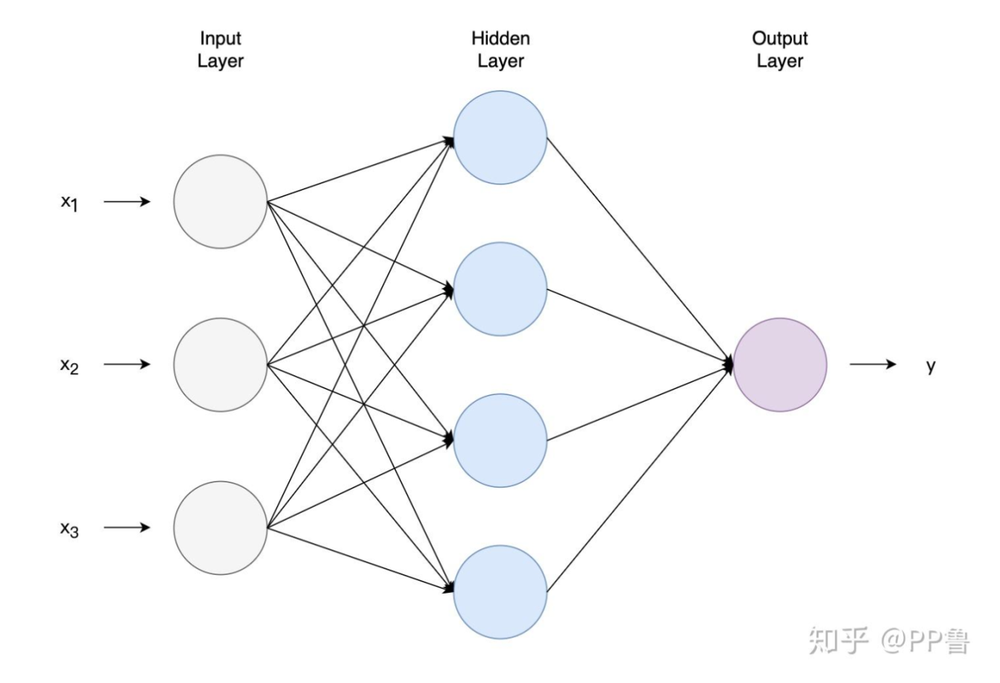

<h1 id="XLAFh"></h1>
<h1 id="nJYxY">Grok Explain</h1>

让我们深入了解 Transformer 模型中的自注意力机制（self-attention mechanism），重点关注如何在 PyTorch 中使用 einsum 函数计算注意力权重（attention weights）。自注意力机制是 Transformer 的核心，它使得模型能够动态地衡量输入序列中不同部分的重要性。在这里，我们将探讨注意力权重的计算过程——特别是 Query (Q) 和 Key (K) 矩阵之间的点积，并提供完整的实现代码。

<h2 id="UeZoS">理解注意力权重</h2>

在自注意力机制中，注意力权重决定了序列中的每个 token 应该对其他 token 给予多少关注。这些权重通过测量 Query (Q) 和 Key (K) 向量之间的相似性来获得，通常使用点积进行计算。然后对结果进行缩放和归一化，以生成概率分布。

**给定：**

+ Query 矩阵 Q：形状为 `(batch_size, seq_len, d_k)`
+ Key 矩阵 K：形状为 `(batch_size, seq_len, d_k)`

其中：

+ batch_size 是一个批次中包含的序列数，
+ seq_len 是每个序列的长度，
+ d_k 是每个 query/key 向量的维度。

注意力权重的计算公式如下：

$$
\text{attention\_weights} = \operatorname{softmax} \left( \frac{QK^T}{\sqrt{d_k}} \right)
$$

+ **点积（Q K^T）**：计算每个查询与键之间的相似性，得到一个形状为 (batch_size, seq_len, seq_len) 的矩阵。
+ **缩放（Scaling）**：除以  可以防止数值过大导致梯度不稳定。
+ **Softmax**：沿最后一个维度将分数归一化为概率分布。

<h2 id="daNsP">使用 einsum 进行点积计算</h2>

PyTorch 的 `torch.einsum` 是一个强大的张量运算工具，可以高效地执行点积操作。对于 Q K^T 的计算，我们定义如下操作：

```python
attention_scores = torch.einsum('bik,bjk->bij', Q, K)
```

+ `'bik'`：表示 Q 的形状 (batch_size, seq_len, d_k)
+ `'bjk'`：表示 K 的形状 (batch_size, seq_len, d_k)（我们直接使用 K，einsum 会隐式处理转置）
+ `'bij'`：输出形状 (batch_size, seq_len, seq_len)，每个元素表示查询与键之间的相似性

<h2 id="gMsBY">完整的自注意力机制实现</h2>

为了完整实现自注意力机制，我们还需要 Value 矩阵 V，其形状为 (batch_size, seq_len, d_v)（通常 d_v = d_k）。注意力权重将应用于 V 来生成输出：

```python
output = torch.einsum('bij,bjd->bid', attention_weights, V)
```

+ `'bij'`：注意力权重的形状 `(batch_size, seq_len, seq_len)`
+ `'bjd'`：V 的形状 `(batch_size, seq_len, d_v)`
+ `'bid'`：输出形状 `(batch_size, seq_len, d_v)`

以下是完整的实现代码：

```python
import torch
import torch.nn.functional as F
import math

def self_attention(Q, K, V):
    """
    实现自注意力机制
    
    参数：
    Q (torch.Tensor): Query 矩阵，形状为 (batch_size, seq_len, d_k)
    K (torch.Tensor): Key 矩阵，形状为 (batch_size, seq_len, d_k)
    V (torch.Tensor): Value 矩阵，形状为 (batch_size, seq_len, d_v)
    
    返回：
    output (torch.Tensor): 自注意力机制的输出，形状为 (batch_size, seq_len, d_v)
    """
    # 获取 key 向量的维度
    d_k = Q.size(-1)
    
    # 计算 Q 和 K^T 的点积
    attention_scores = torch.einsum('bik,bjk->bij', Q, K)
    
    # 对分数进行缩放
    attention_scores = attention_scores / math.sqrt(d_k)
    
    # 应用 softmax 得到注意力权重
    attention_weights = F.softmax(attention_scores, dim=-1)
    
    # 将注意力权重应用于 value 矩阵 V
    output = torch.einsum('bij,bjd->bid', attention_weights, V)
    
    return output

# 示例用法
batch_size, seq_len, d_k, d_v = 2, 4, 64, 64
Q = torch.randn(batch_size, seq_len, d_k)
K = torch.randn(batch_size, seq_len, d_k)
V = torch.randn(batch_size, seq_len, d_v)
output = self_attention(Q, K, V)
print(output.shape)  # 预期输出: torch.Size([2, 4, 64])
```

<h2 id="gfriG">代码解释</h2>

1. **点积计算**：`torch.einsum('bik,bjk->bij', Q, K)` 计算原始注意力分数。
2. **缩放操作**：除以 (\sqrt{d_k}) 保证数值稳定性。
3. **Softmax 归一化**：`F.softmax(..., dim=-1)` 沿着 key 维度对分数进行归一化。
4. **加权求和**：`torch.einsum('bij,bjd->bid', attention_weights, V)` 通过对 V 加权生成最终输出。

这个实现简洁、高效，并利用了 einsum 来优雅地处理张量操作，是一个理解 Transformer 中自注意力机制的实用示例。


<h1 id="caKqD">自己的理解</h1>
<h2 id="x65oI">第一步</h2>

$ Q = X W^Q $

$ K = X W^K $

$ V = X W^V $

```python
Q = torch.einsum('btm,mk->btk', X, WQ)
```


神经网络的计算，就是`seq_len ✖ d_k`个数字，每个数字乘一个参数再累加，得到隐藏层的第一个节点数值，继续，每个数字再乘一组参数，得到隐藏层第二个节点的数值。以此计算 个节点的值，所以参数数量是多少？ `(seq_len, d_k, t)`




<h2 id="Djg3T">第二步</h2>


$$\text{attention\_weights} = \text{softmax}\left(\frac{QK^T}{\sqrt{d_k}}\right)$$

$Q$的Shape: $(\text{batch\_size}, \text{seq\_len}, d_k)$

$a_{bsu}$ 代表什么: 代表第 $b$ 个batch中, 第 $s$ 个token, 与第 $u$ 个token的注意力权重

$$a_{111} = q_{111} \cdot k_{111} + q_{112} \cdot k_{112} + \cdots + q_{11d_k} \cdot k_{11d_k}$$

$$a_{112} = q_{111} \cdot k_{121} + q_{112} \cdot k_{122} + \cdots + q_{11d_k} \cdot k_{12d_k}$$

转成公式:

$$a_{bsu} = \sum_{d=1}^{d_k} q_{bsd} \cdot k_{bud}$$

```python
# Compute the dot product between Q and K^T
attention_scores = torch.einsum('bik,bjk->bij', Q, K)

# Scale the scores
attention_scores = attention_scores / math.sqrt(d_k)

# Apply softmax to get attention weights
attention_weights = F.softmax(attention_scores, dim=-1)
```


<h2 id="gIz8R">第三步</h2>

Apply attention weights to the value matrix V

$V$ 的形状：`（batch_size, seq_len, head_size）`

$attention_weight$ 的形状：`(batch_size, seq_len, seq_len)`


$attention_weight$  的意义：

$b_{111}$

$$
b_{bsk} = \sum_{s=1} a_{bsu} \cdot v_{buk}
$$


