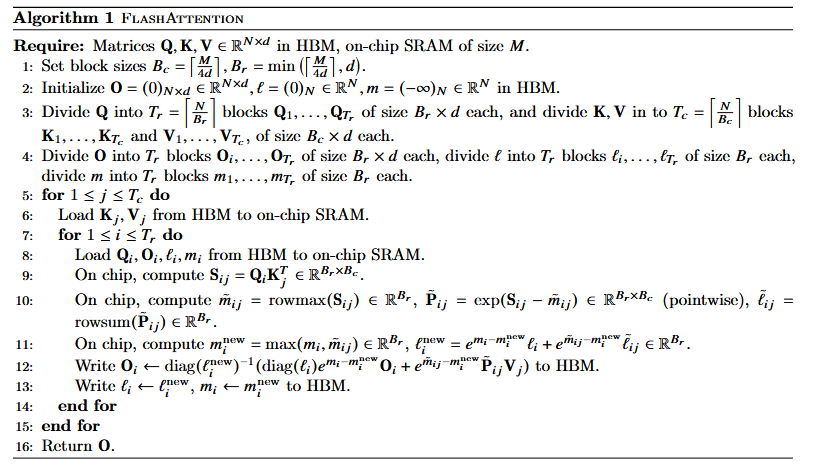
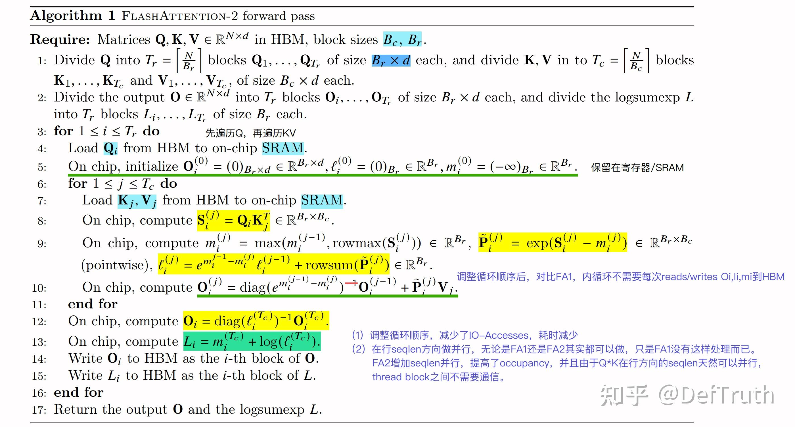
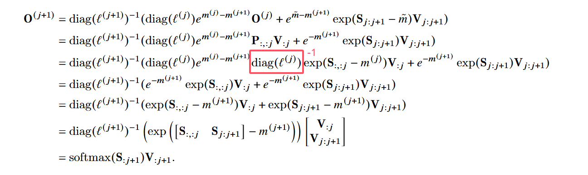

<!-- <iframe src="../../.assets/flash_attention2_forward.html" width="100%" height="1200px" style="border:none;"></iframe> -->
--8<-- ".assets/flash_attention2_forward.html"

---
## FlashAttention V1

### 公式符号解释

$N$ 代表输入序列的长度（Sequence Length），是一个整型标量。

$d$ 代表每个注意力头的维度（Head Dimension），是一个整型标量。

$M$ 代表 GPU 片上高速缓存 SRAM 的大小，是一个整型标量。

$\mathbf{Q}$ 代表查询矩阵（Query Matrix），形状为 $N \times d$。

$\mathbf{K}$ 代表键矩阵（Key Matrix），形状为 $N \times d$。

$\mathbf{V}$ 代表值矩阵（Value Matrix），形状为 $N \times d$。

$\mathbf{O}$ 代表注意力机制前向传播的最终输出矩阵（Output Matrix），形状为 $N \times d$。

$\mathbf{S}$ 代表全局未归一化的注意力得分矩阵（Attention Score Matrix），形状为 $N \times N$。

$\mathbf{P}$ 代表全局归一化后的注意力权重矩阵（Attention Weight Matrix），形状为 $N \times N$。

$B_c$ 代表键矩阵和值矩阵沿列维度进行分块的每块大小（Column Block Size），是一个整型标量。

$B_r$ 代表查询矩阵和输出矩阵沿行维度进行分块的每块大小（Row Block Size），是一个整型标量。

$T_c$ 代表键矩阵和值矩阵被分割成的总分块数量，是一个整型标量，计算公式为 $\lceil \frac{N}{B_c} \rceil$。

$T_r$ 代表查询矩阵和输出矩阵被分割成的总分块数量，是一个整型标量，计算公式为 $\lceil \frac{N}{B_r} \rceil$。

$\ell$ 代表 Softmax 行归一化分母累加值的全局统计向量，形状为 $N \times 1$。

$m$ 代表 Softmax 每行最大值的全局统计向量，用于数值稳定，形状为 $N \times 1$。

$\mathbf{Q}_i$ 代表查询矩阵 $\mathbf{Q}$ 沿行方向分割出的第 $i$ 个分块，形状为 $B_r \times d$。

$\mathbf{K}_j$ 代表键矩阵 $\mathbf{K}$ 沿行方向分割出的第 $j$ 个分块，形状为 $B_c \times d$。

$\mathbf{V}_j$ 代表值矩阵 $\mathbf{V}$ 沿行方向分割出的第 $j$ 个分块，形状为 $B_c \times d$。

$\mathbf{O}_i$ 代表输出矩阵 $\mathbf{O}$ 沿行方向分割出的第 $i$ 个分块，形状为 $B_r \times d$。

$\ell_i$ 代表全局行累加分母向量 $\ell$ 对应的第 $i$ 个分块，形状为 $B_r \times 1$。

$m_i$ 代表全局行最大值向量 $m$ 对应的第 $i$ 个分块，形状为 $B_r \times 1$。

$\mathbf{S}_{ij}$ 代表局部未归一化的注意力得分矩阵分块，形状为 $B_r \times B_c$。

$\tilde{m}_{ij}$ 代表局部得分矩阵分块 $\mathbf{S}_{ij}$ 的行最大值向量，形状为 $B_r \times 1$。

$\tilde{\mathbf{P}}_{ij}$ 代表未经过最终归一化、仅进行减去行最大值并计算指数后的局部注意力权重矩阵分块，形状为 $B_r \times B_c$。

$\tilde{\ell}_{ij}$ 代表局部权重矩阵分块 $\tilde{\mathbf{P}}_{ij}$ 的行累加值向量，形状为 $B_r \times 1$。

$m_i^{\mathrm{new}}$ 代表融合当前局部最大值后，更新后的行最大值统计分块，形状为 $B_r \times 1$。

$\ell_i^{\mathrm{new}}$ 代表融合当前局部累加和并经过指数修正后，更新后的行归一化分母统计分块，形状为 $B_r \times 1$。

$\tau$ 代表 Softmax 计算前的缩放因子（Scaling Constant），是一个浮点型标量。

$p_{\mathrm{drop}}$ 代表 Dropout 的丢弃概率，是一个浮点型标量。

$\mathcal{R}$ 代表用于前向传播生成随机数以及反向传播重构掩码的伪随机数生成器状态（Random State），是一个状态标量。

$\mathbf{dO}$ 代表输出矩阵 $\mathbf{O}$ 的损失函数梯度矩阵，形状为 $N \times d$。

$\mathbf{dQ}$ 代表查询矩阵 $\mathbf{Q}$ 的损失函数梯度矩阵，形状为 $N \times d$。

$\mathbf{dK}$ 代表键矩阵 $\mathbf{K}$ 的损失函数梯度矩阵，形状为 $N \times d$。

$\mathbf{dV}$ 代表值矩阵 $\mathbf{V}$ 的损失函数梯度矩阵，形状为 $N \times d$。

$\mathbf{dO}_i$ 代表输出梯度矩阵 $\mathbf{dO}$ 沿行方向分割出的第 $i$ 个分块，形状为 $B_r \times d$。

$\mathbf{dQ}_i$ 代表查询梯度矩阵 $\mathbf{dQ}$ 沿行方向分割出的第 $i$ 个分块，形状为 $B_r \times d$。

$\mathbf{dK}_j$ 代表键梯度矩阵 $\mathbf{dK}$ 沿行方向分割出的第 $j$ 个分块，形状为 $B_c \times d$。

$\mathbf{dV}_j$ 代表值梯度矩阵 $\mathbf{dV}$ 沿行方向分割出的第 $j$ 个分块，形状为 $B_c \times d$。

$D_i$ 代表反向传播中用于计算 Softmax 梯度的行累加点积中间统计量，形状为 $B_r \times 1$。

$\mathbf{Z}_{ij}$ 代表反向传播中通过状态 $\mathcal{R}$ 重新生成的局部 Dropout 掩码矩阵分块，形状为 $B_r \times B_c$。

$\mathbf{M}$ 代表块稀疏注意力机制中的块选择掩码矩阵（Block Sparsity Mask），形状为 $(N/B_r) \times (N/B_c)$。

$s$ 代表块稀疏掩码中非零块的比例（Sparsity Ratio），是一个浮点型标量。

注意：

在**证明**里：**$\tilde{m}$（m波浪号）并不是指单单“第 $j+1$ 列的值”，而是指第 $j+1$ 个“列分块”（包含 $B_c$ 列）在每一行上的最大值**。
符号上的混淆（Python 习惯 vs 论文习惯）
* **在 Python/NumPy 中**：切片 `S[:, j:j+1]` 确实表示只取第 $j$ 列（宽度为 1 的二维矩阵）。
* **在论文的数学证明中**：这里的 $j$ 是**分块（Block）的索引**，而不是单个列的索引。作者在证明中特别进行了解释：
  > “...the slice of $\mathbf{S}$ from column $j B_c$ to column $(j+1) B_c - 1$”
  这意味着，这个切片实际上代表了从第 $j B_c$ 列到第 $(j+1) B_c - 1$ 列、**宽度为 $B_c$ 的一整块区域**，而不是孤立的一列。

### 📊 Algorithm 1 逐行注释解析

这份算法的核心精髓在于：**如何不用在 HBM 中保存 $O(N^2)$ 的注意力矩阵 $S$ 和 $P$，而是直接在 SRAM 中边算边聚合出最终的 $O$。**

*   **Require**: 
    *   矩阵 $\mathbf{Q}, \mathbf{K}, \mathbf{V} \in \mathbb{R}^{N \times d}$ 位于 HBM（主显存）。
    *   已知片上 SRAM（极速缓存）的容量为 $M$。
*   **Line 1-2 (初始化)**: 
    *   计算切块大小 $B_c$ 和 $B_r$，确保划分的矩阵块能完美塞进有限的 SRAM 里。
    *   在 HBM 中初始化输出结果 $\mathbf{O}$ 为 0，全局指数和 $\ell$ 为 0，全局最大值 $m$ 为 $-\infty$。
*   **Line 3-4 (切分 Blocks)**: 
    *   将 $\mathbf{Q}, \mathbf{O}, \ell, m$ 切分成 $T_r$ 个块（按查询序列划分）。
    *   将 $\mathbf{K}, \mathbf{V}$ 切分成 $T_c$ 个块（按键值序列划分）。
*   **Line 5 (外层循环开始)**: 
    *   `for 1 <= j <= Tc do`：遍历所有的 $\mathbf{K}$ 和 $\mathbf{V}$ 块。
*   **Line 6 (加载 KV)**: 
    *   把当前的外层块 $\mathbf{K}_j, \mathbf{V}_j$ 从 HBM **加载进 SRAM 并常驻**。
*   **Line 7 (内层循环开始)**: 
    *   `for 1 <= i <= Tr do`：遍历所有的 $\mathbf{Q}$ 块。
*   **Line 8 (加载 Q 及状态)**: 
    *   把当前的 $\mathbf{Q}_i$ 以及过去算到一半的输出 $\mathbf{O}_i$、过去的指数和 $\ell_i$、过去的最大值 $m_i$ **全部加载进 SRAM**。
*   **Line 9 (计算局部注意力分数)**: 
    *   在 SRAM 内算矩阵乘法：$\mathbf{S}_{ij} = \mathbf{Q}_i \mathbf{K}_j^T$。（*注意：这只占一小块内存，算完马上处理，不存入 HBM*）。
*   **Line 10 (计算局部 Softmax 统计量)**: 
    *   找出当前这块 $S_{ij}$ 的最大值 $\tilde{m}_{ij}$。
    *   算出减去最大值后的指数 $\tilde{\mathbf{P}}_{ij} = \exp(\mathbf{S}_{ij} - \tilde{m}_{ij})$。
    *   算出这块的局部指数和 $\tilde{\ell}_{ij}$。
*   **Line 11 (代数聚合 - 全局状态更新)**: 
    *   **核心魔法发生地！** 我们不能直接把局部的当成全局的，所以需要合并历史。
    *   比较历史最大值 $m_i$ 和当前局部最大值 $\tilde{m}_{ij}$，得出**全新的全局最大值** $m_i^{new}$。
    *   根据新的最大值，将历史指数和与局部指数和按比例修正后相加，得出**全新的全局指数和** $\ell_i^{new}$。
*   **Line 12 (修正输出并直接写回 HBM)**: 
    *   根据刚才最新的全局统计量，修正以前算出来的老 $\mathbf{O}_i$（把它乘上 $e^{m_i - m_i^{new}}$ 缩放因子），再加上当前新算的 $\tilde{\mathbf{P}}_{ij} \mathbf{V}_j$。
    *   **算完的最新 $\mathbf{O}_i$ 直接覆盖写回 HBM**。
*   **Line 13 (写回统计量)**: 
    *   把最新的全局指数和 $\ell_i$ 和最大值 $m_i$ 也**覆盖写回 HBM**。
*   **Line 14-16**: 结束内外循环，最终 HBM 里的 $\mathbf{O}$ 就是精确无误的 Attention 结果。

---

## 证明

---

### tips 1

算法1里对 $i$ 的分块有点类似Megatron的矩阵切分，对 $i$ 这个维度进行切分的小块互不干扰，独立计算各个 $O_i$ ，最后Concat成一个完整 $O$ 就可以了

---

### tips 2

> **对比按 $i$ 分块和按 $j$ 分块的区别，为什么 $j$ 就不能独立， $i$ 和 $j$ 的最根本区别在哪里？**

**答：**

这是一个非常经典且触及 Softmax 本质的问题。

简单来说，**$i$（Query 维度）和 $j$（Key/Value 维度）最根本的区别在于：Softmax 是”跨 $j$ 进行归一化”的。**

这导致了：

- **$i$ 维度是完全解耦（独立）的**。
- **$j$ 维度则是强耦合（非独立）的**。

以下我们通过数学公式与第一性原理来拆解为什么 $j$ 无法像 $i$ 那样简单地”各自计算、最后拼接”。

---

#### 根本原因：Softmax 的数学定义

我们写出注意力机制中，输出矩阵 $\mathbf{O}$ 的第 $i$ 行（对应第 $i$ 个 Token 的输出 $o_i$）的完整数学公式：

$$
o_i = \sum_{j=1}^{N} P_{ij} v_j = \sum_{j=1}^{N} \left( \frac{e^{q_i k_j^T}}{\sum_{j'=1}^{N} e^{q_i k_{j'}^T}} \right) v_j
$$

请仔细观察公式中 $i$ 和 $j$ 的位置：

- **看行维度 $i$**：计算 $o_i$ 的整个公式里，**只有 $q_i$ 参与计算**，完全不涉及其他的 $q_{i'}$（$i' \neq i$）。这意味着 $o_1$ 的计算和 $o_2$ 的计算在数学上没有任何交集。
- **看列维度 $j$**：在括号内的 Softmax 分母中，有一个累加和 $\sum_{j'=1}^{N} e^{q_i k_{j'}^T}$。这个累加和**必须遍历所有的 $j'$（从 1 到 $N$）**。

> **这就是最根本的区别：为了算出任意一个位置的注意力权重，你必须事先知道整条序列上所有 Key（即所有 $j$）的信息。**

---

#### 如果强行对 $j$ 进行独立分块，会发生什么？

假设我们将 $j$（Key/Value 维度）强行切分成两个不重叠的块：

- **第一块（前一半 Keys）**：计算出局部输出 $o_i^{(1)}$，局部 Softmax 分母为 $D_i^{(1)}$。
- **第二块（后一半 Keys）**：计算出局部输出 $o_i^{(2)}$，局部 Softmax 分母为 $D_i^{(2)}$。

如果我们像对待 $i$ 那样，把它们直接拼起来或者加起来，会得到什么？

- 它们的归一化分母 $D_i^{(1)}$ 和 $D_i^{(2)}$ 是不同的。
- 如果直接相加 $o_i^{(1)} + o_i^{(2)}$，这就好比分数相加时**没有通分**（即 $\frac{a}{b} + \frac{c}{d}$ 直接算成了 $\frac{a+c}{b+d}$ 或 $\frac{a}{b} + \frac{c}{d}$ ），数学上是完全错误的。

> **因此，$j$ 维度的各个分块无法独立计算，因为它们共享同一个全局归一化分母。**

---

## FlashAttention V2

## 校对

 flash attention论文[2]23页证明有笔误

## 参考文献
[1] 知乎专栏. 《[Attention优化][2w字]📚原理篇: 从Online-Softmax到FlashAttention V1/V2/V3》. 见于 2026年6月19日. https://zhuanlan.zhihu.com/p/668888063.

[2] Dao, Tri, Daniel Y. Fu, Stefano Ermon, Atri Rudra和Christopher Ré. 《FlashAttention: Fast and Memory-Efficient Exact Attention with IO-Awareness》. arXiv:2205.14135. 预印本, arXiv, 2022年6月23日. https://doi.org/10.48550/arXiv.2205.14135.

[3] Dao, Tri. 《FlashAttention-2: Faster Attention with Better Parallelism and Work Partitioning》. arXiv:2307.08691. 预印本, arXiv, 2023年7月17日. https://doi.org/10.48550/arXiv.2307.08691.
