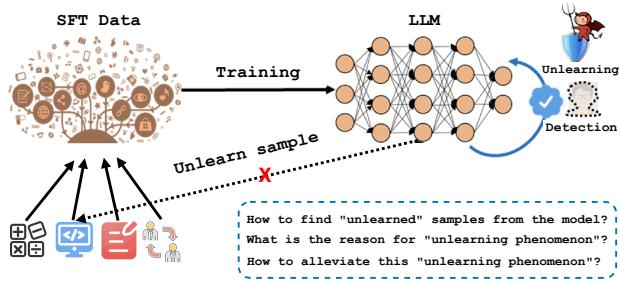
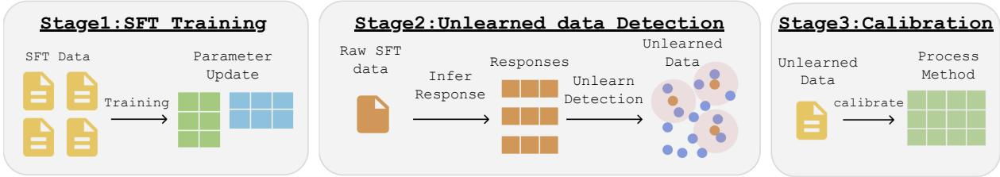
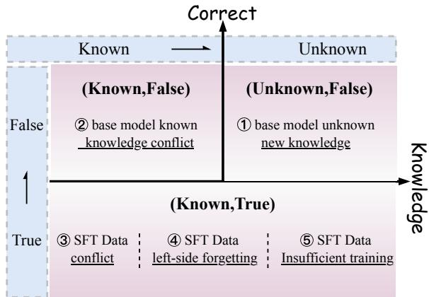
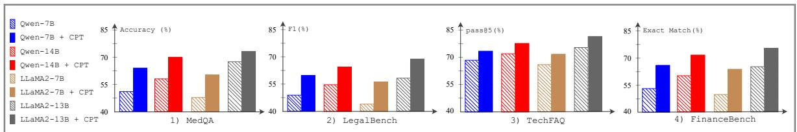

# Why Supervised Fine-Tuning Fails to Learn: A Systematic Study of Incomplete Learning in Large Language Models

Chao Xue1,⋆, Yao Wang1,⋆, Mengqiao Liu2, Di Liang2,3,†, Xingsheng Han2, Peiyang Liu5, Xianjie Wu2, Chenyao Lu2, Lei Jiang2, Yu Lu2, Haibo Shi2,3, Shuang Liang4, Minlong Peng2, Flora D. Salim1,†

1 University of New South Wales, Australia, 2 Tencent Hunyuan, China, 3 Tencent Yuanbao, China, 4 UESTC, China , 5 Peking University, China

xuechao8071@gmail.com; flora.salim@unsw.edu.au

## Abstract

Supervised Fine-Tuning (SFT) is the standard approach for adapting large language models (LLMs) to downstream tasks. However, we observe a persistent failure mode: even after convergence, models often fail to cor rectly reproduce a subset of their own supervised training data. We refer to this behavior as the Incomplete Learning Phenomenon (ILP). This paper presents the first systematic study of ILP in LLM fine-tuning. We formal ize ILP as post-training failure to internalize supervised instances and demonstrate its prevalence across multiple model families, domains, and datasets. Through controlled analyses, we identify five recurrent sources of incomplete learning: (1) missing prerequisite knowledge in the pre-trained model, (2) conflicts between SFT supervision and pre-training knowledge, (3) internal inconsistencies within SFT data, (4) left-side forgetting during sequential fine tuning, and (5) insufficient optimization for rare or complex patterns. We introduce a diagnosticfirst framework that maps unlearned samples to these causes using observable training and inference signals, and study several targeted mitigation strategies as causal interventions. Experiments on Qwen, LLaMA, and OLMo2 show that incomplete learning is widespread and heterogeneous, and that improvements in aggregate metrics can mask persistent unlearned subsets. The findings highlight the need for fine-grained diagnosis of what supervised finetuning fails to learn, and why.

## 1 Introduction

Supervised Fine-Tuning has become the dominant paradigm for adapting large language models (LLMs) to downstream applications such as question answering, dialogue generation, and domainspecific reasoning (Hou et al., 2024a; Zhao et al., 2024). By leveraging relatively small but carefully curated labeled datasets, SFT enables pre-trained models to align their behavior with task-specific objectives while retaining general linguistic competence. As a result, SFT is widely regarded as a reliable and efficient mechanism for specialization.

Despite its widespread adoption, SFT exhibits a subtle but consequential failure mode that is insufficiently understood. In practice, we observe that even after training loss convergence and extensive hyperparameter tuning, LLMs frequently fail to correctly answer a subset of their supervised training examples. These failures occur on the SFT dataset itself, rather than on held-out or out-of-distribution data, and persist across random seeds and evaluation settings. We refer to this behavior as the Incomplete Learning Phenomenon (ILP). Figure 1 illustrates ILP: after fine-tuning, re-evaluating the model on its supervised training set reveals that certain instances or patterns remain consistently mispredicted. Importantly, ILP is distinct from catastrophic forgetting (McCloskey and Cohen, 1989), which concerns the loss of previously acquired capabilities, and from machine unlearning (Cao and Yang, 2015), which is intentional. Instead, ILP reflects a failure to acquire or internalize parts of the supervision signal during SFT.

Understanding ILP is practically important for several reasons. First, SFT datasets, especially in expert domains such as law and medicine, are costly to construct, and incomplete learning directly reduces their utility. Second, unlearned samples are often not random; they tend to correspond to rare cases, compositional patterns, or knowledge-intensive instances, which disproportionately affect robustness and reliability. Third, aggregate evaluation metrics can obscure ILP: improvements on standard benchmarks may coexist with persistent failures on specific supervised instances. Prior work has investigated challenges related to fine-tuning stability, data quality, and optimization dynamics (Gururangan et al., 2020; Zhang and Wu, 2024; Bengio et al., 2009; Wang et al., 2026a). However, these studies typically focus on improving overall task performance rather than explaining which supervised knowledgefails to be learned and why. As a result, existing approaches provide limited tools for diagnosing fine-tuning failures at the level of individual samples or patterns.

In this paper, we take a phenomenon-driven perspective. Our goal is not to propose a new finetuning algorithm, but to systematically characterize, diagnose, and validate the sources of incomplete learning in SFT. Through extensive empirical analysis, we identify five recurring contributors to ILP: (i) Pre-training Knowledge Limitations, where the base model lacks prerequisite concepts needed to absorb the supervised signal; (ii) Knowledge Conflicts, where SFT supervision contradicts entrenched pre-training knowledge; (iii) Internal SFT Data Conflicts, arising from noisy or inconsistent annotations; (iv) Left-Side Forgetting, where earlier supervised instances are overwritten during sequential fine-tuning; (v) Insufficient Optimization for Complex Patterns, where rare or compositional structures receive inadequate training signal.

To operationalize this analysis, we introduce a diagnostic framework that associates unlearned samples with these causes using observable training and inference indicators, such as prediction consistency, entropy dynamics, and replay sensitivity. We further examine several targeted mitigation strategies, including continued pre-training, conflict-aware scheduling, and replay-based resampling, not as universally optimal solutions, but as controlled interventions to test the plausibility of each hypothesized cause. We evaluate our framework on multiple LLMs (Qwen, LLaMA, and OLMo2) across diverse domains and tasks. The results demonstrate that incomplete learning is both prevalent and heterogeneous: no single intervention resolves all failures, and improvements in aggregate metrics can mask persistent unlearned subsets.

Overall, this work makes three contributions. First, it identifies and formalizes the Incomplete

  
Figure 1: Schematic illustration of the incomplete learning phenomenon, where testing the model on the initial training set after fine-tuning reveals that certain samples or patterns were not effectively learned during SFT.

Learning Phenomenon as a measurable and reproducible failure mode in supervised fine-tuning. Second, it provides a systematic taxonomy and diagnostic framework that links unlearned supervised instances to distinct underlying causes. Third, it empirically shows that different sources of incomplete learning require different remedies, highlighting the limitations of one-size-fits-all fine-tuning strategies. Together, these findings argue for a shift from performance-centric evaluation of SFT toward fine-grained, learning-centric diagnosis, offering a foundation for more reliable and interpretable adaptation of large language models.

## 2 Related Works

Recent research on large language models spans multiple directions: stepwise distillation (Chen et al., 2025; Jiang et al., 2025; Zhang et al., 2025), multi-hop temporal knowledge reasoning (Wen et al., 2026; Xue et al., 2024), and security and robustness through jailbreak detection (Hua et al., 2025) and backdoor analysis in reward learning (Guo et al., 2026b); structured representation learning for contextual semantic matching (Xue and Gao, 2025) and empathetic dialogue model ing (Ji et al., 2026); multimodal referential understanding (Wang et al., 2026b); memorizationconstrained story reasoning (Jiang and Ferraro, 2026); and broader applications in AI governance (Chen, 2026b,a) and predictive analytics (Hu and Shen, 2026). A common thread across many of these approaches is the reliance on high-quality, human- or model-generated reasoning demonstrations—typically injected into the model via supervised fine-tuning (SFT)—to align behavior with desired reasoning patterns.

Supervised Fine-Tuning of Large Language Models LLMs show remarkable zero-shot ca-

  
Figure 2: The Incomplete Learning framework consists of three stages: (1) fine-tune on SFT data; (2) detect unlearned samples via re-evaluation; (3) calibrate model and data to fix them.

pabilities (Brown et al., 2020; Wu et al., 2021; Hou et al., 2024b; Song et al., 2023), leading to extensive efforts in enhancing their applicability via Supervised Fine-Tuning. To unlock their full potential, LLMs are often subjected to the SFT phase, which refines their ability to perform spe cific tasks and better align with human instructions (Ponti et al., 2023; Li et al., 2026; Gao et al., 2026; Huang et al., 2026). This study broadens the traditional scope of SFT to incorporate diverse forms of sequence-to-sequence fine-tuning, including fine-tuning for human alignment, instruction adherence, and domain-specific task optimization (Zhou et al., 2023b; Yuan et al., 2023b; Cheng et al., 2023a; Zhang et al., 2024; Liu et al., 2026). Recent research has explored multi-task instruc tion fine-tuning for pre-trained LLMs, aimed at enhancing their zero-shot performance across a broad range of downstream NLP tasks (Sanh et al., 2022; Khashabi et al., 2020). Prominent efforts such as FLAN, which curated large-scale instruc tion datasets, have shown that models fine-tuned with such data (Chung et al., 2022; Singhal et al., 2022) achieve improved zero-shot generalization. Although the generalization capabilities of LLMs in out-of-distribution domains have been exten sively studied (Liu et al., 2024a; Yuan et al., 2024; Wang et al., 2024), the effect of multi-task fine tuning on in-domain performance, and potentia SFT-induced degradation of foundational abilities (Mukhoti et al., 2023; Liu et al., 2025b) or catas trophic forgetting (Kotha et al., 2023), remain criti cal areas of investigation. These challenges high light the complexities our work on ILP addresses by focusing on why SFT data itself is not fully learned. With the rise of proprietary models like ChatGPT, the focus on SFT for better aligning LLMs with human intent has grown (Ouyang et al., 2022). Beyond crowd-sourcing, user logs (Chiang et al., 2023; Wang et al., 2023a) and LLM-assisted self-generated data (Wang et al., 2023c; Taori et al., 2023; Cheng et al., 2023b; Lei et al., 2023; Xu et al., 2023; Xue et al., 2023b; Wu et al., 2025a; Mukherjee et al., 2023; Wang et al., 2025; Wu et al., 2025c) are increasingly used for SFT. Moreover, methods to improve the quality of SFT datasets have been proposed to enhance alignment with human preferences (Zhou et al., 2023a; Wang et al., 2023b; Lu et al., 2023; Wu et al., 2025d; Liu et al., 2024b; Cui et al., 2023). SFT has also proven valuable for domain-specific applications, excelling in areas such as mathematical reasoning (Cobbe et al., 2021; Yuan et al., 2023a; Yue et al., 2023; Gou et al., 2024; Yue et al., 2024; Dai et al., 2025) and code generation tasks (Chaudhary, 2023; Luo et al., 2023; Wei et al., 2023; Wu et al., 2025b). Additionally, supervised fine-tuned LLMs have been leveraged to enhance interactivity by composing external commands, enabling the execution of a variety of highly complex downstream applications, such as tool integration (Yao et al., 2023b,a; Song et al., 2024; Fu et al., 2024; Liu et al., 2025a; Guo et al., 2026a).

Data Quality and Multi-Stage Fine-Tuning Improving data quality is a recurring focal point in the SFT pipeline (Mazumder et al., 2023; Li et al., 2024a; Liu et al., 2024c; Li et al., 2024c). Techniques such as data augmentation (Shorten and Khoshgoftaar, 2019; Li et al., 2024b; Fu et al., 2021) and active learning (Settles, 2009) aim to enhance the diversity or informativeness of training examples. Prompt engineering (Lester et al., 2021; Liu et al., 2023b,a) has been introduced to reshape the input space, thereby encouraging more consistent model outputs. Additionally, knowledge distillation (Hinton, 2015) is employed to transfer knowledge from larger teacher models to smaller or specialized student models, ensuring knowledge preservation while reducing model size or computational overhead (Sanh et al., 2019; Liang et al., 2019b; Wang et al., 2022; Song et al., 2022; Xue et al., 2023a; Chen et al., 2026; Gui et al., 2018; Zheng et al., 2022; Liang et al., 2019a; Hu et al.,

2025; Xue et al., 2026). Curriculum learning (Bengio et al., 2009; Qian et al.) arranges training samples in an order of increasing complexity, enabling models to develop foundational competencies before tackling more difficult examples. Such methods have demonstrated improved convergence rates and robustness (Platanios et al., 2019). Multi-Task and multi-pass fine-tuning extend ideas by exposing the model to multiple related tasks or multistep schedules, where earlier tasks are revisited (Dong et al., 2023; Ruder, 2017; Ma et al., 2022; Fei et al., 2022). These strategies highlight how training order, data scheduling, and repeated reexposure to previously learned samples can reduce overfitting, mitigate forgetting, and improve generalization (Parisi et al., 2019).

Scaling Laws in Large Language Models The remarkable performance of LLMs is driven by scal ing model sizes, dataset volumes, and computational resources to unprecedented levels (Kaplan et al., 2020). Analyzing how performance across an exponential range of scales has become crucial. Research has explored scaling laws in pre-training (Anil et al., 2023; Hoffmann et al., 2022), transfer learning (Chronopoulou et al., 2019), preference modeling (Gao et al., 2022), and mathematical reasoning (Yuan et al., 2023a), underscoring the pivotal role of scaling in enhancing LLMs’ capability.

## 3 Methods

Our method is designed to systematically diagnose and mitigate incomplete learning phenomena in supervised fine-tuning of large language models. As illustrated in Figure 2, the framework consists of two tightly coupled components: Unlearned Sample Detection and Unlearned Sample Processing. The Unlearned Sample Detection module aims to identify training instances that are not effectively internalized by the model during SFT. Unlike conventional data filtering approaches that rely on static heuristics or annotation quality, we focus on samples that remain persistently mispredicted or unstable across training, indicating a failure of learning rather than noise. These unlearned samples form hidden bottlenecks that limit performance gains from additional data or training iterations. Building on the detected unlearned samples, the Unlearned Sample Processing module analyzes their underlying characteristics and failure modes. Through empirical analysis, we categorize typical unlearned samples into five representative error types, each associated with distinct learning deficiencies. For each type, we design targeted processing strategies that directly address its root cause, rather than uniformly reweighting or discarding data.

## 3.1 Unlearned Sample Detection

A prerequisite for studying incomplete learning is a reliable mechanism to identify which supervised instances are not effectively learned after fine-tuning. In this work, we treat unlearned sample detection as a post-training measurement problem rather than an optimization objective. Specifically, we ask whether a model, after supervised fine-tuning (SFT) convergence, can consistently reproduce the supervision signal it has already seen.

## 3.1.1 Sample-Level Evaluation

SFT datasets typically consist of free-form text responses, which makes instance-level correctness difficult to assess in a standardized manner. To enable consistent measurement across heterogeneous datasets and tasks, we operationalize supervised responses into a multiple-choice (MC) format. This conversion is not intended to change the supervision content, but to provide a discrete and comparable evaluation interface. Concretely, for each SFT instance, the original response is preserved as the correct option, while several semantically plausible but incorrect alternatives are constructed as distractors. The model is then required to select the correct option among a fixed set of candidates. Figure 2 illustrates the overall framework, and an example of this conversion is shown below.

<table><tr><td>Dataset Conversion Example</td></tr><tr><td>Original Sample. Prompt: Explain what deep learning is. Response: Deep learning is a machine learning method based on neural networks. Converted Evaluation Form. Options: A) is a machine learning method based on neural networks. B) is a rule-based system. C) is a reinforcement learning method. D) is a traditional statistical method.</td></tr></table>

The index of the correct option is recorded and used for subsequent evaluation. Importantly, this conversion is applied onlyfor detection and analysis and does not alter the original SFT training objective.

## 3.1.2 Post-SFT Consistency Evaluation

As shown in Figure 2, unlearned sample detection is performed after the SFT process has converged. During fine-tuning, we monitor the training loss to ensure stable optimization and exclude undertraining artifacts. After convergence, the entire SFT dataset is re-evaluated by the fine-tuned model using the MC-based interface. For a dataset of N supervised instances, we define sample-level correctness by whether the model selects the groundtruth option. The training-set accuracy is:

$$
\mathrm{Acc} = \frac {1}{N} \sum_ {i = 1} ^ {N} \mathbb {I} \left(\arg \max _ {k} \hat {y} _ {i, k} = y _ {i}\right),\tag{1}
$$

where $\hat { y } _ { i , k }$ is predicted probability for option k of instance $i ,$ and $y _ { i }$ is the correct index. Accuracy is coarse and misses partial or unstable learning; thus, we use repeated sampling to reduce stochasticity.

## 3.1.3 Robust Detection

For each instance, we perform N independent inference runs and compute its pass@N rate, defined as the fraction of runs in which the model predicts the correct option. This metric reflects the consistency with which the supervision signal is recovered. In addition, we adopt a Best-of-N (BoN) criterion, which selects the prediction with the highest confidence score among N samples, providing a complementary upper-bound estimate of model capability. An instance is considered unlearned if its pass@N rate falls below a predefined threshold T. In our experiments, we set $T = 0 . 2$ under BoN-5 sampling unless otherwise stated. We empirically verify that the identified unlearned instances are stable across random seeds and sampling runs, indicating that they are not artifacts of stochastic decoding.

## 3.1.4 Empirical Prevalence of Unlearned Samples

Applying this detection protocol across ten benchmark SFT datasets, we find that incomplete learning is widespread. On average, $1 5 . 3 \% \pm 2 . 1 \%$ of supervised instances remain unlearned after SFT convergence. This observation holds across model families and domains, suggesting that ILP is not an isolated or dataset-specific phenomenon. For subsequent analysis, we construct a candidate set by selecting instances with pass@5 rates below the threshold under repeated BoN-5 sampling. From this set, we select the top-K most severe cases based on error consistency, with $K = 1 0 0 0$ in our main experiments. These instances form the basis for fine-grained diagnosis in the following section.

## 3.1.5 Knowledge-State Probing for Diagnostic Preparation

To enable attribution of unlearned samples to potential causes, we probe the knowledge state of the base model prior to fine-tuning. For each candidate instance x, we first test whether the base model can correctly answer it in a zero-shot setting. We define a binary indicator of knowledge existence as

$$
\mathcal {P} _ {\mathrm{exist}} (x) = \mathbb {I} \left(\mathrm{Acc} (\mathcal {M} _ {\mathrm{base}} (x)) > 0. 8\right).\tag{2}
$$

In addition, we measure how the model’s predictive distribution changes after SFT by computing the Jensen–Shannon divergence between the base and fine-tuned models,as:

$$
\begin{array}{r l} D _ {\mathrm{JS}} (P _ {\text {base}} \| P _ {\mathrm{SFT}}) & = \frac {1}{2} D _ {\mathrm{KL}} (P _ {\text {base}} \| M) \\ & + \frac {1}{2} D _ {\mathrm{KL}} (P _ {\mathrm{SFT}} \| M) \end{array}\tag{3}
$$

where $M = ( P _ { \mathrm { b a s e } } + P _ { \mathrm { S F T } } ) / 2$ . Together, these signals characterize whether the base model lacks relevant knowledge, holds conflicting priors, or undergoes insufficient or unstable updates during fine-tuning. In the next subsection, we use these diagnostics to analyze unlearned samples and map them to distinct sources of incomplete learning.

## 3.2 Unlearned Sample Processing

To systematically analyze the Incomplete Learning Phenomenon (ILP), we introduce a unified pipeline that operates at the level of individual supervised instances. The core objective is not merely to improve aggregate performance, but to determine why specific SFT samples remain unlearned after convergence. Figure 3 illustrates the overall attribution process. The pipeline begins by identifying unlearned samples via post-SFT evaluation. Each such sample is then sequentially examined under a set of diagnostic tests, each corresponding to a hypothesized source of incomplete learning. Importantly, the mitigation strategies described below are not positioned as general-purpose solutions; instead, they serve as controlled interventions to validate the causal relevance of each attributed factor.

## 3.2.1 Base Model Knowledge Limitations

The first step of our framework focuses on identifying knowledge blind spots in the base model. We begin by detecting unlearned samples from the SFT dataset and extracting their underlying factual content using OpenIE tools.1 Each sample is converted into a set of subject–predicate–object triplets, forming a candidate knowledge set ${ \cal K } _ { \mathrm { c a n d } } = \{ ( h , r , t ) \}$

To quantify whether a knowledge triplet is sufficiently covered by the base model, we adopt BoN sampling and the pass@N metric as probing mechanisms. Intuitively, if the model repeatedly fails to produce correct answers even under multiple sampling attempts, the corresponding knowledge is likely missing rather than poorly optimized. Formally, we define the set of blind knowledge as:

$$
\begin{array}{c} \mathcal {K} _ {\text { blind }} = \{k \mid \text { pass@10 } (k) <   0. 2 \\ \wedge \text { BoN - 5   Acc } (k) <   0. 1 \}. \end{array}\tag{4}
$$

This criterion filters out cases where errors are attributable to stochasticity or reasoning noise, retaining only those samples that reflect systematic knowledge gaps. Once blind knowledge is identified, we expand the corresponding background information by querying multiple external sources, including WikiData APIs, Google Search, and the OpenAI-o1 API. For each unknown entity, we retrieve an average of $2 0 \pm 1 . 1$ related documents, covering definitions, relations, and contextual usage. This multi-source aggregation mitigates bias from any single knowledge provider and improves factual completeness. The resulting knowledge-augmented corpus $\mathcal { C } _ { \mathrm { a u g } }$ is then mixed with a general-domain corpus to perform continued pre-training. The mixed corpus as:

$$
\mathcal {C} _ {\text { mix }} = 0. 8 \mathcal {C} _ {\text { general }} + 0. 2 \mathcal {C} _ {\text { aug }},\tag{5}
$$

where $\mathcal { C } _ { \mathrm { g e n e r a l } }$ consists of standard pre-training data such as OpenWebText and BookCorpus. This design explicitly balances knowledge injection and distributional stability, enabling the model to acquire missing facts without degrading its general language understanding capabilities. After CPT, we reapply SFT using the original SFT dataset and evaluate the updated model. Improvements are measured using accuracy and pass@N metrics, allowing us to isolate gains attributable to knowledge completion rather than optimization artifacts. As shown in Figure 4, this procedure consistently improves downstream performance across medical, legal, and financial benchmarks, validating that incomplete learning in SFT can often be traced back to knowledge deficiencies in the base model.

  
Figure 3: Unlearned sample attribution framework.

## 3.2.2 Conflicts Between SFT and Base Model

Beyond missing knowledge, we observe another failure mode in which the base model exhibits strong but incorrect beliefs that conflict with SFT supervision. Such conflicts are particularly problematic because high-confidence errors tend to resist correction during fine-tuning, leading to unstable or slow convergence. To systematically identify these cases, we prompt the base model to answer multiple-choice questions from the SFT dataset and extract the probability of the predicted answer token. Let $P _ { \mathrm { m o d e l } } ( y \mid x )$ ) denote the model’s confidence for input x and predicted answer y. A sample is flagged as a high-confidence error if the model strongly prefers an incorrect answer:

$$
\operatorname{Error} (x, y) = \left\{ \begin{array}{l} 1, P (y | x) > T \text {   and   } y \neq y _ {\mathrm{SFT}}, \\ 0, \text { otherwise }. \end{array} \right.\tag{6}
$$

Here, $T$ denotes a predefined confidence threshold, and y is the ground-truth label provided by the SFT data. Samples satisfying this condition form a high-confidence error set $\mathcal { E } ,$ , representing explicit knowledge conflicts between the base model and supervision. To resolve these conflicts, we follow the same knowledge augmentation and CPT procedure described above. Specifically, authoritative external sources such as Wikipedia and domainspecific corpora are used to retrieve verified information corresponding to conflicting samples. Continued pre-training on this curated corpus realigns the model’s internal knowledge representations, reducing resistance to subsequent SFT updates.

## 3.2.3 Knowledge Conflicts Within SFT Data

Incomplete learning may also originate from inconsistencies internal to the SFT dataset itself. When semantically similar inputs are associated with contradictory labels, the model receives an incoherent learning signal, limiting convergence on affected samples. We detect such conflicts by computing semantic similarity between sample pairs. If $\mathrm { S i m } ( s _ { i } , s _ { j } ) > X$ , the pair is treated as potentially conflicting. To determine correctness, we employ GPT(OpenAI et al., 2024),deepseek(DeepSeek-AI et al., 2025) as an external evaluator. If one sample is judged incorrect, it is removed; if both are judged correct, the pair is retained but treated as incompatible during training. Rather than discarding valid supervision, we assign conflicting samples to separate training buckets, ensuring they do not co-occur within the same mini-batch. This bucket assignment is periodically re-evaluated every K training steps to reflect the model’s evolving competence. Observed reductions in error rates on these samples after bucketing indicate that internal data conflict, rather than representational insufficiency, was the primary cause of incomplete learning.

## 3.2.4 Left-side Forgetting

Another manifestation of incomplete learning appears as left-side forgetting. When SFT datasets are concatenated or processed sequentially, we observe a systematic bias toward recently seen data. By reversing dataset order and tracking per-dataset accuracy, we find that earlier samples are progressively overshadowed, consistent with left-side forgetting (Li and Lee, 2024). To mitigate this effect, we apply random shuffling across the entire SFT dataset and introduce a dynamic re-sampling mechanism. At regular intervals of K steps, validation accuracy is monitored for each data subset. If a significant drop is detected, samples from the affected subset are temporarily upweighted. This strategy, detailed in Algorithm 4, serves to test whether incomplete learning arises from training order effects rather than intrinsic difficulty.

## 3.2.5 Insufficient Training

Finally, incomplete learning can arise from insufficient optimization, where a fixed number of training epochs fails to accommodate datasets of varying complexity. To address this, we adopt a progressive epoch increment strategy inspired by early stopping (Prechelt, 2002). Training begins with a minimal epoch count $E _ { \mathrm { m i n } }$ and incrementally increases until validation performance ceases to improve. The stopping condition is defined as

$$
\mathcal {C} \text { stop } = \mathbb {I} \left(\mathcal {L} \text { val } ^ {(e)} > \mathcal {L} _ {\text { val }} ^ {(e - 1)} + \delta\right),\tag{7}
$$

where δ = 0.01 prevents premature termination due to noise. This adaptive strategy ensures sufficient learning while avoiding overfitting, and its implementation is detailed in Algorithm 5.

## 4 Results Analysis

## 4.1 Base Model Knowledge Enhancement

To address pre-training knowledge gaps, we employ Continued Pre-Training (CPT), described in Appendix A. As illustrated in Figure 4, CPT consistently improves accuracy on domain-specific benchmarks, including MedQA (Jin et al., 2020), LegalBench (Guha et al., 2023; Koreeda and Manning, 2021), and FinanceBench (Islam et al., 2023) for models such as Qwen (Bai et al., 2023) and LLaMA2 (Touvron et al., 2023). Accuracy gains range from 9.4% to 14.1% (e.g., +12.5% on MedQA), demonstrating CPT’s effectiveness in filling critical knowledge gaps that standard SFT fails to capture. Notably, simply extending SFT epochs leads to only marginal improvements, underscoring that missing foundational knowledge cannot be addressed through prolonged fine-tuning alone. Further validation with OLMo2-7B (OLMo et al., 2025) (Appendix F) shows similar trends: CPT significantly enhances performance in domains where the base model initially exhibited high ’Knowledge Non-Existence Rates’. While targeted knowledge injection sometimes interacts with generalization, careful corpus balancing mitigates negative effects, indicating that CPT can selectively improve domain-specific knowledge without undermining overall language understanding. Collectively, these results highlight CPT as a necessary step for bridging knowledge deficits in LLMs prior to SFT.

## 4.2 Knowledge Conflict Calibration

High-confidence conflicts between pre-trained knowledge and SFT supervision pose another obstacle to complete learning. To resolve this, we apply a CPT-based calibration strategy (Appendix B). Table 1 demonstrates consistent accuracy improvements across models(Qwen-7B/14B, LLaMA2-7B, and LLaMA2-13B) on diverse benchmarks. Gains range from +1.6% (LLaMA2-13B on SocialIQA) to +2.8% (Qwen-7B on ARC), with additional improvements for other datasets (e.g., +2.5% for Qwen-14B on ARC, +2.1% for LLaMA2-13B on CommonQA). These improvements correspond to a marked reduction in high-confidence SFT conflicts, confirming that targeted CPT effectively aligns the model’s predictions with supervised knowledge. Case studies on OLMo2-7B reveal that CPT recalibrates conflict points where pre-trained knowledge previously overrode SFT supervision. This demonstrates CPT’s dual role: both filling missing knowledge and mitigating entrenched misbeliefs. Overall, CPT provides a systematic mechanism to harmonize pre-training and supervised signals, which is essential for reducing incomplete learning arising from knowledge conflicts.

Figure 4: Performance improvements achieved by introducing Continued Pre-Training (CPT). Results demonstrate consistent accuracy gains across the medical (MedQA), legal (LegalBench), and financial (FinanceBench) domains.

<table><tr><td>Model</td><td>ARC</td><td>CommonQA</td><td>SocialIQA</td><td>MedMCQA</td></tr><tr><td>Qwen 7B</td><td>68.1 → 70.9 (+2.8)</td><td>74.5 → 76.9 (+2.4)</td><td>70.3 → 72.2 (+1.9)</td><td>61.2 → 63.7 (+2.5)</td></tr><tr><td>Qwen 14B</td><td>71.2 → 73.7 (+2.5)</td><td>76.8 → 79.1 (+2.3)</td><td>72.1 → 74.0 (+1.9)</td><td>63.1 → 65.3 (+2.2)</td></tr><tr><td>LLaMA2 7B</td><td>66.3 → 68.8 (+2.5)</td><td>72.8 → 75.3 (+2.5)</td><td>68.9 → 71.1 (+2.2)</td><td>58.9 → 61.4 (+2.5)</td></tr><tr><td>LLaMA2 13B</td><td>69.1 → 71.3 (+2.2)</td><td>75.2 → 77.3 (+2.1)</td><td>70.5 → 72.1 (+1.6)</td><td>61.1 → 63.0 (+1.9)</td></tr></table>

Table 1: Accuracy (%) before and after Continued Pre-Training (CPT) on four knowledge-intensive benchmarks. Improvements brought by CPT are highlighted in color and remain consistent across model sizes and domains.

## 4.3 SFT Knowledge Conflict Resolution

Internal conflicts within the SFT dataset can also induce incomplete learning, particularly when semantically similar or nearly identical inputs are paired with contradictory labels—introducing noise that confuses the optimization process. To mitigate this, we propose a two-stage approach based on conflict detection followed by dynamic bucketing, which groups potentially conflicting examples into separate training batches while preserving all valid supervision signals (see Appendix C for implementation details). As demonstrated in Table 2, this strategy yields consistent and substantial performance gains on mixed-domain SFT datasets: for instance, Qwen-7B improves from 82.3% to 85.1% (+2.8%) and Qwen-14B from 84.5% to 87.2% (+2.7%). Comparable improvements are observed across LLaMA model variants, confirming the generality of the method. By isolating conflicting samples into distinct batches rather than discarding them, the model retains access to valuable supervisory information and learns more robust representations from complex, real-world SFT data.

Ablation studies reported in Table 8 further validate that dynamic bucketing significantly outperforms naive conflict resolution strategies—such as removing all samples flagged as conflicting—which often eliminate informative examples and inadvertently reduce the overall learning capacity of the model.

## 4.4 Alleviating Left-Side Forgetting

Left-side forgetting, where early-learned SFT knowledge is progressively overshadowed or even overwritten during sequential training on multitask or mixed-domain data, represents another critical source of incomplete learning. To counteract this temporal bias, we employ a joint strategy of global shuffling—randomizing the entire training sequence across epochs—together with dynamic resampling that adaptively upweights earlier examples throughout training (Appendix D). This dual approach ensures that initial knowledge remains actively reinforced rather than diluted by later batches. As shown in Table 2, this leads to consistent accuracy improvements on mixed datasets: Qwen-7B rises from 78.5% → 79.8%, and Qwen-14B from 79.3% → 80.5%. More importantly, ROUGE-L scores on the first 10% of summarization data—the segment most vulnerable to left-side forgetting—increased significantly by +29% (from 0.41 → 0.53, Table 11), demonstrating robust preservation of early-acquired capabilities. These results confirm that the combination of dynamic resampling and global shuffling effectively mitigates progressive knowledge decay while minimally interfering with the acquisition of later-stage tasks.

<table><tr><td>Experiment</td><td>Qwen-7B</td><td>Qwen-14B</td><td>LLaMA-7B</td><td>LLaMA-13B</td></tr><tr><td>Knowledge conflict</td><td>82.3 → 85.1 (+2.8)</td><td>84.5 → 87.2 (+2.7)</td><td>81.8 → 84.3 (+2.5)</td><td>83.6 → 86.5 (+2.9)</td></tr><tr><td>Left-side forgetting</td><td>78.5 → 79.8 (+1.3)</td><td>79.3 → 80.5 (+1.2)</td><td>77.9 → 79.1 (+1.2)</td><td>78.7 → 80.2 (+1.5)</td></tr><tr><td>Insufficient learning</td><td>88.2 → 90.1 (+1.9)</td><td>89.5 → 91.3 (+1.8)</td><td>87.8 → 89.7 (+1.9)</td><td>88.9 → 90.8 (+1.9)</td></tr></table>

Table 2: Performance improvements across baseline models after applying optimization strategies for resolving knowledge conflicts, mitigating left-side forgetting, and addressing insufficient learning.

## 4.5 Alleviating Insufficient Learning

Insufficient optimization, particularly for rare, long-tail, or structurally complex patterns in SFT datasets, is a key contributor to incomplete learning. Standard fixed-epoch training often terminates before such difficult examples receive adequate signal, leaving residual errors that degrade model reliability. To address this limitation, we employ a Progressive Epoch Increment strategy combined with validation-driven early stopping (Appendix E), which dynamically adapts training duration per dataset based on real-time validation performance. This adaptive schedule allocates additional epochs only when marginal gains are observed, ensuring that underrepresented or challenging examples receive sufficient gradient updates while simultaneously preventing overfitting through timely termination. As shown in Table 2, Qwen-7B accuracy on underlearned tasks increases from 88.2% to 90.1% (+1.9%), with comparable gains observed across Qwen-14B, LLaMA-7B, and LLaMA-13B, whose improvements range from +1.0% to +1.9%. These results demonstrate that adaptive training duration effectively closes persistent learning gaps for difficult data patterns, thereby enhancing both model completeness and robustness—without compromising generalization on broader benchmarks or incurring unnecessary computational cost.

## 5 Conclusion

In this paper, we systematically investigate the “Incomplete Learning Phenomenon” (ILP) in supervised fine-tuning (SFT) of large language models (LLMs) and identify five major contributing factors: (1) limitations in pre-training knowledge that hinder downstream adaptation, (2) conflicts between SFT data and the base model’s priors, (3) internal inconsistencies within the SFT dataset itself, (4) left-side forgetting during sequential training, and (5) insufficient optimization due to inadequate training duration or data exposure. To address these interrelated challenges, we introduce a unified mitigation framework integrating pre-training enhancement, conflict-aware data processing, dynamic bucketing, data resampling, and adaptive epoch augmentation. Extensive experiments with multiple LLMs across diverse datasets demonstrate that these strategies collectively and effectively mitigate ILP, resulting in significant improvements not only in the model’s mastery of SFT-specific knowledge but also in generalization performance on standard evaluation benchmarks.

## 6 Limitations

Despite the effectiveness and breadth of our proposed framework for addressing the Incomplete Learning Phenomenon in Supervised Fine-Tuning (SFT), several limitations warrant further investigation:

Complexity of Conflict Detection: While we have proposed strategies for detecting and resolving knowledge conflicts (both between pre-training and SFT data, and within the SFT data itself), the current approach depends on high-quality annotations and reliable external tools (e.g., for domain verification). Inconsistent or noisy data sources may reduce conflict detection accuracy, leading to potentially suboptimal or partial conflict resolution.

Dependency on Quality Pre-training Data: Our method presupposes that injecting additional knowledge or updates into the pre-training phase will robustly bridge knowledge gaps. However, if the supplementary corpus is itself noisy or a biased representative, those newly introduced biases or errors could propagate through subsequent finetuning stages, diminishing overall performance gains.

Computational Overheads: The inclusion of pretraining enhancement and knowledge resampling increases training time and resource consumption. Particularly at the multi-billion parameter level LLMs, amplify computational demands, raising concerns about feasibility for organizations with limited hardware or training budgets.

Overall, while our proposed framework alleviates many inherent challenges of SFT in large language models, the actual fine-grained calibration remains underexplored.

## References

Rohan Anil, Andrew M Dai, Orhan Firat, Melvin John son, Dmitry Lepikhin, Alexandre Passos, Siamak Shakeri, Emanuel Taropa, Paige Bailey, Zhifeng Chen, et al. 2023. Palm 2 technical report. arXiv preprint arXiv:2305.10403.

Jinze Bai, Shuai Bai, Yunfei Chu, Zeyu Cui, Kai Dang, Xiaodong Deng, Yang Fan, Wenbin Ge, Yu Han, Fei Huang, et al. 2023. Qwen technical report. arXiv preprint arXiv:2309.16609.

Yoshua Bengio, Jérôme Louradour, Ronan Collobert, and Jason Weston. 2009. Curriculum learning. In Proceedings ofthe 26th annual international conference on machine learning, pages 41–48.

Tom Brown, Benjamin Mann, Nick Ryder, Melanie Subbiah, Jared D Kaplan, Prafulla Dhariwal, Arvind Neelakantan, Pranav Shyam, Girish Sastry, Amanda Askell, et al. 2020. Language models are few-shot learners. Advances in neural information processing systems, 33:1877–1901.

Yinzhi Cao and Junfeng Yang. 2015. Towards making systems forget with machine unlearning. In 2015 IEEE symposium on security and privacy, pages 463– 480. IEEE.

Sahil Chaudhary. 2023. Code alpaca: An instructionfollowing llama model for code generation. https: //github.com/sahil280114/codealpaca.

Lusi Chen. 2026a. Beyond external constraints: The missing dimension of ai governance. Available at 6449 38

Lusi Chen. 2026b. Testing moral development in ai: An experimental architecture for internal value development in ai governance. Available at SSRN 6472178.

Yao Chen, Yilong Chen, Yinqi Yang, Junyuan Shang, Zhenyu Zhang, Zefeng Zhang, Shuaiyi Nie, Shuohuan Wang, Yu Sun, Hua Wu, et al. 2026. Sparse growing transformer: Training-time sparse depth allocation via progressive attention looping. arXiv preprint arXiv:2603.23998.

Yao Chen, Jiawei Sheng, Wenyuan Zhang, and Tingwen Liu. 2025. Improving reasoning capabilities in small models through mixture-of-layers distillation with stepwise attention on key information. In Proceedings ofthe 2025 Conference on Empirical Methods in Natural Language Processing, pages 4952–4971.

Xuxin Cheng, Qianqian Dong, Fengpeng Yue, Tom Ko, Mingxuan Wang, and Yuexian Zou. 2023a. M 3 st: Mix at three levels for speech translation. In ICASSP 2023-2023 IEEE International Conference on Acoustics, Speech and Signal Processing (ICASSP), pages 1–5. IEEE.

Xuxin Cheng, Zhihong Zhu, Wanshi Xu, Yaowei Li, Hongxiang Li, and Yuexian Zou. 2023b. Accelerating multiple intent detection and slot filling via

targeted knowledge distillation. In The 2023 Conference on Empirical Methods in Natural Language Processing.

Wei-Lin Chiang, Zhuohan Li, Zi Lin, Ying Sheng, Zhanghao Wu, Hao Zhang, Lianmin Zheng, Siyuan Zhuang, Yonghao Zhuang, Joseph E. Gonzalez, Ion Stoica, and Eric P. Xing. 2023. Vicuna: An opensource chatbot impressing gpt-4 with 90%\* chatgpt quality.

Alexandra Chronopoulou, Christos Baziotis, and Alexandros Potamianos. 2019. An embarrassingly simple approach for transfer learning from pretrained language models. arXiv preprint arXiv:1902.10547.

Hyung Won Chung, Le Hou, Shayne Longpre, Barret Zoph, Yi Tay, William Fedus, Yunxuan Li, Xuezhi Wang, Mostafa Dehghani, Siddhartha Brahma, Albert Webson, Shixiang Shane Gu, Zhuyun Dai, Mirac Suzgun, Xinyun Chen, Aakanksha Chowdhery, Alex Castro-Ros, Marie Pellat, Kevin Robinson, Dasha Valter, Sharan Narang, Gaurav Mishra, Adams Yu, Vincent Zhao, Yanping Huang, Andrew Dai, Hongkun Yu, Slav Petrov, Ed H. Chi, Jeff Dean, Jacob Devlin, Adam Roberts, Denny Zhou, Quoc V. Le, and Jason Wei. 2022. Scaling instruction-finetuned language models. Preprint, arXiv:2210.11416.

Peter Clark, Isaac Cowhey, Oren Etzioni, Tushar Khot, Ashish Sabharwal, Carissa Schoenick, and Oyvind Tafjord. 2018. Think you have solved question answering? try arc, the ai2 reasoning challenge. arXiv:1803.05457v1.

Karl Cobbe, Vineet Kosaraju, Mohammad Bavarian, Mark Chen, Heewoo Jun, Lukasz Kaiser, Matthias Plappert, Jerry Tworek, Jacob Hilton, Reiichiro Nakano, et al. 2021. Training verifiers to solve math word problems. arXiv preprint arXiv:2110.14168.

Ganqu Cui, Lifan Lee, Zekun Liu, Cenyuan Yuan, Shijie Li, Yixin Sun, Chi Zhang, YS Tian, Zhaoyang Zhang, Long Li, et al. 2023. Ultrafeedback: Boosting language models with high-quality feedback. arXiv preprint arXiv:2310.01377.

Chang Dai, Hongyu Shan, Mingyang Song, and Di Liang. 2025. Hope: Hyperbolic rotary positional encoding for stable long-range dependency modeling in large language models. arXiv preprint arXiv:2509.05218.

DeepSeek-AI, Aixin Liu, Bei Feng, Bing Xue, Bingxuan Wang, Bochao Wu, Chengda Lu, Chenggang Zhao, Chengqi Deng, Chenyu Zhang, Chong Ruan, Damai Dai, Daya Guo, Dejian Yang, Deli Chen, Dongjie Ji, Erhang Li, Fangyun Lin, Fucong Dai, Fuli Luo, Guangbo Hao, Guanting Chen, Guowei Li, H. Zhang, Han Bao, Hanwei Xu, Haocheng Wang, Haowei Zhang, Honghui Ding, Huajian Xin, Huazuo Gao, Hui Li, Hui Qu, J. L. Cai, Jian Liang, Jianzhong Guo, Jiaqi Ni, Jiashi Li, Jiawei Wang, Jin Chen, Jingchang Chen, Jingyang Yuan, Junjie Qiu, Junlong Li, Junxiao Song, Kai Dong, Kai Hu,

Kaige Gao, Kang Guan, Kexin Huang, Kuai Yu, Lean Wang, Lecong Zhang, Lei Xu, Leyi Xia, Liang Zhao, Litong Wang, Liyue Zhang, Meng Li, Miaojun Wang, Mingchuan Zhang, Minghua Zhang, Minghui Tang, Mingming Li, Ning Tian, Panpan Huang, Peiyi Wang, Peng Zhang, Qiancheng Wang, Qihao Zhu, Qinyu Chen, Qiushi Du, R. J. Chen, R. L. Jin, Ruiqi Ge, Ruisong Zhang, Ruizhe Pan, Runji Wang, Runxin Xu, Ruoyu Zhang, Ruyi Chen, S. S. Li, Shanghao Lu, Shangyan Zhou, Shanhuang Chen, Shaoqing Wu, Shengfeng Ye, Shengfeng Ye, Shirong Ma, Shiyu Wang, Shuang Zhou, Shuiping Yu, Shunfeng Zhou, Shuting Pan, T. Wang, Tao Yun, Tian Pei, Tianyu Sun, W. L. Xiao, Wangding Zeng, Wanjia Zhao, Wei An, Wen Liu, Wenfeng Liang, Wenjun Gao, Wenqin Yu, Wentao Zhang, X. Q. Li, Xiangyue Jin, Xianzu Wang, Xiao Bi, Xiaodong Liu, Xiaohan Wang, Xiaojin Shen, Xiaokang Chen, Xiaokang Zhang, Xiaosha Chen, Xiaotao Nie, Xiaowen Sun, Xiaoxiang Wang, Xin Cheng, Xin Liu, Xin Xie, Xingchao Liu, Xingkai Yu, Xinnan Song, Xinxia Shan, Xinyi Zhou, Xinyu Yang, Xinyuan Li, Xuecheng Su, Xuheng Lin, Y. K. Li, Y. Q. Wang, Y. X. Wei, Y. X. Zhu, Yang Zhang, Yanhong Xu, Yanhong Xu, Yanping Huang, Yao Li, Yao Zhao, Yaofeng Sun, Yaohui Li, Yaohui Wang, Yi Yu, Yi Zheng, Yichao Zhang, Yifan Shi, Yiliang Xiong, Ying He, Ying Tang, Yishi Piao, Yisong Wang, Yixuan Tan, Yiyang Ma, Yiyuan Liu, Yongqiang Guo, Yu Wu, Yuan Ou, Yuchen Zhu, Yuduan Wang, Yue Gong, Yuheng Zou, Yujia He, Yukun Zha, Yunfan Xiong, Yunxian Ma, Yuting Yan, Yuxiang Luo, Yuxi ang You, Yuxuan Liu, Yuyang Zhou, Z. F. Wu, Z. Z. Ren, Zehui Ren, Zhangli Sha, Zhe Fu, Zhean Xu, Zhen Huang, Zhen Zhang, Zhenda Xie, Zhengyan Zhang, Zhewen Hao, Zhibin Gou, Zhicheng Ma, Zhi gang Yan, Zhihong Shao, Zhipeng Xu, Zhiyu Wu, Zhongyu Zhang, Zhuoshu Li, Zihui Gu, Zijia Zhu, Zijun Liu, Zilin Li, Ziwei Xie, Ziyang Song, Ziyi Gao, and Zizheng Pan. 2025. Deepseek-v3 technical report. Preprint, arXiv:2412.19437.

Guanting Dong, Hongyi Yuan, Keming Lu, Chengpeng Li, Mingfeng Xue, Dayiheng Liu, Wei Wang, Zheng Yuan, Chang Zhou, and Jingren Zhou. 2023. How abilities in large language models are affected by supervised fine-tuning data composition. arXiv preprint arXiv:2310.05492.

Edoardo Federici. 2022. sentence-bert-base, sentencetransformer for italian.

Zichu Fei, Qi Zhang, Tao Gui, Di Liang, Sirui Wang, Wei Wu, and Xuan-Jing Huang. 2022. Cqg: A simple and effective controlled generation framework for multi-hop question generation. In Proceedings of the 60th Annual Meeting of the Association for Computational Linguistics (Volume 1: Long Papers), pages 6896–6906.

Dayuan Fu, Jianzhao Huang, Siyuan Lu, Guanting Dong, Yejie Wang, Keqing He, and Weiran Xu. 2024. Preact: Predicting future in react enhances agent’s planning ability. Preprint, arXiv:2402.11534.

Xinmei Fu, Zhenzhou Shao, Ying Qu, Yong Guan, Yibo Zou, Zhiping Shi, and Jindong Tan. 2021. Fast and unsupervised non-local feature learning for direct volume rendering of 3d medical images. In 2021 IEEE/RSJ International Conference on Intelligent Robots and Systems (IROS), pages 5886–5891. IEEE.

Leo Gao, John Schulman, and Jacob Hilton. 2022. Scaling laws for reward model overoptimization. Preprint, arXiv:2210.10760.

Ziyuan Gao, Di Liang, Xianjie Wu, Philippe Morel, and Minlong Peng. 2026. Decorl: Decoupling reasoning chains via parallel sub-step generation and cascaded reinforcement for interpretable and scalable rlhf. In Proceedings of the AAAI Conference on Artificial Intelligence, volume 40, pages 30789–30797.

Aaron Gokaslan, Vanya Cohen, Ellie Pavlick, and Stefanie Tellex. 2019. Openwebtext corpus. http: //Skylion007.github.io/OpenWebTextCorpus.

Zhibin Gou, Zhihong Shao, Yeyun Gong, Yelong Shen, Yujiu Yang, Minlie Huang, Nan Duan, and Weizhu Chen. 2024. Tora: A tool-integrated reasoning agent for mathematical problem solving. Preprint, arXiv:2309.17452.

Neel Guha, Julian Nyarko, Daniel E. Ho, Christopher Ré, Adam Chilton, Aditya Narayana, Alex Chohlas-Wood, Austin Peters, Brandon Waldon, Daniel N. Rockmore, Diego Zambrano, Dmitry Talisman, Enam Hoque, Faiz Surani, Frank Fagan, Galit Sarfaty, Gregory M. Dickinson, Haggai Porat, Jason Hegland, Jessica Wu, Joe Nudell, Joel Niklaus, John Nay, Jonathan H. Choi, Kevin Tobia, Margaret Hagan, Megan Ma, Michael Livermore, Nikon Rasumov-Rahe, Nils Holzenberger, Noam Kolt, Peter Henderson, Sean Rehaag, Sharad Goel, Shang Gao, Spencer Williams, Sunny Gandhi, Tom Zur, Varun Iyer, and Zehua Li. 2023. Legalbench: A collaboratively built benchmark for measuring legal reasoning in large language models. Preprint, arXiv:2308.11462.

Tao Gui, Qi Zhang, Jingjing Gong, Minlong Peng, Di Liang, Keyu Ding, and Xuan-Jing Huang. 2018. Transferring from formal newswire domain with hypernet for twitter pos tagging. In Proceedings of the 2018 conference on empirical methods in natural language processing, pages 2540–2549.

Weiyang Guo, Zesheng Shi, Liye Zhao, Jiayuan Ma, Zeen Zhu, Junxian He, Min Zhang, and Jing Li. 2026a. E3-tir: Enhanced experience exploitation for tool-integrated reasoning. Preprint, arXiv:2604.09455.

Weiyang Guo, Zesheng Shi, Zeen Zhu, Yuan Zhou, Min Zhang, and Jing Li. 2026b. Backdoors in rlvr: Jailbreak backdoors in llms from verifiable reward. Preprint, arXiv:2604.09748.

Suchin Gururangan, Ana Marasovic, Swabha´ Swayamdipta, Kyle Lo, Iz Beltagy, Doug Downey, and Noah A. Smith. 2020. Don’t stop pretraining: Adapt language models to domains and tasks. Preprint i 6

Dan Hendrycks, Collin Burns, Steven Basart, Andrew Critch, Jerry Li, Dawn Song, and Jacob Steinhardt. 2021a. Aligning ai with shared human values. Proceedings ofthe International Conference on Learning Representations (ICLR).

Dan Hendrycks, Collin Burns, Steven Basart, Andy Zou, Mantas Mazeika, Dawn Song, and Jacob Steinhardt. 2021b. Measuring massive multitask language understanding. Proceedings ofthe International Con ference on Learning Representations (ICLR).

Geoffrey Hinton. 2015. Distilling the knowledge in a neural network. arXiv preprint arXiv:1503.02531.

Jordan Hoffmann, Sebastian Borgeaud, Arthur Mensch, Elena Buchatskaya, Trevor Cai, and Laurent Sifre. 2022. Training compute-optimal large language models. Preprint, arXiv:2203.15556.

Xia Hou, Qifeng Li, Jian Yang, Tongliang Li, Linzheng Chai, Xianjie Wu, Hangyuan Ji, Zhoujun Li, Jixuan Nie, Jingbo Dun, et al. 2024a. Raw text is all you need: Knowledge-intensive multi-turn instruction tuning for large language model. arXiv preprint arXiv:2407.03040.

Yupeng Hou, Junjie Zhang, Zihan Lin, Hongyu Lu, Ruobing Xie, Julian McAuley, and Wayne Xin Zhao. 2024b. Large language models are zero-shot rankers for recommender systems. In European Conference on Information Retrieval, pages 364–381. Springer.

Jianpeng Hu, Chao Xue, Chunqing Yu, Jiacheng Xu, and Chengxiang Tan. 2025. Joint learning eventspecific probe and argument library with differential optimization for document-level multi-event extraction. In Findings of the Association for Computational Linguistics: NAACL 2025, pages 714–726.

Liang Hu and Yinru Shen. 2026. A predictive analytics approach for forecasting global stock index returns using deep learning techniques. Decision Analytics Journal, page 100685.

Peichun Hua, Hao Li, Shanghao Shi, Zhiyuan Yu, and Ning Zhang. 2025. Rethinking jailbreak detection of large vision language models with representational contrastive scoring. Preprint, arXiv:2512.12069.

Fanding Huang, Guanbo Huang, Xiao Fan, Yi He, Xiao Liang, Xiao Chen, Qinting Jiang, Faisal Nadeem Khan, Jingyan Jiang, and Zhi Wang. 2026. Semanticspace exploration and exploitation in rlvr for llm reasoning. Preprint, arXiv:2509.23808.

Pranab Islam, Anand Kannappan, Douwe Kiela, Rebecca Qian, Nino Scherrer, and Bertie Vidgen. 2023. Financebench: A new benchmark for financial question answering. Preprint, arXiv:2311.11944.

Hongru Ji, Yuyin Fan, Meng Zhao, Xianghua Li, Lianwei Wu, and Chao Gao. 2026. Stride-ed: A strategygrounded stepwise reasoning framework for empathetic dialogue systems. Preprint, arXiv:2604.07100.

Yuxuan Jiang and Francis Ferraro. 2026. Beyond math: Stories as a testbed for memorization-constrained reasoning in llms. In Proceedings ofthe 19th Conference ofthe European Chapter ofthe Associationfor Computational Linguistics (Volume 1: Long Papers), pages 5590–5607.

Yuxuan Jiang, Dawei Li, and Frank Ferraro. 2025. Drp: Distilled reasoning pruning with skill-aware step decomposition for efficient large reasoning models. arXiv preprint arXiv:2505.13975.

Di Jin, Eileen Pan, Nassim Oufattole, Wei-Hung Weng, Hanyi Fang, and Peter Szolovits. 2020. What disease does this patient have? a large-scale open domain question answering dataset from medical exams. arXiv preprint arXiv:2009.13081.

Mandar Joshi, Eunsol Choi, Daniel Weld, and Luke Zettlemoyer. 2017. triviaqa: A Large Scale Distantly Supervised Challenge Dataset for Reading Comprehension. arXiv e-prints, arXiv:1705.03551.

Jared Kaplan, Sam McCandlish, Tom Henighan, Tom B Brown, Benjamin Chess, Rewon Child, Scott Gray, Alec Radford, Jeffrey Wu, and Dario Amodei. 2020. Scaling laws for neural language models. arXiv preprint arXiv:2001.08361.

Daniel Khashabi, Sewon Min, Asqar Saparov, Hannaneh Hajishirzi, Wen-tau Yih, and Peter Clark. 2020. Unifiedqa: Crossing format boundaries with a single qa system. In Findings ofthe Associationfor Computational Linguistics: EMNLP 2020, pages 1896– 1907.

Yuta Koreeda and Christopher D Manning. 2021. Contractnli: A dataset for document-level natural language inference for contracts. arXiv preprint arXiv:2110.01799.

Suhas Kotha, Jacob Mitchell Springer, and Aditi Raghunathan. 2023. Understanding catastrophic forgetting in language models via implicit inference. arXiv preprint arXiv:2309.10105.

Tom Kwiatkowski, Jennimaria Palomaki, Olivia Redfield, Michael Collins, Ankur Parikh, Chris Alberti, Danielle Epstein, Illia Polosukhin, Jacob Devlin, Kenton Lee, Kristina Toutanova, Llion Jones, Matthew Kelcey, Ming-Wei Chang, Andrew M. Dai, Jakob Uszkoreit, Quoc Le, and Slav Petrov. 2019a. Natural questions: A benchmark for question answering research. Transactions ofthe Associationfor Computational Linguistics, 7:452–466.

Tom Kwiatkowski, Jennimaria Palomaki, Olivia Redfield, Michael Collins, Ankur Parikh, Chris Alberti, Danielle Epstein, Illia Polosukhin, Matthew Kelcey, Jacob Devlin, Kenton Lee, Kristina N. Toutanova, Llion Jones, Ming-Wei Chang, Andrew Dai, Jakob Uszkoreit, Quoc Le, and Slav Petrov. 2019b. Natural questions: a benchmark for question answering research. Transactions ofthe Association ofComputational Linguistics.

Shanglin Lei, Guanting Dong, Xiaoping Wang, Keheng Wang, and Sirui Wang. 2023. Instructerc: Reforming emotion recognition in conversation with a retrieval multi-task llms framework. Preprint, arXiv:2309.11911.

Brian Lester, Rami Al-Rfou, and Noah Constant. 2021. The power of scale for parameter-efficient prompt tuning. arXiv preprint arXiv:2104.08691.

Bo Li, Di Liang, and Zixin Zhang. 2024a. Comateformer: Combined attention transformer for semantic sentence matching. arXiv preprint arXiv:2412.07220.

Chen-An Li and Hung-Yi Lee. 2024. Examining forgetting in continual pre-training of aligned large language models. arXiv preprint arXiv:2401.03129.

Junchen Li, Chao Qi, Rongzheng Wang, Qizhi Chen, Liang Xu, Di Liang, Bob Simons, and Shuang Liang. 2026. When safety becomes a vulnerability: Exploiting llm alignment homogeneity for transferable blocking in rag. arXiv preprint arXiv:2603.03919.

Liang Li, Qisheng Liao, Meiting Lai, Di Liang, and Shangsong Liang. 2024b. Local and global: Text matching via syntax graph calibration. In ICASSP 2024-2024 IEEE International Conference on Acoustics, Speech and Signal Processing (ICASSP), pages 11571–11575. IEEE.

Ming Li, Yong Zhang, Shwai He, Zhitao Li, Hongyu Zhao, Jianzong Wang, Ning Cheng, and Tianyi Zhou. 2024c. Superfiltering: Weak-to-strong data filtering for fast instruction-tuning. In Proceedings of the 62nd Annual Meeting ofthe Associationfor Computational Linguistics (Volume 1: Long Papers), pages 14255-14273

Di Liang, Fubao Zhang, Qi Zhang, and Xuan-Jing Huang. 2019a. Asynchronous deep interaction net work for natural language inference. In Proceedings ofthe 2019 Conference on Empirical Methods in Nat ural Language Processing and the 9th International Joint Conference on Natural Language Processing (EMNLP-IJCNLP), pages 2692–2700.

Di Liang, Fubao Zhang, Weidong Zhang, Qi Zhang, Jinlan Fu, Minlong Peng, Tao Gui, and Xuanjing Huang. 2019b. Adaptive multi-attention network incorporating answer information for duplicate question detection. In Proceedings ofthe 42nd international ACM SIGIR conference on research and development in information retrieval, pages 95–104.

Xiaobo Liang, Lijun Wu, Juntao Li, Yue Wang, Qi Meng, Tao Qin, Wei Chen, Min Zhang, and Tie-Yan Liu. 2021. R-drop: Regularized dropout for neural networks. Preprint, arXiv:2106.14448.

Bo Liu, Liming Zhan, Zexin Lu, Yujie Feng, Lei Xue, and Xiao-Ming Wu. 2024a. How good are llms at out-of-distribution detection? Preprint, arXiv:2308.10261

Peiyang Liu, Ziqiang Cui, Di Liang, and Wei Ye. 2025a. Who stole your data? a method for detecting unauthorized rag theft. arXiv preprint arXiv:2510.07728.

Wei Liu, Weihao Zeng, Keqing He, Yong Jiang, and Junxian He. 2024b. What makes good data for alignment? a comprehensive study of automatic data selection in instruction tuning. Preprint, arXiv:2312.15685.

Xiaoyu Liu, Xiaoyu Guan, Di Liang, and Xianjie Wu. 2026. Dpi: Exploiting parameter heterogeneity for interference-free fine-tuning. arXiv preprint arXiv:2601.17777.

Xiaoyu Liu, Di Liang, Hongyu Shan, Peiyang Liu, Yonghao Liu, Muling Wu, Yuntao Li, Xianjie Wu, Li Miao, Jiangrong Shen, et al. 2025b. Structural reward model: Enhancing interpretability, efficiency, and scalability in reward modeling. In Proceedings ofthe 2025 Conference on Empirical Methods in Natural Language Processing: Industry Track, pages 672–685.

Yonghao Liu, Mengyu Li, Di Liang, Ximing Li, Fausto Giunchiglia, Lan Huang, Xiaoyue Feng, and Renchu Guan. 2024c. Resolving word vagueness with scenario-guided adapter for natural language inference. arXiv preprint arXiv:2405.12434.

Yonghao Liu, Di Liang, Fang Fang, Sirui Wang, Wei Wu, and Rui Jiang. 2023a. Time-aware multiway adaptive fusion network for temporal knowledge graph question answering. In ICASSP 2023-2023 IEEE International Conference on Acoustics, Speech and Signal Processing (ICASSP), pages 1–5. IEEE.

Yonghao Liu, Di Liang, Mengyu Li, Fausto Giunchiglia, Ximing Li, Sirui Wang, Wei Wu, Lan Huang, Xiaoyue Feng, and Renchu Guan. 2023b. Local and global: Temporal question answering via information fusion. In IJCAI, pages 5141–5149.

Keming Lu, Hongyi Yuan, Zheng Yuan, Runji Lin, Junyang Lin, Chuanqi Tan, and Chang Zhou. 2023. # instag: Instruction tagging for diversity and complexity analysis. arXiv preprint arXiv:2308.07074.

Ziyang Luo, Can Xu, Pu Zhao, Qingfeng Sun, Xiubo Geng, Wenxiang Hu, Chongyang Tao, Jing Ma, Qingwei Lin, and Daxin Jiang. 2023. Wizardcoder: Empowering code large language models with evolinstruct. arXiv preprint arXiv:2306.08568.

Ruotian Ma, Yiding Tan, Xin Zhou, Xuanting Chen, Di Liang, Sirui Wang, Wei Wu, Tao Gui, and Qi Zhang. 2022. Searching for optimal subword tokenization in cross-domain ner. arXiv preprint arXiv:2206.03352.

Andrew L. Maas, Raymond E. Daly, Peter T. Pham, Dan Huang, Andrew Y. Ng, and Christopher Potts. 2011. Learning word vectors for sentiment analysis. In Proceedings of the 49th Annual Meeting of the Associationfor Computational Linguistics: Human Language Technologies, pages 142–150, Portland,

Oregon, USA. Association for Computational Linguistics.

Mark Mazumder, Colby Banbury, Xiaozhe Yao, Bojan Karlaš, William Gaviria Rojas, Sudnya Diamos, Greg Diamos, Lynn He, Alicia Parrish, Hannah Rose Kirk, et al. 2023. Dataperf: Benchmarks for data-centric ai development. Advances in Neural Information Processing Systems, 36:5320–5347.

Michael McCloskey and Neal J Cohen. 1989. Catastrophic interference in connectionist networks: The sequential learning problem. In Psychology oflearning and motivation, volume 24, pages 109–165. Elsevier.

Subhabrata Mukherjee, Arindam Mitra, Ganesh Jawahar, Sahaj Agarwal, Hamid Palangi, and Ahmed Awadallah. 2023. Orca: Progressive learning from complex explanation traces of gpt-4. Preprint, arXiv:2306.02707.

Jishnu Mukhoti, Sanyam Rajeswar, Harsh Singh, Koushik Rajan, Sebastian Ruder, Pratik Kumar, Aditya Raghunathan, Anoop Kunchukuttan, Digvijay Kumar, and Sunita Sarawagi. 2023. Finetuning can cripple your foundation model; preserving features may be the solution. arXiv preprint arXiv:2308.13320.

Shashi Narayan, Shay B. Cohen, and Mirella Lapata. 2018. Don’t give me the details, just the summary! topic-aware convolutional neural networks for extreme summarization. ArXiv, abs/1808.08745.

Team OLMo, Pete Walsh, Luca Soldaini, Dirk Groeneveld, Kyle Lo, Shane Arora, Akshita Bhagia, Yuling Gu, Shengyi Huang, Matt Jordan, Nathan Lambert, Dustin Schwenk, Oyvind Tafjord, Taira Anderson, David Atkinson, Faeze Brahman, Christopher Clark, Pradeep Dasigi, Nouha Dziri, Allyson Ettinger, Michal Guerquin, David Heineman, Hamish Ivison, Pang Wei Koh, Jiacheng Liu, Saumya Malik, William Merrill, Lester James V. Miranda, Jacob Morrison, Tyler Murray, Crystal Nam, Jake Poznanski, Valentina Pyatkin, Aman Rangapur, Michael Schmitz, Sam Skjonsberg, David Wadden, Christopher Wilhelm, Michael Wilson, Luke Zettlemoyer, Ali Farhadi, Noah A. Smith, and Hannaneh Hajishirzi. 2025. 2 olmo 2 furious. Preprint, arXiv:2501.00656.

OpenAI, Josh Achiam, Steven Adler, Sandhini Agarwal, Lama Ahmad, Ilge Akkaya, Florencia Leoni Aleman, Diogo Almeida, Janko Altenschmidt, Sam Altman, Shyamal Anadkat, Red Avila, Igor Babuschkin, Suchir Balaji, Valerie Balcom, Paul Baltescu, Haiming Bao, Mohammad Bavarian, Jeff Belgum, Irwan Bello, Jake Berdine, Gabriel Bernadett-Shapiro, Christopher Berner, Lenny Bogdonoff, Oleg Boiko, Madelaine Boyd, Anna-Luisa Brakman, Greg Brockman, Tim Brooks, Miles Brundage, Kevin Button, Trevor Cai, Rosie Campbell, Andrew Cann, Brittany Carey, Chelsea Carlson, Rory Carmichael, Brooke Chan, Che Chang, Fotis Chantzis, Derek Chen, Sully Chen, Ruby Chen, Jason Chen, Mark Chen, Ben

Chess, Chester Cho, Casey Chu, Hyung Won Chung, Dave Cummings, Jeremiah Currier, Yunxing Dai, Cory Decareaux, Thomas Degry, Noah Deutsch Damien Deville, Arka Dhar, David Dohan, Steve Dowling, Sheila Dunning, Adrien Ecoffet, Atty Eleti Tyna Eloundou, David Farhi, Liam Fedus, Niko Felix Simón Posada Fishman, Juston Forte, Isabella Ful ford, Leo Gao, Elie Georges, Christian Gibson, Vik l i i b i l h h ij Lopes, Jonathan Gordon, Morgan Grafstein, Scot Gray Rvan Greene, Joshua Gross, Shixiang Shane Gu Yufei Guo Chris Hallacy Jesse Han Jeff Harris Yuchen He, Mike Heaton Johannes Heidecke, Chris Hesse, Alan Hickey, Wade Hickey, Peter Hoeschele Brandon Houghton, Kenny Hsu, Shengli Hu, Xin Hu, Joost Huizinga, Shantanu Jain, Shawn Jain, Joanne Jang, Angela Jiang, Roger Jiang, Haozhun Jin, Denny Jin, Shino Jomoto, Billie Jonn, Hee woo Jun, Tomer Kaftan, Łukasz Kaiser, Ali Ka mali, Ingmar Kanitscheider, Nitish Shirish Keskar Tabarak Khan, Logan Kilpatrick, Jong Wook Kim Christina Kim, Yongjik Kim, Jan Hendrik Kirch ner. Jamie Kiros, Matt Knight. Daniel Kokotailo Łukasz Kondraciuk, Andrew Kondrich, Aris Kon stantinidis, Kyle Kosic, Gretchen Krueger, Visha Kuo, Michael Lampe, Ikai Lan, Teddy Lee, Jan Leike, Jade Leung, Daniel Levy, Chak Ming Li, Rachel Lim, Molly Lin, Stephanie Lin, Mateusz Litwin, Theresa Lopez, Ryan Lowe, Patricia Lue Anna Makanju, Kim Malfacini, Sam Manning, Todor Markov, Yaniv Markovski, Bianca Martin, Katie Mayer, Andrew Mayne, Bob McGrew, Scott Mayer McKinney, Christine McLeavey, Paul McMillan, Jake McNeil, David Medina, Aalok Mehta, Jacob Menick, Luke Metz, Andrey Mishchenko, Pamela Mishkin, Vinnie Monaco, Evan Morikawa, Danie Mossing, Tong Mu, Mira Murati, Oleg Murk, David Mély, Ashvin Nair Rejichiro Nakano Raieev Navak Arvind Neelakantan Richard Ngo. Hveonwoo Noh Long Ouyang, Cullen O’Keefe, Jakub Pachocki, Alex Paino Joe Palermo Ashley Pantuliano Giambat tista Parascandolo Joel Parish Emy Parparita Alex Passos, Mikhail Pavloy. Andrew Peng Adam Perel man. Filipe de Avila Belbute Peres. Michael Petroy Henrique Ponde de Oliveira Pinto, Michael Poko rny, Michelle Pokrass, Vitchyr H. Pong, Tolly Pow ell, Alethea Power, Boris Power, Elizabeth Proehl Raul Puri, Alec Radford. Jack Rae. Aditva Ramesh d i l d i b h Carl Ross, Bob Rotsted, Henri Roussez, Nick Ry der, Mario Saltarelli, Ted Sanders, Shibani Santurkar, Girish Sastry, Heather Schmidt. David Schnurr, John Schulman, Daniel Selsam, Kyla Sheppard, Tok Sherbakov, Jessica Shieh, Sarah Shoker, Pranav Shyam, Szymon Sidor, Eric Sigler, Maddie Simens, Jordan Sitkin, Katarina Slama, Ian Sohl, Benjamin Sokolowsky, Yang Song, Natalie Staudacher, Fe lipe Petroski Such, Natalie Summers, Ilya Sutskever Jie Tang, Nikolas Tezak, Madeleine B. Thompson, Phil Tillet, Amin Tootoonchian, Elizabeth Tseng, Preston Tuggle, Nick Turley, Jerry Tworek, Juan Fe lipe Cerón Uribe, Andrea Vallone, Arun Vijayvergiya Chelsea Voss, Carroll Wainwright, Justin Jay Wang Alvin Wang, Ben Wang, Jonathan Ward, Jason Wei

CJ Weinmann, Akila Welihinda, Peter Welinder, Jiayi Weng, Lilian Weng, Matt Wiethoff, Dave Willner, Clemens Winter, Samuel Wolrich, Hannah Wong, Lauren Workman, Sherwin Wu, Jeff Wu, Michael Wu, Kai Xiao, Tao Xu, Sarah Yoo, Kevin Yu, Qiming Yuan, Wojciech Zaremba, Rowan Zellers, Chong Zhang, Marvin Zhang, Shengjia Zhao, Tianhao Zheng, Juntang Zhuang, William Zhuk, and Barret Zoph. 2024. Gpt-4 technical report. Preprint, arXiv:2303.08774.

Long Ouyang, Jeff Wu, Xu Jiang, Diogo Almeida, Carroll L. Wainwright, Pamela Mishkin, Chong Zhang, Sandhini Agarwal, Katarina Slama, Alex Ray, John Schulman, Jacob Hilton, Fraser Kelton, Luke Miller, Maddie Simens, Amanda Askell, Peter Welinder, Paul Christiano, Jan Leike, and Ryan Lowe. 2022. Training language models to follow instructions with human feedback. Preprint, arXiv:2203.02155.

Ankit Pal, Logesh Kumar Umapathi, and Malaikannan Sankarasubbu. 2022. Medmcqa: A large-scale multisubject multi-choice dataset for medical domain question answering. In Proceedings of the Conference on Health, Inference, and Learning, volume 174 of Proceedings ofMachine Learning Research, pages 248–260. PMLR.

German I Parisi, Ronald Kemker, Jose L Part, Christopher Kanan, and Stefan Wermter. 2019. Continual lifelong learning with neural networks: A review. Neural networks, 113:54–71.

Emmanouil Antonios Platanios, Otilia Stretcu, Graham Neubig, Barnabas Poczos, and Tom M Mitchell. 2019. Competence-based curriculum learning for neural machine translation. arXiv preprint arXiv:1903.09848.

Edoardo Maria Ponti, Clara Vania, Goran Glavaš, Olga Majewska, Zining Wu, Jannis Lin, Ivan Vulic, and Anna Korhonen. 2023. Fine-tuning language models for specific tasks can be harmful. arXiv preprint arXiv:2310.09419

Lutz Prechelt. 2002. Early stopping-but when? In Neural Networks: Tricks of the trade, pages 55–69. Springer.

Qi Qian, Muling Wu, Zisu Huang, Wenhao Liu, Changze Lv, Xiaohua Wang, Zhenghua Wang, Zhengkang Guo, Zhibo Xu, Lina Chen, et al. Adap tive curriculum strategies: Stabilizing reinforcement learning for large language models.

Pranav Rajpurkar, Jian Zhang, Konstantin Lopyrev, and Percy Liang. 2016. SQuAD: 100,000+ questions for machine comprehension of text. In Proceedings of the 2016 Conference on Empirical Methods in Natural Language Processing, pages 2383–2392, Austin, Texas. Association for Computational Linguistics.

Siva Reddy, Danqi Chen, and Christopher D. Manning. 2019. CoQA: A conversational question answering challenge. Transactions ofthe Associationfor Com putational Linguistics, 7:249–266.

David Rein, Betty Li Hou, Asa Cooper Stickland, Jackson Petty, Richard Yuanzhe Pang, Julien Dirani, Julian Michael, and Samuel R. Bowman. 2024. GPQA: A graduate-level google-proof q&a benchmark. In First Conference on Language Modeling.

Sebastian Ruder. 2017. An overview of multi-task learning in deep neural networks. arXiv preprint arXiv:1706.05098.

Victor Sanh, Lysandre Debut, Julien Chaumond, and Thomas Wolf. 2019. Distilbert, a distilled version of bert: smaller, faster, cheaper and lighter. arXiv preprint arXiv:1910.01108.

Victor Sanh, Albert Webson, Thomas Wolf, and Alexander M. Rush. 2022. Multitask prompted training enables zero-shot task generalization. Preprint, arXiv:2110.08207

Abigail See, Peter J. Liu, and Christopher D. Manning. 2017. Get to the point: Summarization with pointergenerator networks. In Proceedings ofthe 55th Annual Meeting of the Association for Computational Linguistics (Volume 1: Long Papers), pages 1073– 1083, Vancouver, Canada. Association for Computational Linguistics.

Burr Settles. 2009. Active learning literature survey.

Connor Shorten and Taghi M Khoshgoftaar. 2019. A survey on image data augmentation for deep learning. Journal ofbig data, 6(1):1–48.

Karan Singhal, Shekoofeh Azizi, Tao Tu, S. Sara Mahdavi, Jason Wei, Hyung Won Chung, Nathan Scales, Yun Liu, Alvin Rajkomar, Joelle Barral, Christopher Semturs, Alan Karthikesalingam, and Vivek Natarajan. 2022. Large language models encode clinical knowledge. Preprint, arXiv:2212.13138.

Jian Song, Di Liang, Rumei Li, Yuntao Li, Sirui Wang, Minlong Peng, Wei Wu, and Yongxin Yu. 2022. Improving semantic matching through dependencyenhanced pre-trained model with adaptive fusion. arXiv preprint arXiv:2210.08471.

Xiaoshuai Song, Keqing He, Pei Wang, Guanting Dong, Yutao Mou, Jingang Wang, Yunsen Xian, Xunliang Cai, and Weiran Xu. 2023. Large language models meet open-world intent discovery and recognition: An evaluation of chatgpt. Preprint, arXiv:2310.10176.

Xiaoshuai Song, Zhengyang Wang, Keqing He, Guanting Dong, Yutao Mou, Jinxu Zhao, and Weiran Xu. 2024. Knowledge editing on black-box large language models. Preprint, arXiv:2402.08631.

Mirac Suzgun, Nathan Scales, Nathanael Schärli, Sebastian Gehrmann, Yi Tay, Hyung Won Chung, Aakanksha Chowdhery, Quoc V Le, Ed H Chi, Denny Zhou, , and Jason Wei. 2022. Challenging big-bench tasks and whether chain-of-thought can solve them. arXiv preprint arXiv:2210.09261.

Alon Talmor, Jonathan Herzig, Nicholas Lourie, and Jonathan Berant. 2019. CommonsenseQA: A question answering challenge targeting commonsense knowledge. In Proceedings ofthe 2019 Conference ofthe North American Chapter ofthe Associationfor Computational Linguistics: Human Language Tech nologies, Volume 1 (Long and Short Papers), pages 4149–4158, Minneapolis, Minnesota. Association for Computational Linguistics.

Rohan Taori, Ishaan Gulrajani, Tianyi Zhang, Yann Dubois, Xuechen Li, Carlos Guestrin, Percy Liang, and Tatsunori B. Hashimoto. 2023. Stanford alpaca: An instruction-following llama model. https:// github.com/tatsu-lab/stanford\_alpaca.

Hugo Touvron, Louis Martin, Kevin Stone, Peter Albert, Amjad Almahairi, Yasmine Babaei, Nikolay Bashlykov, Soumya Batra, Prajjwal Bhargava, Shruti Bhosale, Dan Bikel, Lukas Blecher, Cristian Canton Ferrer, Moya Chen, Guillem Cucurull, David Esiobu, Jude Fernandes, Jeremy Fu, Wenyin Fu, Brian Fuller, Cynthia Gao, Vedanuj Goswami, Naman Goyal, Anthony Hartshorn, Saghar Hosseini, Rui Hou, Hakan Inan, Marcin Kardas, Viktor Kerkez, Madian Khabsa, Isabel Kloumann, Artem Korenev, Punit Singh Koura, Marie-Anne Lachaux, Thibaut Lavril, Jenya Lee, Diana Liskovich, Yinghai Lu, Yuning Mao, Xavier Martinet, Todor Mihaylov, Pushkar Mishra, Igor Molybog, Yixin Nie, Andrew Poulton, Jeremy Reizenstein, Rashi Rungta, Kalyan Saladi, Alan Schelten, Ruan Silva, Eric Michael Smith, Ranjan Subramanian, Xiaoqing Ellen Tan, Binh Tang, Ross Taylor, Adina Williams, Jian Xiang Kuan, Puxin Xu, Zheng Yan, Iliyan Zarov, Yuchen Zhang, Angela Fan, Melanie Kambadur, Sharan Narang, Aurelien Rodriguez, Robert Stojnic, Sergey Edunov, and Thomas Scialom. 2023. Llama 2: Open foundation and finetuned chat models. Preprint, arXiv:2307.09288.

Guan Wang, Sijie Cheng, Xianyuan Zhan, Xiangang Li, Sen Song, and Yang Liu. 2023a. Openchat: Advancing open-source language models with mixed-quality data. Preprint, arXiv:2309.11235.

Pei Wang, Yejie Wang, Muxi Diao, Keqing He, Guanting Dong, and Weiran Xu. 2024. Multi-perspective consistency enhances confidence estimation in large language models. Preprint, arXiv:2402.11279.

Rongzheng Wang, Yihong Huang, Muquan Li, Jiakai Li, Di Liang, Bob Simons, Pei Ke, Shuang Liang, and Ke Qin. 2026a. Rethinking llm-driven heuristic design: Generating efficient and specialized solvers via dynamics-aware optimization. arXiv preprint arXiv:2601.20868.

Sirui Wang, Di Liang, Jian Song, Yuntao Li, and Wei Wu. 2022. Dabert: Dual attention enhanced bert for semantic matching. arXiv preprint arXiv:2210.03454.

Yao Wang, Di Liang, and Minlong Peng. 2025. Not all parameters are created equal: Smart isolation boosts fine-tuning performance. arXiv preprint arXiv:2508.21741

Yizhong Wang, Hamish Ivison, Pradeep Dasigi, Jack Hessel, Tushar Khot, Khyathi Raghavi Chandu, David Wadden, Kelsey MacMillan, Noah A Smith, Iz Beltagy, et al. 2023b. How far can camels go? exploring the state of instruction tuning on open resources. arXiv preprint arXiv:2306.04751.

Yizhong Wang, Yeganeh Kordi, Swaroop Mishra, Alisa Liu, Noah A. Smith, Daniel Khashabi, and Hannaneh Hajishirzi. 2023c. Self-instruct: Aligning language models with self-generated instructions. Preprint, arXiv:2212.10560.

Yu Wang, Emmanuele Chersoni, and Chu-Ren Huang. 2026b. This one or that one? a study on accessibility via demonstratives with multimodal large language models. In Language Resources and Evaluation Conference 2026. European Language Resources Association (ELRA).

Yuxiang Wei, Zhe Wang, Jiawei Liu, Yifeng Ding, and Lingming Zhang. 2023. Magicoder: Source code is all you need. Preprint, arXiv:2312.02120.

Wuzhenghong Wen, Chao Xue, Su Pan, Yuwei Sun, and Minlong Peng. 2026. Reinforcement learning enhanced multi-hop reasoning for temporal knowledge question answering. arXiv preprint arXiv:2601.01195.

Adina Williams, Nikita Nangia, and Samuel Bowman. 2018. A broad-coverage challenge corpus for sentence understanding through inference. In Proceedings ofthe 2018 Conference ofthe North American Chapter of the Association for Computational Linguistics: Human Language Technologies, Volume 1 (Long Papers), pages 1112–1122. Association for Computational Linguistics.

Muling Wu, Qi Qian, Wenhao Liu, Xiaohua Wang, Zisu Huang, Di Liang, LI Miao, Shihan Dou, Changze Lv, Zhenghua Wang, et al. 2025a. Progressive mastery: Customized curriculum learning with guided prompting for mathematical reasoning. arXiv preprint arXiv:2506.04065.

Shaohua Wu, Xudong Zhao, Tong Yu, Rongguo Zhang, Chong Shen, Hongli Liu, Feng Li, Hong Zhu, Jiangang Luo, Liang Xu, et al. 2021. Yuan 1.0: Largescale pre-trained language model in zero-shot and few-shot learning. arXiv preprint arXiv:2110.04725.

Xianjie Wu, Di Liang, Jian Yang, Xianfu Cheng, LinZheng Chai, Tongliang Li, Liqun Yang, and Zhoujun Li. 2025b. Breaking size barrier: Enhancing reasoning for large-size table question answering. In International Conference on Database Systems for Advanced Applications, pages 241–256. Springer.

Xianjie Wu, Jian Yang, Linzheng Chai, Ge Zhang, Jiaheng Liu, Xeron Du, Di Liang, Daixin Shu, Xianfu Cheng, Tianzhen Sun, et al. 2025c. Tablebench: A comprehensive and complex benchmark for table question answering. In Proceedings ofthe AAAI Conference on Artificial Intelligence, volume 39, pages 5 55 6

Xianjie Wu, Jian Yang, Tongliang Li, Shiwei Zhang, Yiyang Du, LinZheng Chai, Di Liang, and Zhoujun Li. 2025d. Unleashing potential of evidence in knowledge-intensive dialogue generation. In ICASSP 2025-2025 IEEE International Conference on Acoustics, Speech and Signal Processing (ICASSP), pages 1–5. IEEE.

Can Xu, Qingfeng Sun, Kai Zheng, Xiubo Geng, Pu Zhao, Jiazhan Feng, Chongyang Tao, and Daxin Jiang. 2023. Wizardlm: Empowering large language models to follow complex instructions. Preprint, arXiv:2304.12244.

Chao Xue and Ziyuan Gao. 2025. Structcoh: Structured contrastive learning for context-aware text semantic matching. In Pacific Rim International Conference on Artificial Intelligence, pages 300–315. Springer.

Chao Xue, Di Liang, Pengfei Wang, and Jing Zhang. 2024. Question calibration and multi-hop modeling for temporal question answering. In Proceedings of the AAAI Conference on Artificial Intelligence, volume 38, pages 19332–19340.

Chao Xue, Di Liang, Sirui Wang, Jing Zhang, and Wei Wu. 2023a. Dual path modeling for semantic matching by perceiving subtle conflicts. In ICASSP 2023- 2023 IEEE International Conference on Acoustics, Speech and Signal Processing (ICASSP), pages 1–5. IEEE.

Chao Xue, Yao Wang, Mengqiao Liu, Di Liang, Xingsheng Han, Peiyang Liu, Xianjie Wu, Chenyao Lu, Lei Jiang, Yu Lu, Haibo Shi, Shuang Liang, Minlong Peng, and Flora D. Salim. 2026. Reason only when needed: Efficient generative reward modeling via model-internal uncertainty. Preprint, arXiv:2604.10072.

Mingfeng Xue, Dayiheng Liu, Kexin Yang, Guanting Dong, Wenqiang Lei, Zheng Yuan, Chang Zhou, and Jingren Zhou. 2023b. Occuquest: Mitigating occupational bias for inclusive large language models. Preprint, arXiv:2310.16517.

Shunyu Yao, Dian Yu, Jeffrey Zhao, Izhak Shafran, Thomas L. Griffiths, Yuan Cao, and Karthik Narasimhan. 2023a. Tree of thoughts: Deliberate problem solving with large language models. Preprint, arXiv:2305.10601.

Shunyu Yao, Jeffrey Zhao, Dian Yu, Nan Du, Izhak Shafran, Karthik Narasimhan, and Yuan Cao. 2023b. React: Synergizing reasoning and acting in language models. Preprint, arXiv:2210.03629.

Lifan Yuan, Yangyi Chen, Ganqu Cui, Hongcheng Gao, Fangyuan Zou, Xingyi Cheng, Heng Ji, Zhiyuan Liu, and Maosong Sun. 2024. Revisiting out-of distribution robustness in nlp: Benchmarks, analysis, and llms evaluations. Advances in Neural Informa tion Processing Systems, 36.

Zheng Yuan, Hongyi Yuan, Chengpeng Li, Guanting Dong, Chuanqi Tan, and Chang Zhou. 2023a.

Scaling relationship on learning mathematical reasoning with large language models. Preprint, arXiv:2308.01825.

Zheng Yuan, Hongyi Yuan, Chuanqi Tan, Wei Wang, Songfang Huang, and Fei Huang. 2023b. Rrhf: Rank responses to align language models with human feedback without tears. Preprint, arXiv:2304.05302.

Xiang Yue, Xingwei Qu, Ge Zhang, Yao Fu, Wenhao Huang, Huan Sun, Yu Su, and Wenhu Chen. 2023. Mammoth: Building math generalist models through hybrid instruction tuning. arXiv preprint arXiv:2309.05653.

Xiang Yue, Tuney Zheng, Ge Zhang, and Wenhu Chen. 2024. Mammoth2: Scaling instructions from the web. Preprint, arXiv:2405.03548.

Hengyuan Zhang, Shiping Yang, Xiao Liang, Chenming Shang, Yuxuan Jiang, Chaofan Tao, Jing Xiong, Hayden Kwok-Hay So, Ruobing Xie, Angel X Chang, et al. 2025. Find your optimal teacher: Personalized data synthesis via router-guided multi-teacher distillation. arXiv preprint arXiv:2510.10925.

Shengyu Zhang, Linfeng Dong, Xiaoya Li, Sen Zhang, Xiaofei Sun, Shuhe Wang, Jiwei Li, Runyi Hu, Tianwei Zhang, Fei Wu, and Guoyin Wang. 2024. Instruction tuning for large language models: A survey. Preprint, arXiv:2308.10792.

Xiang Zhang, Junbo Jake Zhao, and Yann LeCun. 2015. Character-level convolutional networks for text classification. In NIPS.

Xiao Zhang and Ji Wu. 2024. Dissecting learning and forgetting in language model finetuning. In The Twelfth International Conference on Learning Representations.

Yang Zhao, Li Du, Xiao Ding, Kai Xiong, Ting Liu, and Bing Qin. 2024. Supervised fine-tuning achieve rapid task adaption via alternating attention head activation patterns. arXiv preprint arXiv:2409.15820.

Rui Zheng, Rong Bao, Yuhao Zhou, Di Liang, Sirui Wang, Wei Wu, Tao Gui, Qi Zhang, and Xuanjing Huang. 2022. Robust lottery tickets for pre-trained language models. arXiv preprint arXiv:2211.03013.

Wanjun Zhong, Ruixiang Cui, Yiduo Guo, Yaobo Liang, Shuai Lu, Yanlin Wang, Amin Saied, Weizhu Chen, and Nan Duan. 2023. Agieval: A humancentric benchmark for evaluating foundation models. Preprint, arXiv:2304.06364.

Chunting Zhou, Pengfei Liu, Puxin Xu, Srini Iyer, Jiao Sun, Yuning Mao, Xuezhe Ma, Avia Efrat, Ping Yu, Lili Yu, et al. 2023a. Lima: Less is more for alignment. arXiv preprint arXiv:2305.11206.

Jeffrey Zhou, Tianjian Lu, Swaroop Mishra, Siddhartha Brahma, Sujoy Basu, Yi Luan, Denny Zhou, and Le Hou. 2023b. Instruction-following evaluation for large language models. Preprint, arXiv:2311.07911.

## A Base Model Knowledge Limitations Supplement

<table><tr><td>Dataset</td><td>Domain</td><td>Sample Size</td><td>Evaluation</td></tr><tr><td>MedQA</td><td>Medical</td><td>12,873</td><td>Accuracy</td></tr><tr><td>LegalBench</td><td>Legal</td><td>8,452</td><td>F1-score</td></tr><tr><td>TechFAQ</td><td>Technology</td><td>5,621</td><td>pass@5</td></tr><tr><td>FinanceBench</td><td>Finance</td><td>10,150</td><td>EM</td></tr></table>

Table 3: Statistics of the SFT datasets and their corresponding evaluation metrics.

## A.1 Experimental Datasets

As shown in Table 3, the experiment employs standard test sets from diverse domains to validate the consistency and efficacy of the method in augmenting knowledge across various fields. The specific datasets utilized are as follows:

MedQA:(Jin et al., 2020) comprises question-andanswer pairs in the medical domain, assessing the model’s proficiency in medical expertise.

LegalBench:(Guha et al., 2023) Focused on legal knowledge and question-answering, this dataset evaluates the model’s capacity to comprehend and interpret legal statutes and case law.

TechFAQ:(Liang et al., 2021) encompasses common issues in the information technology sector, testing the model’s grasp of technical knowledge, such as programming and network security.

FinanceBench :(Islam et al., 2023) Centered on financial topics, which measures the model’s understanding of economics and financial accounting.

## A.2 Experimental Baselines

To evaluate the impact of different models before and after addressing the knowledge gap, employs the following representative LLMs as baselines: qwen-7b, qwen-14b, llama2-8B, llama2- 13B. These baselines vary in parameter scales, allowing for a more comprehensive assessment of the adaptability and enhancement effects of the proposed method across each model.

## A.3 Algorithm of Knowledge-Enhanced Continue Pre-training

Our "knowledge-enhanced continual pre-training" method, illustrated in Algorithm 1, addresses pretraining knowledge limitations. The process starts by identifying SFT samples the base model fails to learn. These are processed via $\mathrm { O p e n I E } ^ { 2 } )$ into candidate knowledge triplets $( K _ { \mathrm { c a n d } } )$ . As outlined in Step 1 of Algorithm 1, model proficiency on $\kappa _ { \mathrm { c a n d } }$ is assessed using pass@N and BoN accuracy to identify ’blind knowledge triplets $( K _ { \mathrm { b l i n d } } )$

Algorithm 1 Knowledge Continue Pre-train
1: Require: SFT dataset $\mathcal{D}_{\text{SFT}}$, base model $M_{\text{base}}$
2: Ensure: Optimized base model
3: Step 1: Identify Knowledge Gaps
4: Extract unlearned samples into knowledge graph triples $\mathcal{K}_{\text{cand}} = \{(h, r, t)\}$.
5: Use BoN and pass@N indicators to locate blind areas:
$\mathcal{K}_{\text{blind}} = \{k \mid \text{pass} @ 10(k) &lt; 0.2 \wedge \text{BoN-5 Acc}(k) &lt; 0.1\}$.
6: Step 2: Collect External Knowledge
7: for Each blind area entity $e \in \mathcal{K}_{\text{blind}}$ do
8: Use WikiData, Google Search, and other extended background knowledge to build corpus $\mathcal{C}_{\text{aug}}$.
9: end for
10: Step 3: Continue Pre-training
11: Mix general data with augmented corpus:
$\mathcal{C}_{\text{mix}} = 0.8\mathcal{C}_{\text{general}} + 0.2\mathcal{C}_{\text{aug}}$.
12: Continue pre-training with $\mathcal{C}_{\text{mix}}$.
13: Step 4: Validate with SFT
14: Perform SFT on the updated model and evaluate the performance improvement.
15: return Optimized base model

Step 2 details the construction of an augmented corpus $( \mathcal { C } _ { \mathrm { a u g } } )$ for these deficient areas using external resources (WikiData API, Google Search, OpenAI API). We prioritize collecting foundational information and conceptual explanations pertinent to the knowledge area, deliberately avoiding direct content from the original unlearned SFT samples to ensure CPT supplements understanding. This yields approximately $2 0 \pm 1 . 1$ documents per area.

In Step 3, $\mathcal { C } _ { \mathrm { a u g } }$ is mixed with a general pretraining dataset $\mathcal { C } _ { g e n e r a l } \left( \mathrm { { e . g . } , 0 . 8 \mathcal { C } _ { g e n e r a l } + 0 . 2 \mathcal { C } _ { a u g } , } \right.$ found effective in experiments – discussion in Appendix V), and the base model undergoes CPT on this mix. Step 4 validates the enhanced model via SFT and subsequent evaluation on standard benchmarks, demonstrating improved knowledge coverage and performance.

<table><tr><td>Dataset</td><td>Method</td><td>Acc (%)</td><td>pass@10</td><td>Learn Rate (%)</td></tr><tr><td rowspan="3">MedQA</td><td>Baseline (2 epoch SFT)</td><td>0.0</td><td>0.0</td><td>65.3</td></tr><tr><td>Increase epoch to 10</td><td>+1.2</td><td>+1.5</td><td>66.8</td></tr><tr><td>Continued pre-training + SFT</td><td>+8.3</td><td>+10.5</td><td>82.1</td></tr><tr><td rowspan="3">LegalBench</td><td>Baseline (2 epoch SFT)</td><td>0.0</td><td>0.0</td><td>62.5</td></tr><tr><td>Increase epoch to 10</td><td>+1.0</td><td>+1.3</td><td>63.8</td></tr><tr><td>Continued pre-training + SFT</td><td>+7.9</td><td>+9.8</td><td>80.5</td></tr><tr><td rowspan="3">TechFAQ</td><td>Baseline (2 epoch SFT)</td><td>0.0</td><td>0.0</td><td>68.1</td></tr><tr><td>Increase epoch to 10</td><td>+1.4</td><td>+1.8</td><td>69.5</td></tr><tr><td>Continued pre-training + SFT</td><td>+8.7</td><td>+11.2</td><td>83.6</td></tr><tr><td rowspan="3">FinanceBench</td><td>Baseline (2 epoch SFT)</td><td>0.0</td><td>0.0</td><td>63.8</td></tr><tr><td>Increase epoch to 10</td><td>+1.1</td><td>+1.6</td><td>65.4</td></tr><tr><td>Continued pre-training + SFT</td><td>+8.0</td><td>+10.1</td><td>81.7</td></tr></table>

Table 4: Comparison of SFT performance by increasing training epochs and applying continued pre-training (CPT + SFT) across four datasets. Performance improvements are highlighted in red.

## A.4 Verification of the Unlearnability of Knowledge Blind Spots by Increasing SFT Epochs

## A.4.1 Experimental Design

To further investigate the characteristics of knowl edge blind spots in the base model, we designed a comparative experiment, addressing the following questions: Can the knowledge gaps of the base model be filled by increasing the number of training rounds (epochs) of SFT? The experimental results are presented in Table 4.

The results indicate that increasing the number of epochs in Supervised Fine-Tuning shows limited effectiveness in improving the model’s performance in areas where it lacks knowledge. For example, in the MedQA dataset, extending the training from 2 to 10 epochs only marginally increased the coverage rate of knowledge blind spots from 65.3% to 66.8%. This suggests that simply increasing the number of SFT training epochs does not significantly address the knowledge gaps in the base model. In contrast, continuing pre-training with

<table><tr><td>Dataset</td><td>Field</td><td>Size</td><td>Evaluation</td></tr><tr><td>ARC</td><td>Science</td><td>7,787</td><td>Accuracy</td></tr><tr><td>Common</td><td>Commonsense</td><td>12,247</td><td>Accuracy</td></tr><tr><td>SocialIQA</td><td>Social</td><td>33,410</td><td>Accuracy</td></tr><tr><td>MedMCQA</td><td>Medical</td><td>187,995</td><td>Accuracy</td></tr></table>

Table 5: SFT Dataset statistics and evaluation index.

knowledge enhancement significantly improves the model’s ability to cover these blind spots. For instance, in the TechFAQ dataset, the coverage rate increased from 68.1% to 83.6%. This underscores the importance of incorporating external knowledge during the pre-training stage to enable the base model to acquire missing knowledge, which is critical for effective SFT. Furthermore, the experimental results reveal a certain "unlearnability" of the base model’s knowledge blind spots. Even with additional SFT training epochs, the model struggles to master the missing knowledge. This highlights the importance of addressing these gaps during the pre-training stage.

This finding emphasizes the critical role of knowledge injection in the pre-training stage in the optimization process of large-scale language models. For the knowledge blind spot of the base model, it is not enough to rely solely on SFT. External knowledge must be introduced through a continued pre-training phase for optimizing large-scale language models.

## B Conflicts Between SFT and Base Model Supplement

## B.1 Experimental Datasets

As presented in Table 5, the experiment utilizes datasets from multiple domains to validate the consistency and effectiveness of the method augmenting knowledge across various fields, as:

ARC(AI2 Reasoning Challenge):(Clark et al., 2018) This dataset comprises science-related questions, categorized into easy and challenging levels, focusing on the model’s reasoning capabilities and knowledge in the scientific domain.

CommonsenseQA:(Talmor et al., 2019) A multiple-choice dataset designed for commonsense reasoning, requiring the model to possess extensive commonsense knowledge. It evaluates the model’s performance in handling questions that demand background knowledge and logical reasoning.

<table><tr><td>Model</td><td>ARC (+CPT)</td><td>CommonQA (+CPT)</td><td>SocialIQA (+CPT)</td><td>MedMCQA (+CPT)</td></tr><tr><td>Qwen 7B</td><td>12.3% → 8.8% (-3.5)</td><td>10.1% → 7.3% (-2.8)</td><td>11.7% → 8.8% (-2.9)</td><td>14.5% → 10.7% (-3.8)</td></tr><tr><td>Qwen 14B</td><td>11.2% → 8.0% (-3.2)</td><td>9.3% → 6.8% (-2.5)</td><td>10.8% → 8.2% (-2.6)</td><td>13.1% → 9.6% (-3.5)</td></tr><tr><td>LLaMA2 7B</td><td>13.1% → 9.5% (-3.6)</td><td>10.7% → 7.7% (-3.0)</td><td>12.3% → 9.2% (-3.1)</td><td>15.2% → 11.2% (-4.0)</td></tr><tr><td>LLaMA2 13B</td><td>12.5% → 9.2% (-3.3)</td><td>9.8% → 7.1% (-2.7)</td><td>11.5% → 8.7% (-2.8)</td><td>14.3% → 10.6% (-3.7)</td></tr></table>

Table 6: Relative reduction of conflict rates on the SFT dataset before and after Continued Pre-Training (CPT) for each model. Negative improvements indicate a decrease in conflict rates, consistently observed across benchmarks and model sizes.

SocialIQA:3 This dataset covers questions related to social commonsense reasoning, involving emotions, social norms, and interpersonal interactions. It focuses on the model’s understanding of social contexts and human behavior.

MedMCQA:(Pal et al., 2022) A multiple-choice dataset in the medical field, encompassing a wide range of medical knowledge and clinical reasoning. It tests the model’s ability to handle complex medical questions and support clinical decision-making.

## B.2 Algorithm for Resolving Calibration Conflicts Between SFT and Base Mode

The optimization strategy, which leverages highconfidence error detection and CPT, is outlined in Algorithm 2. Initially, high-confidence error samples are identified by comparing the model’s predictions with the ground truth labels in the SFT dataset. If the model’s confidence in an incorrect prediction surpasses a predefined threshold, the sample is classified as a high confidence error and included to the error set E. Subsequently, for each identified error sample, relevant knowledge is gathered from external sources, such as WikiData or other knowledge repositories, to construct an enhanced knowledge corpus $\kappa _ { i }$ . This step ensures that the model acquires additional context and information to rectify its errors. Furthermore, domain-specific databases and academic papers are considered to be utilized for a more comprehensive knowledge base. Finally, the enhanced knowledge corpus is integrated with the general pre-training dataset at a specified ratio α, and the model undergoes continued pre-training with this combined dataset. This approach aims to enhance the model’s accuracy by targeting specific areas where it previously made high-confidence errors. The model’s effectiveness is subsequently evaluated through SFT and validation steps to confirm performance improvements.

<table><tr><td>Dataset</td><td>Field</td><td>Size</td><td>Evaluation</td></tr><tr><td>SQuAD</td><td>General</td><td>150,000</td><td>EM</td></tr><tr><td>CoQA</td><td>Conversational</td><td>127,000</td><td>F1</td></tr><tr><td>TriviaQA</td><td>Trivia</td><td>95,000</td><td>Acc</td></tr><tr><td>Natural Questions</td><td>Web Search</td><td>307,373</td><td>EM</td></tr></table>

Table 7: SFT Dataset statistics and evaluation index.

The experimental results are presented in Table 6. From the perspective of the reduction in the data conflict rate, all models across the four datasets exhibit a significant decrease in conflict rates. This indicates that CPT effectively mitigates the knowledge conflicts between the model and the SFT data. Notably, Qwen 14B outperforms other models in reducing the conflict rate, likely due to its larger parameter scale. Furthermore, the most substantial reduction in conflict rate is observed on the MedMCQA dataset, suggesting that external knowledge retrieval and continued pre-training have a particularly pronounced effect on knowledge calibration in the medical domain. In summary, the observed reduction in the data conflict rate further validates the effectiveness of the high-confidence error detection-based method. CPT significantly mitigates model knowledge conflicts, thereby enhancing the model’s performance and reliability.

## C Knowledge Conflicts Between SFT Data Supplement

## C.1 Experimental Datasets

To evaluate the model’s performance in knowledge conflict scenarios, we utilize a diverse set of question-answering datasets, each designed to test different aspects of the model’s knowledge and reasoning capabilities, and summarized in Table 7: SQuAD (Stanford QA Dataset):(Rajpurkar et al., 2016) A widely-used dataset for reading comprehension, focusing on extracting answers from provided passages. This dataset evaluates the model’s ability to handle context-specific information and resolve potential conflicts within the text.

Algorithm 2 Optimization Strategy Based on High-Confidence Error Detection and Continued Pre-training

1: Input: SFT dataset  $D_{SFT}$ ; base model  $M_{base}$ ; confidence threshold  $T_{conf}$ ; external knowledge source K

2: Output: Optimized base model

3: Initialize high-confidence error set  $E \leftarrow \emptyset$ 

4: for all  $(x, y_{\mathrm{SFT}}) \in \mathcal{D}_{\mathrm{SFT}}$  do

5: Obtain model prediction distribution  $P_{model}(y \mid x)$  using  $M_{base}$ 

6: if  $P_{model}(y \mid x) &gt; T_{conf}$  and  $y \neq y_{SFT}$  then

7:  $E \leftarrow E \cup \{(x, y_{\mathrm{SFT}})\}$ 

8: end if

9: end for

10: for all  $e_i \in E$  do

11: Retrieve relevant knowledge from K and construct a knowledge-enhanced corpus  $K_i$ 

12: end for

13: Mix the aggregated knowledge-enhanced corpus with the general pre-training data according to the ratio  $\alpha$ 

14: Continue pre-training  $M_{base}$  on the mixed corpus

15: return the optimized base model

Algorithm 3 Optimization Strategy Based on Conflict Detection and Conflict Sample Bucketing

1: Input: SFT dataset set  $\{D_1, D_2, \ldots, D_n\}$ ; semantic similarity threshold X; number of buckets B

2: Output: Optimized SFT dataset

3: Initialize conflict group set  $C \leftarrow \emptyset$ 

4: for all sample pair  $(s_i, s_j)$  in the dataset do

5: Compute semantic similarity Sim( $s_i, s_j$ )

6: if Sim( $s_i, s_j$ ) &gt; X then

7: Use GPT to determine the correctness of  $s_i$  and  $s_j$ 

8: if  $s_i$  is incorrect then

9: Remove  $s_i$  from the dataset

10: else if  $s_j$  is incorrect then

11: Remove  $s_j$  from the dataset

12: else

13:  $C \leftarrow C \cup \{(s_i, s_j)\}$ 

14: end if

15: end if

16: end for

17: for all conflict group  $G \in C$  do

18: Evenly distribute samples in G into B buckets

19: end for

20: return the optimized SFT dataset

CoQA (Conversational Question Answering Dataset):(Reddy et al., 2019) A dataset designed for conversational question answering, requiring the model to maintain context across multiple dialogue turns. This tests the model’s ability to ensure knowledge consistency in dynamic interactions.

TriviaQA(Joshi et al., 2017): A large-scale dataset containing trivia questions spanning a wide range of topics. It challenges the model’s general knowledge and its ability to resolve conflicts between different information sources.

Natural Questions(NQ):(Kwiatkowski et al., 2019b) based on user queries from Google Search, focusing on open-domain question answering. This dataset evaluates the model’s capacity to integrate information from diverse knowledge sources.

## C.2 Algorithm of Knowledge Conflicts Between SFT Data

The "Optimization Strategy Based on Conflict Detection and Conflict Sample Bucketing" method, as illustrated in Algorithm 3, initiates by initializing an empty conflict group set. For each pair of samples within the dataset, the semantic similarity is computed by a Sentence-BERT model(Edoardo Federici, 2022). If the similarity surpasses a predefined threshold, GPT-4 is employed to assess the correctness of the samples. Incorrect samples are subsequently removed from the dataset, whereas conflicting pairs are incorporated into the conflict group. Following this, the samples within each conflict group are evenly distributed into a designated number of buckets. The process concludes by returning the optimized dataset, ensuring improved quality and reduced conflicts.

## C.3 Deleting and Grouping Conflicting Data

The experiment is to evaluate the role of knowledge conflict detection and conflict grouping strategies in resolving sample-level contradictions in conflict datasets during SFT as depicted in Table 8. In comparison to directly merging datasets, the proposed strategies have consistently improved the accuracy of all baseline models. This outcome demonstrates that integrating conflict detection with perceptually coherent grouping can effectively mitigate the interference caused by conflicting knowledge during batch training. Furthermore, after the removal of conflict data, the accuracy of the model trained with conflict detection and grouping has increased by 1-5%. This indicates that segregating conflict samples can prevent performance degradation due to label inconsistencies. Lastly, regarding dynamic grouping, periodically re-evaluating data conflicts (dynamic grouping) ensures superior learning outcomes. By isolating contradictory examples into distinct groups, knowledge conflicts between datasets can be effectively managed. This strategy maximally reduces interference while preserving the value of high-quality samples.

<table><tr><td>Experiment</td><td>Qwen-7B</td><td>Qwen-14B</td><td>LLaMA-7B</td><td>LLaMA-13B</td></tr><tr><td>Knowledge conflict</td><td>82.3% → 85.1% (+2.8)</td><td>84.5% → 87.2% (+2.7)</td><td>81.8% → 84.3% (+2.5)</td><td>83.6% → 86.5% (+2.9)</td></tr><tr><td>+ deletion</td><td>82.3% → 83.8% (+1.5)</td><td>84.5% → 85.9% (+1.4)</td><td>81.8% → 83.2% (+1.4)</td><td>83.6% → 85.1% (+1.5)</td></tr><tr><td>+ grouping</td><td>82.3% → 84.5% (+2.2)</td><td>84.5% → 86.6% (+2.1)</td><td>81.8% → 83.9% (+2.1)</td><td>83.6% → 85.8% (+2.2)</td></tr></table>

Table 8: The indicators of sub-optimization strategies (deletion and grouping) applied to four baselines are shown.

## D Left-side Forgetting Supplement

## D.1 Experimental Datasets

<table><tr><td>Dataset</td><td>Field</td><td>Data Size</td><td>Evaluation</td></tr><tr><td colspan="2">CNN/DailyMail News</td><td>312,000</td><td>Acc</td></tr><tr><td>XSum</td><td>Extreme</td><td>226,000</td><td>Acc</td></tr><tr><td>OpenWebText</td><td>Language</td><td>800,000</td><td>Acc</td></tr></table>

Table 9: SFT Dataset statistics and evaluation index.

As shown in Table 9, the experiment employs datasets from various domains to validate the consistency and effectiveness of the method in enhancing knowledge across different fields, including: CNN/DailyMail:(See et al., 2017) A widely-used dataset for news summarization tasks, comprising news articles paired with their summaries. This dataset is designed to evaluate the model’s ability to generate concise and informative summaries.

XSum:(Narayan et al., 2018) An extreme summarization dataset, where each sample consists of a news article and a single-sentence summary.

Algorithm 4 Dynamic resampling
1: Input: SFT dataset set  $\{D_{1}, D_{2}, \ldots, D_{n}\}$ , training step interval K, accuracy drop threshold T
2: Output: Optimized SFT model
3: Initialize training steps t = 0
4: Randomly shuffle all dataset samples
5: while Training is not completed do
6: Perform K steps of training
7: Update training steps  $t = t + K$ 
8: for Each SFT dataset  $D_{i}$  do
9: Calculate current accuracy  $A_{i}(t)$ 
10: Calculate accuracy change  $\Delta A_{i}(t) = A_{i}(t - K) - A_{i}(t)$ 
11: if  $\Delta A_{i}(t) &gt; T$  then
12: Resample from  $D_{i}$  and add to the current training batch
13: end if
14: end for
15: end while
16: return the optimized model

This dataset tests the model’s capability to produce highly abstractive summaries.

OpenWebText:(Gokaslan et al., 2019) An opensource text dataset derived from Reddit submissions, utilized for training and evaluating language models on diverse and conversational text data.

Parameter Settings for Dynamic Resampling. Our dynamic resampling (Algorithm 4) uses two key parameters: evaluation frequency K and performance drop threshold $T _ { d r o p }$ . We set K to 500 training steps, balancing timely forgetting detection with computational cost. $T _ { d r o p }$ was empirically set to a 5% relative performance decrease on a development set, aiming to capture significant degradation while avoiding noise-induced over-triggering. These parameters were based on preliminary experiments; comprehensive sensitivity analysis remains future work.

## D.2 Algorithm of Left-side Forgetting

The "Dynamic Resampling" method, as outlined in Algorithm 4, is designed to enhance the performance of an SFT model by adaptively adjusting the data based on accuracy changes. The process begins by initializing training steps and shuffling all datasets. During training, the algorithm performs a fixed number of training steps and updates the step count. For each SFT dataset, it calculates the current accuracy and the change in accuracy compared to the previous interval. If the accuracy drop exceeds the threshold, the algorithm resamples from the corresponding dataset and incorporates these samples into the current training batch.

## D.3 Analysis of Alleviating Left-sided Forgetting

The dynamic re-sampling mechanism has significantly mitigated the problem of early - stage data forgetting. The ROUGE - L score of the first 10% of the training data has increased by 29% (from 0.41 to 0.53), while the performance of subsequent data has not been significantly impaired (the last 10% of the data has only decreased by 1.6%). As shown in Table 11, the gain for data in the middle stage is relatively small (+3.5%), confirming that the forgetting phenomenon is most pronounced during the initial stage of training.

## E Insufficient Training Supplement

## E.1 Experimental Datasets

As shown in Table 12, the experiment employs datasets from various domains to validate the consistency and effectiveness of the method in enhancing knowledge across different fields. Specifically, the datasets include:

AG News(Zhang et al., 2015): The news articles are categorized into four classes: World, Sports, Business, and Sci/Tech. It is commonly used for text classification tasks, evaluating the model’s ability to categorize news articles accurately.

IMDB(Maas et al., 2011): A dataset of movie reviews labeled as positive or negative, widely used for sentiment analysis tasks. This dataset tests the model’s capability to understand and classify the sentiment expressed in text.

MultiNLI(Williams et al., 2018): A dataset for natural language inference (NLI) tasks, containing sentence pairs labeled with their relationship (entailment, contradiction, or neutral). It evaluates the model’s ability to understand the logical relationship between two sentences.

Algorithm 5 Epoch Increment Strategy
1: Input: SFT dataset D, initial epoch E = 1, evaluation function Eval(·)
2: Output: optimal training round  $E_{optimal}$ 
3: Initialize  $P_{best} = 0$ 
4: while  $P_{E} \geq P_{best}$  do
5: Train the model to round E
6: Calculate performance using validation set  $P_{E} = \text{Eval(Model)}$ 
7: if  $P_{E} &gt; P_{best}$  then
8: Update  $P_{best} = P_{E}$ 
9: Increase training round  $E = E + 1$ 
10: else
11: Stop training
12: end if
13: end while
14: return the best training round  $E_{optimal} = E - 1$

Quora Question Pairs4 : A dataset consisting of question pairs from Quora, labeled as either duplicate or non-duplicate. It is used for duplicate question detection tasks, assessing the model’s ability to identify semantically similar questions.

## E.2 Algorithm of Insufficient Training

The "Epoch Increment Strategy" as illustrated in Algorithm5, is designed to identify the optimal number of training epochs for a model by progressively increasing the epoch count and evaluating performance. The strategy commences with an initial epoch count, iteratively trains the model, and assesses its performance on a validation set. If performance improves, the epoch count is incremented, and training continues. Conversely, if no further improvement is detected, training is terminated, and the optimal epoch count is recorded. This approach ensures the model is trained to achieve the best possible performance without overfitting.

## F Experiment and Analysis with Olmo2-7B

To further investigate the Incomplete Learning Phenomenon (ILP) and validate our proposed CPT strategies on a recent open-source model, we conducted a series of experiments using OLMo2-7B (OLMo et al., 2025). OLMo2-7B is a 7-billion parameter model, part of the OLMo suite, trained on the Dolma dataset, a 5 trillion token open corpus.

<table><tr><td>Type</td><td>Description</td><td>Proportion</td></tr><tr><td>I. Base Model Knowledge Limitations</td><td> $\mathcal{P}_{\text{exist}}(x) = 0$  generate wrong predict</td><td>18.7%</td></tr><tr><td>II. Conflicts Between SFT and Base Model</td><td> $D_{JS} > 0.3$  cognitive conflict</td><td>13.2%</td></tr><tr><td>III. Knowledge Conflicts Between SFT Data</td><td>Wrong answer or multiple positions</td><td>14.1%</td></tr><tr><td>IV. Left-side Forgetting</td><td>Previous training data is forgotten</td><td>17.4%</td></tr><tr><td>V. Insufficient Training</td><td>SFT data is not fully learned</td><td>14.6%</td></tr></table>

Table 10: Classification of unlearned phenomena in SFT and their corresponding proportions.

<table><tr><td>Position</td><td>ROUGE-L</td><td>Strategy</td><td>Gain</td></tr><tr><td>First 10% data</td><td>0.41</td><td>0.53</td><td>+29%</td></tr><tr><td>Middle data</td><td>0.57</td><td>0.59</td><td>+3.5%</td></tr><tr><td>Last 10% data</td><td>0.61</td><td>0.60</td><td>-1.6%</td></tr></table>

Table 11: ROUGE-L results and gain comparison.

<table><tr><td>Dataset</td><td>Field</td><td>Data Size</td><td>Evaluation</td></tr><tr><td>AG News</td><td>News</td><td>120,000</td><td>Acc</td></tr><tr><td>IMDB</td><td>Movie Reviews</td><td>50,000</td><td>Acc</td></tr><tr><td>MultiNLI</td><td>NLI</td><td>433,000</td><td>Acc</td></tr><tr><td>QQP</td><td>Quora</td><td>404,000</td><td>Acc</td></tr></table>

Table 12: SFT Dataset statistics and evaluation index.

## F.1 Experimental Setup

Expanded Evaluation Framework. For a comprehensive assessment of OLMo2-7B’s capabilities before and after CPT and SFT, we employed an expanded evaluation framework. This framework assesses performance across four key dimensions, utilizing the following standard benchmarks and their respective metrics:

• General Ability: MMLU (Massive Multitask Language Understanding) (Hendrycks et al., 2021b,a) and AGIEval (Zhong et al., 2023).

• Reasoning Ability: BBH (Big-Bench Hard, specifically the 3-shot version) (Suzgun et al., 2022).

• Professional Knowledge: GPQA (Graduate-Level Google-Proof Q&A Benchmark) (Rein et al., 2024) and NQ (Natural Questions) (Kwiatkowski et al., 2019a).

• Multilingual Ability: MMLU-Multi (a multilingual version of MMLU).

Performance was measured using the primary accuracy metric reported for each benchmark.

## F.2 Analysis of SFT Data in Relation to OLMo2 Pre-training Corpus

To quantitatively understand the extent of pretraining knowledge limitations and potential conflicts OLMo2 might face when fine-tuned on typical Supervised Fine-Tuning (SFT) datasets, we conducted an in-depth analysis comparing our SFT data collections against OLMo2’s pre-training corpus (Dolma).

Methodology for Knowledge Relationship Assessment. Our methodology involved three primary steps to assess the relationship between individual SFT knowledge items (derived from various SFT datasets used in our study) and the Dolma corpus:

1. Relevant Pre-training Data Retrieval: Given the 5 trillion token scale of the Dolma corpus, an exhaustive comparison is infeasible. Therefore, for each SFT dataset, we first identified thematic keywords and concepts. We then utilized a distributed indexing cluster built on Elasticsearch5 to retrieve the Top-100,000 text snippets from Dolma that were most thematically relevant to these SFT dataset concepts. This step aimed to narrow down the search space to potentially pertinent pre-training data.

2. Precise Semantic Matching: From these retrieved 100k snippets, we employed an Apache Spark6 cluster in conjunction with a Sentence-BERT model (Edoardo Federici, 2022) to perform fine-grained semantic matching. For each specific knowledge item or query from our SFT samples, this step extracted text segments from the retrieved Dolma snippets that exhibited high semantic similarity to the SFT item.

<table><tr><td>Dataset Type (SFT)</td><td>Total SFT Entries</td><td>Non-Existence Rate (%)</td><td>Conflict Rate (%)</td></tr><tr><td>General Ability</td><td>10,000</td><td>18.6</td><td>13.8</td></tr><tr><td>Reasoning Knowledge</td><td>8,000</td><td>13.1</td><td>10.3</td></tr><tr><td>Professional Knowledge</td><td>9,500</td><td>27.4</td><td>18.4</td></tr><tr><td>Multilingual Knowledge</td><td>7,500</td><td>16.5</td><td>15.0</td></tr><tr><td>Total</td><td>35,000</td><td>19.3</td><td>14.5</td></tr></table>

Table 13: Analysis of Knowledge Existence and Conflict between SFT Data and OLMo2 Pre-training Data.

3. Knowledge Existence and Conflict Evaluation using GPT: The core assessment was performed using GPT as an expert evaluator. For each SFT knowledge item, alongside its semantically matched pre-trained text segments from Dolma, GPT was prompted to determine two aspects:

(a) Knowledge Existence: Whether corresponding or semantically equivalent knowledge to the SFT item was present in the provided Dolma segments.

(b) Knowledge Conflict: If such knowledge was found, whether the information in the Dolma segments conflicted with the SFT item (e.g., factual discrepancies, outdated information, or contradictory statements).

The prompt for GPT involved presenting both the SFT item and the retrieved pre-trained snippets, requesting a categorical judgment (exists/not\_exists) along with a brief justification. Based on GPT’s judgments, we calculated the “Knowledge Non-Existence Rate” (the proportion of SFT items not found in the relevant retrieved Dolma segments) and the “Knowledge Conflict Rate” (the proportion of SFT items that were found but assessed as conflicting with the Dolma segments).

Statistical Results. We applied this analysis pipeline to SFT datasets categorized by the primary capability they aim to instill or evaluate. The aggregated statistical results, showing the Non-Existence Rate and Conflict Rate for different types of SFT data in relation to OLMo2’s pre-training corpus, are presented in Table 13.

Discussion of Findings. The results in Table 13 indicate that a substantial portion of knowledge targeted by common SFT datasets may either be new to OLMo2 or in direct conflict with information encountered during its pre-training (overall Conflict Rate of 14.5%). For instance, SFT data aimed at "Professional Knowledge" exhibited particularly high rates of both non-existence (27.4%) and conflict (18.4%). These figures quantitatively underscore the significant challenges an LLM like OLMo2 faces during SFT, highlighting the necessity for robust mechanisms to inject new knowledge and resolve conflicts, which our CPT strategy aims to provide.

## F.3 CPT Performance and Knowledge Relationship Analysis on OLMo2-7B

Following the analysis of knowledge gaps and conflicts, we applied our Continued Pre-Training (CPT) strategy to the OLMo2-7B model. The CPT data was specifically curated to address the identified areas of knowledge non-existence and to help resolve conflicts observed between SFT data and OLMo2’s pre-training corpus.

Quantitative Results. Table 14 presents the percentage change (∆%) in OLMo2-7B’s performance on various standard benchmarks post-CPT. These changes are juxtaposed with the "Knowledge Non-Existence Rate" and "Knowledge Conflict Rate" of the SFT data collections used to target each evaluation dimension.

Discussion of CPT Impact on OLMo2-7B Generalization. As demonstrated by Table 14, the application of CPT on OLMo2-7B led to a decrease in performance across all listed general ability, reasoning, professional knowledge, and multilingual benchmarks. This outcome, while seemingly counterintuitive when CPT is intended for knowledge enhancement, requires careful interpretation in the context of the ILP.

<table><tr><td>Evaluation Dimension</td><td>Benchmark</td><td>Non-Existence Rate (SFT Data, %)</td><td>Conflict Rate (SFT Data, %)</td><td>Performance Change after CPT (Δ%)</td></tr><tr><td>General Ability</td><td>MMLU</td><td>12.7</td><td>8.3</td><td>-3.5</td></tr><tr><td>General Ability</td><td>AGIEval</td><td>15.2</td><td>6.8</td><td>-2.9</td></tr><tr><td>Reasoning Ability</td><td>BBH</td><td>9.4</td><td>4.1</td><td>-1.2</td></tr><tr><td>Professional Knowledge</td><td>GPQA</td><td>21.5</td><td>11.6</td><td>-6.8</td></tr><tr><td>Professional Knowledge</td><td>NQ</td><td>18.3</td><td>9.7</td><td>-4.3</td></tr><tr><td>Multilingual Ability</td><td>MMLU-Multi</td><td>23.1</td><td>15.4</td><td>-8.1</td></tr></table>

Table 14: CPT Performance Change on OLMo2-7B Across Evaluation Dimensions

We hypothesize that this observed performance degradation on broad generalization benchmarks reflects the significant cognitive effort and internal recalibration the model undergoes when attempting to integrate substantial amounts of new knowledge and reconcile information that conflicts with its pre-trained biases. The Dolma pre-training corpus is vast, and the knowledge targeted by CPT, while relevant to specific SFT tasks, might represent a relatively small yet potentially disruptive portion compared to the model’s overall representations.

Particularly in dimensions like "Professional Knowledge" and "Multilingual Ability," where the SFT data exhibited high Non-Existence and Conflict Rates (up to 23.1% and 15.4% respectively, as per Table 13), the more pronounced performance drops (e.g., -6.8% on GPQA, -8.1% on MMLU-Multi) might signify a period of significant representational adjustment. The model is actively working to incorporate information that is either entirely novel or contradicts its established knowledge base. This process could temporarily disrupt performance on tasks that rely on the stability of its previous, broader knowledge representations.

This suggests a potential trade-off: while our CPT strategy can be effective for targeted knowledge injection and resolving specific conflicts at a granular level, the process of assimilating this specialized or corrective information can have complex, and sometimes initially detrimental, impacts on broadly measured generalization capabilities. This is particularly relevant for highly adaptable open-source models like OLMo2, which might be more sensitive to such shifts. These findings highlight the necessity for carefully calibrated CPT strategies and possibly subsequent SFT stages or other alignment techniques to re-harmonize newly acquired specialized knowledge with the model’s general abilities. This observation of a nuanced interplay between targeted knowledge enhancement and general capability retention is an important aspect of understanding and addressing the ILP.

## F.4 Case Studies of Knowledge Conflict Resolution in OLMo2-7B

While Appendix F.3 discussed CPT’s broader impacts on OLMo2-7B’s generalization, this section presents qualitative case studies illustrating its effectiveness in resolving specific knowledge conflicts at a granular level, as detailed in Table 15. These examples show how model outputs shifted post-CPT to better align with SFT data.

Timeliness Conflicts. When SFT data presented updated facts conflicting with OLMo2’s outdated pre-trained knowledge, CPT helped align the model with the newer information. For instance, when queried about a topic with a recently changed status (e.g., "Who is the current US President?", where the SFT data reflects a more recent administration than the base model’s cutoff), the post-CPT OLMo2 model showed an increased tendency to provide the SFT-aligned, more current answer. In contrast, its pre-CPT responses often defaulted to the older knowledge embedded during pre-training, potentially yielding factually outdated outputs. This shift demonstrates CPT’s effectiveness in resolving knowledge conflicts by prioritizing up-to-date supervised signals over stale pre-trained priors.

Disciplinary Controversies or Evolving Terminology. When SFT data introduced perspectives on disciplinary controversies or newer terminology that differed from or were entirely absent in the model’s pre-training, CPT facilitated the incorporation of these new viewpoints by recalibrating the model’s internal priors. For example, if pretrained OLMo2 leaned towards an established theory for a scientific question (e.g., "String Theory" for quantum gravity), and the SFT data emphasized an emerging alternative (e.g., "Loop Quantum Gravity"), the post-CPT model not only acknowledged but often leaned toward the SFT-emphasized perspective in its responses. A similar effect was observed for evolving terminology: when SFT data highlighted modern techniques such as "LayerScale" for neural network regularization—over older, more prevalent terms like "Dropout" from the pre-training era—the post-CPT model adapted its lexical and conceptual usage accordingly. This demonstrates CPT’s capacity to update both factual stances and technical vocabulary in alignment with contemporary supervised signals.

Multilingual Ambiguities and Geo-Specificity. CPT also demonstrated utility in resolving conflicts arising from multilingual contexts or geospecific information not well-represented in the primarily English-centric pre-training. For instance, if an SFT query used a Chinese geographical name (e.g., "库珀蒂诺" for Cupertino when asking about "Apple Inc. headquarters"), the post-CPT OLMo2 showed improved understanding and response generation within that specific Chinese language context, compared to a pre-CPT tendency to default to English-based processing or an inability to link the Chinese entity correctly.

Cross-Cultural Differences and Regional Legal Nuances. Similarly, for knowledge involving cultural nuances or regional legal differences that might conflict with a more "default" or globally prevalent understanding in the pre-training data, CPT helped sensitize the model to SFT-provided specifics. For example, if SFT data provided context on the meaning of a gesture in a specific culture (e.g., a headshake in India signifying affirmation) that differed from a Western interpretation, post-CPT OLMo2 was more likely to reflect this SFTaligned, culturally specific understanding. Likewise, for regional legal details (e.g., differing age limits for data privacy for minors across jurisdictions like GDPR vs. China), CPT helped the model adjust its responses based on the geographical context emphasized in the SFT data.

Summary of Case Study Observations. These qualitative examples from various conflict types consistently demonstrate that CPT can effectively steer OLMo2-7B’s responses towards SFT-aligned knowledge in instances of direct conflict. By encouraging the model to update its internal representations or output tendencies for these particular conflicting concepts, CPT serves as a valuable tool for targeted knowledge correction. This granular effectiveness is crucial for tailoring LLMs to specific, nuanced requirements, complementing the broader (and sometimes complex) performance changes observed on general benchmarks, as discussed in Appendix F.3.

## F.5 Summary and Implications of OLMo2 Experiments

The experiments conducted with the OLMo2-7B model provide several critical insights into the Incomplete Learning Phenomenon (ILP) and the application of our proposed Continued Pre-Training (CPT) strategies to a recent, open-source LLM.

First, quantitative analysis (Appendix F.2) confirmed that significant SFT knowledge portions are absent from or conflict with OLMo2’s pretraining corpus. This highlights the prevalence of pre-training knowledge limitations and conflicts as ILP root causes, corroborating findings on other architectures.

Second, CPT’s application to OLMo2-7B showed nuanced impacts on generalization benchmarks (Appendix F.3). Observed performance decreases post-CPT likely indicate representational adjustments as the model integrates new or contradictory, task-relevant information. This suggests a trade-off between targeted knowledge injection and preserving broad generalization, especially in adaptable open models, potentially requiring further fine-tuning to re-optimize general capabilities after specialized CPT.

Third, despite the complex interplay with broad generalization metrics, qualitative case studies (Appendix F.4) demonstrated CPT’s clear effectiveness at a granular level. In specific instances of knowledge conflict (e.g., timeliness, disciplinary views, cultural nuances), CPT successfully steered OLMo2’s responses to align more closely with SFTprovided knowledge, showcasing its utility as a targeted correction mechanism.

In conclusion, the OLMo2 experiments enrich our understanding of ILP by providing a detailed look at an open-source model’s interaction with SFT data and CPT. They affirm the challenges posed by knowledge gaps and conflicts and demonstrate that while CPT is a potent tool for addressing these specific issues at a fine-grained level, its broader impact on model capabilities can be complex and warrants careful, context-dependent application and evaluation-especially when updating factual knowledge. These findings reinforce the need for comprehensive diagnostic frameworks and adaptable mitigation strategies in our main work.

<table><tr><td>Conflict Type</td><td>Example Scenario (Query/Context)</td><td>Pre-trained OLMo2 Knowledge Tendency (Illustrative Output/Bias)</td><td>SFT Knowledge Version (Target Output/Fact)</td><td>OLMo2 Output Ten-dency (Post-CPT)</td></tr><tr><td>Timeliness Conflict</td><td>Query: &quot;Who is the current US President?&quot; (SFT data updated to 2023 context)</td><td>Might output a president reflecting its pre-training data cutoff (e.g., &quot;Donald Trump&quot;).</td><td>Specifies the president as per 2023 SFT data (e.g., &quot;Joe Biden&quot;).</td><td>Increased tendency to out-put the SFT-aligned, more current president.</td></tr><tr><td>Disciplinary Contro-versy</td><td>Query: &quot;What is the optimal theoretical path for quantum gravity?&quot;</td><td>May favor a historically prominent theory (e.g., &quot;String Theory&quot;).</td><td>SFT data emphasizes an emerging perspective (e.g., &quot;Loop Quantum Gravity&quot;).</td><td>Output may present a more balanced view, ac-knowledge multiple pers-spectives, or lean towards the SFT-emphasized theory.</td></tr><tr><td>Multilingual Ambigu-ity / Geo-specificity</td><td>Query (SFT in Chinese): &quot;苹果公司总部的坐标是什么? &quot; (Coordinates of Apple Inc. headquarters?)</td><td>Primarily processes based on English name or com-mon knowledge, may struggle with direct Chi-nese geo-entity.</td><td>SFT provides query/context with the Chinese geographical name &quot;库珀蒂诺&quot; (Cu-pertino).</td><td>Improved understanding and response generation within the Chinese lan-guage context for the query.</td></tr><tr><td>Cross-cultural Differ-ences</td><td>Query: &quot;Meaning of a headshake gesture in India.&quot;</td><td>Default interpretation might be Western-centric (e.g., negation).</td><td>SFT provides context for South Asian interpreta-tion (e.g., affirmation or other nuances).</td><td>Output demonstrates more context-dependent judgment, aligning with the SFT-provided cultural nuance.</td></tr><tr><td>Terminology Evolution</td><td>Query: &quot;Describe methods for neural network regularization.&quot;</td><td>May primarily list older, well-established methods (e.g., &quot;Dropout&quot;).</td><td>SFT introduces or em-phasizes newer terminol-ogy/methods (e.g., &quot;Lay-erScale&quot;).</td><td>Output incorporates or gives due consideration to newer terminol-ogy/methods, possibly alongside established ones.</td></tr><tr><td>Regional Legal Differ-ences</td><td>Query: &quot;Age limit for data privacy protection of minors in [Specific Region].&quot;</td><td>May default to a widely known regulation (e.g., GDPR: 16 years).</td><td>SFT specifies a differ-ent age for the particu-lar region mentioned (e.g., China: 14 years).</td><td>Adjusts response based on the specific geograph-ical context provided in the SFT data or query.</td></tr></table>

Table 15: Typical Case Analysis of Knowledge Conflict Resolution in OLMo2-7B via CPT.